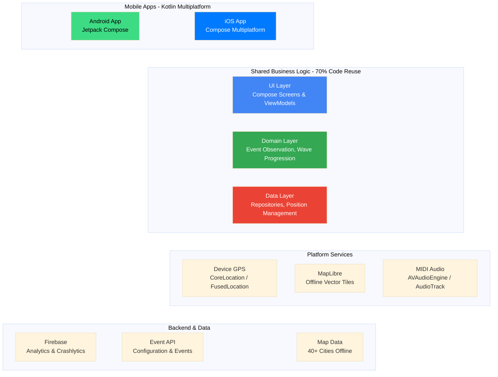

<p align="center">
  
  <h1 align="center">WorldWideWaves</h1>
  <p align="center"><em>Orchestrate synchronized human waves worldwide</em></p>
</p>

<p align="center">
  <a href="https://github.com/mglcel/WorldWideWaves/actions/workflows/99-pipeline-status.yml"></a>
  <a href="https://github.com/mglcel/WorldWideWaves/actions/workflows/03-code-quality.yml"></a>
  <a href="https://github.com/mglcel/WorldWideWaves/actions/workflows/01-build-android.yml"></a>
  <a href="https://github.com/mglcel/WorldWideWaves/actions/workflows/02-build-ios.yml"></a>
</p>

<p align="center">
  <a href="LICENSE"></a>
  
  
  
</p>

A Kotlin Multiplatform mobile application orchestrating synchronized human waves through cities worldwide, fostering unity and shared human experience through real-time coordination and location-based services.

## Overview

WorldWideWaves enables participants to join synchronized wave events at specific times and locations. The app leverages offline maps for 40+ major cities, real-time position tracking, and choreographed animations to create coordinated experiences across devices and geographies.

### Architecture Overview



## Key Features

- Offline maps for 40+ global cities using MapLibre
- Real-time event loading with countdown timers
- GPS position tracking with simulation mode for testing
- Synchronized wave choreography with audio coordination
- Cross-platform business logic sharing (70% code reuse)
- Comprehensive CI/CD pipeline with multi-stage quality gates

## 📱 App Preview

<p align="center">
  
  
  
</p>

<p align="center">
  <em>iOS app running on iPhone 15 Pro simulator</em>
</p>

> **Demo**: Animated demo coming soon - watch this space!

## Project Structure

```
WorldWideWaves/
├── composeApp/              # Android app (Compose UI)
├── shared/                  # Kotlin Multiplatform business logic
├── iosApp/                  # iOS app (Compose UI via ComposeUIViewController)
├── maps/                    # 40+ city offline map modules
│   ├── paris_france/
│   ├── new_york_usa/
│   └── ...
├── scripts/                 # Build tools and map generation
├── docs/                    # Documentation
├── .github/workflows/       # CI/CD pipelines
└── .git-hooks/              # Custom git hooks
```

### Key Modules

| Module | Description |
|--------|-------------|
| `composeApp/` | Android app with Compose Multiplatform UI |
| `shared/` | Cross-platform business logic, ViewModels, and domain layer (70% code reuse) |
| `iosApp/` | iOS app with Compose UI via ComposeUIViewController |
| `maps/` | Android Dynamic Feature modules with offline map data (40+ cities) |

## Tech Stack

**Core:**
- Kotlin 2.2.0
- Kotlin Multiplatform
- Compose Multiplatform 1.8.2
- Gradle 8.14.3

**Android:**
- Target SDK 36
- Jetpack Compose
- MapLibre Android 11.13.0
- Koin 4.1.0

**iOS:**
- Deployment target: iOS 14+
- Compose Multiplatform via ComposeUIViewController
- MapLibre iOS 6.8.0 (95% feature parity with Android)
- Native Swift wrappers for platform services

**Backend:**
- Firebase Analytics & Crashlytics

See [docs/architecture.md](docs/architecture.md) for detailed architecture.

## CI/CD

Multi-stage GitHub Actions workflows with quality gates:

- **Build Pipelines:** Android and iOS compilation verification
- **Quality Gates:** Linting (ktlint, detekt), unit tests (902+), security scanning
- **UI Tests:** Emulator-based UI tests with screenshot capture
- **E2E Tests:** Integration tests and Firebase Test Lab multi-device testing
- **Performance Tests:** Nightly performance regression detection

See [docs/ci-cd.md](docs/ci-cd.md) for pipeline details.

## Requirements

### Development Workstation

| Tool | Minimum Version | Purpose |
|------|----------------|---------|
| JDK | 17 (Temurin) | Kotlin compilation |
| Android Studio | 2024.1+ | Android development |
| Xcode | 15.0+ (macOS only) | iOS development |
| Node.js | 16+ | Map generation scripts |

### Hardware

- CPU: 4+ cores (8+ recommended)
- RAM: 8 GB (16-32 GB recommended)
- Disk: 20 GB free (50 GB on SSD recommended)

See [docs/environment-setup.md](docs/environment-setup.md) for complete setup instructions.

## Quick Setup

### 1. Clone Repository

```bash
git clone https://github.com/mglcel/WorldWideWaves.git
cd WorldWideWaves
```

### 2. Configure Firebase

Create `local.properties` in project root:

```properties
sdk.dir=/path/to/android/sdk

FIREBASE_PROJECT_ID=your-project-id
FIREBASE_PROJECT_NUMBER=123456789012
FIREBASE_MOBILE_SDK_APP_ID=1:123456789012:android:abcdef1234567890
FIREBASE_API_KEY=AIzaSyABCDEF1234567890
```

Generate Firebase configuration:

```bash
./gradlew generateFirebaseConfig
```

### 3. Build Project

```bash
./gradlew build
```

### 4. Run Android

```bash
# Launch emulator
emulator -avd Pixel_3a_API_30 &

# Install and run
./gradlew :composeApp:installDebug
```

### 5. Run iOS (macOS only)

```bash
# Build framework
./gradlew :shared:linkDebugFrameworkIosSimulatorArm64

# Open and run in Xcode
open iosApp/worldwidewaves.xcodeproj
```

### 6. Setup Git Hooks (Optional)

```bash
./dev/setup-git-hooks.sh
```

Enables automatic emulator launch, translation updates, and pre-push tests.

## Development

### Run Tests

```bash
# Unit tests (902+ tests)
./gradlew :shared:testDebugUnitTest

# Android UI tests
./gradlew :composeApp:connectedDebugAndroidTest

# Lint and static analysis
./gradlew ktlintCheck detekt

# All quality checks
./gradlew :shared:testDebugUnitTest ktlintCheck detekt
```

### Local Dev Loop

1. Make code changes in `shared/` or `composeApp/`
2. Android: Compose hot reload applies changes instantly
3. iOS: Rebuild framework with `./gradlew :shared:linkDebugFrameworkIosSimulatorArm64`
4. Run tests to verify changes
5. Commit using [Conventional Commits](https://www.conventionalcommits.org/)

See [docs/development.md](docs/development.md) for detailed workflows and troubleshooting.

## Contributing

We welcome contributions. Please follow these guidelines:

1. Read [docs/contributing.md](docs/contributing.md)
2. Check existing [issues](https://github.com/mglcel/WorldWideWaves/issues)
3. Fork repository and create feature branch
4. Follow commit convention: `<type>(<scope>): <subject>`
5. Add tests for new functionality
6. Ensure all CI checks pass
7. Submit pull request with clear description

### Branch Naming

```
feat/add-feature-name
fix/fix-bug-name
docs/update-documentation
test/add-test-coverage
```

### Commit Convention

```
feat(maps): add Tokyo offline map module
fix(position): prevent duplicate emissions
docs: update environment setup guide
test: add choreography integration tests
```

See [docs/contributing.md](docs/contributing.md) for complete guidelines.

## Testing

### Test Philosophy

"Test Real Code, Not Mocks"

- Focus on business logic and integration points
- Use real implementations where possible
- Mock only external dependencies (network, sensors)
- Never disable tests - always fix root causes
- Tests validate business requirements, not implementation details

### Running Tests

```bash
# Unit tests
./gradlew :shared:testDebugUnitTest

# Android instrumented tests
./gradlew :composeApp:connectedDebugAndroidTest

# iOS safety verification
./scripts/dev/verification/verify-ios-safety.sh

# All quality checks
./gradlew :shared:testDebugUnitTest ktlintCheck detekt
```

See [docs/testing-strategy.md](docs/testing-strategy.md) for complete testing approach.

## Documentation

Comprehensive documentation is available in the `docs/` directory.

### Getting Started
- **[CLAUDE.md](CLAUDE.md)** - Complete project development guide (start here for development)
- **[CLAUDE_iOS.md](CLAUDE_iOS.md)** - iOS-specific development rules and deadlock prevention
- **[API Documentation](https://mglcel.github.io/WorldWideWaves/dokka/)** - Complete API reference (Dokka-generated, auto-updated)
- [Environment Setup](docs/environment-setup.md) - Development environment configuration (macOS, Linux, Windows)

### Development Guides
- [Architecture](docs/architecture.md) - System design, component responsibilities, data flows
- [Development Workflow](docs/development.md) - Local dev loop, testing, debugging
- [Contributing](docs/contributing.md) - Contribution guidelines, code standards, review process
- [CI/CD Pipeline](docs/ci-cd.md) - Workflow details, quality gates, release process

### Platform-Specific
- [iOS Development](docs/ios/) - iOS-specific guides, debugging, and accessibility
  - [iOS Cinterop Memory Safety](docs/ios/cinterop-memory-safety-patterns.md) - Memory pinning & struct access
  - [Swift-Kotlin Bridging Guide](docs/ios/swift-kotlin-bridging-guide.md) - Type conversions & protocols
  - [Platform API Usage Guide](docs/ios/platform-api-usage-guide.md) - UIKit/Foundation/CoreLocation
- [Android Development](docs/android/) - Android MapLibre implementation reference

### Specialized Topics
- [Testing Strategy](docs/TESTING_STRATEGY.md) - Test architecture and approach
- [Accessibility Guide](docs/ACCESSIBILITY_GUIDE.md) - WCAG 2.1 Level AA compliance
- [Firebase Setup](docs/setup/firebase-setup.md) - Firebase project configuration and security
- [Map Architecture](docs/architecture/map-architecture-analysis.md) - Shared vs platform-specific map system design
- [Operations Guide](docs/operations.md) - Runtime config, monitoring, deployment, incident response

See [docs/README.md](docs/README.md) for complete documentation map.

---

## License

```
Copyright 2025 DrWave

Licensed under the Apache License, Version 2.0 (the "License");
you may not use this file except in compliance with the License.
You may obtain a copy of the License at

    http://www.apache.org/licenses/LICENSE-2.0

Unless required by applicable law or agreed to in writing, software
distributed under the License is distributed on an "AS IS" BASIS,
WITHOUT WARRANTIES OR CONDITIONS OF ANY KIND, either express or implied.
See the License for the specific language governing permissions and
limitations under the License.
```

See [LICENSE](LICENSE) for full text.
