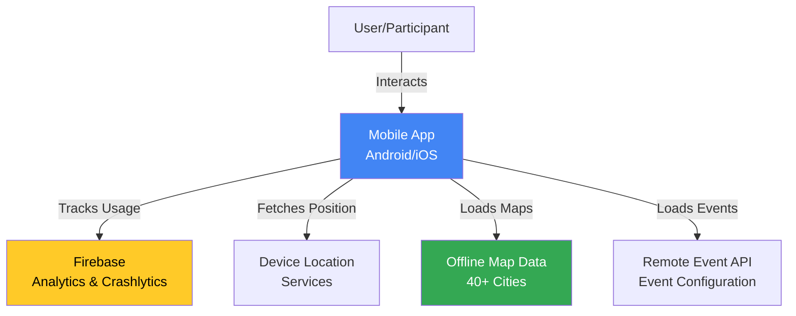
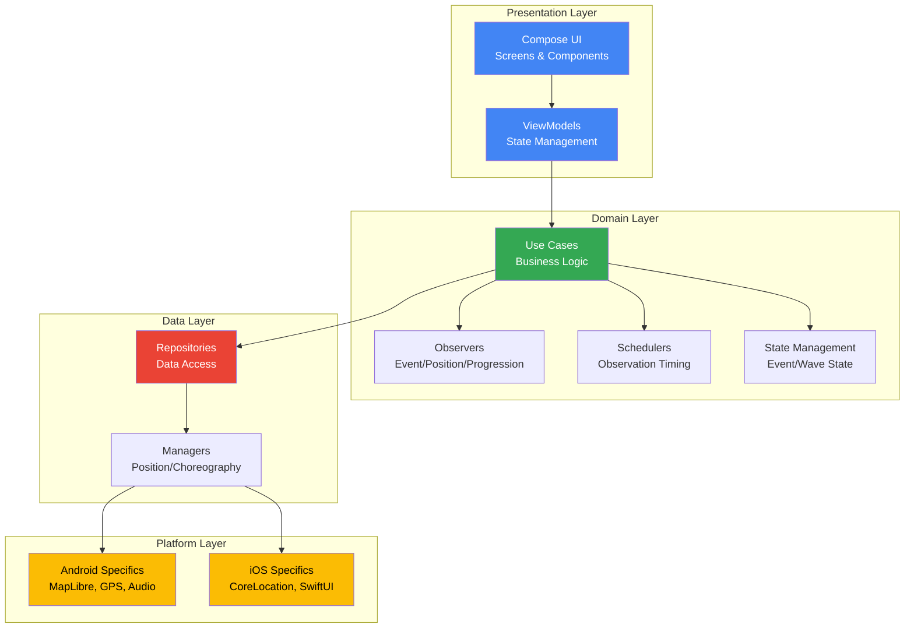
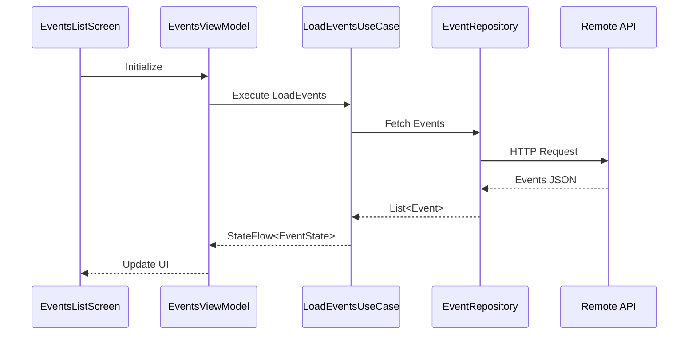
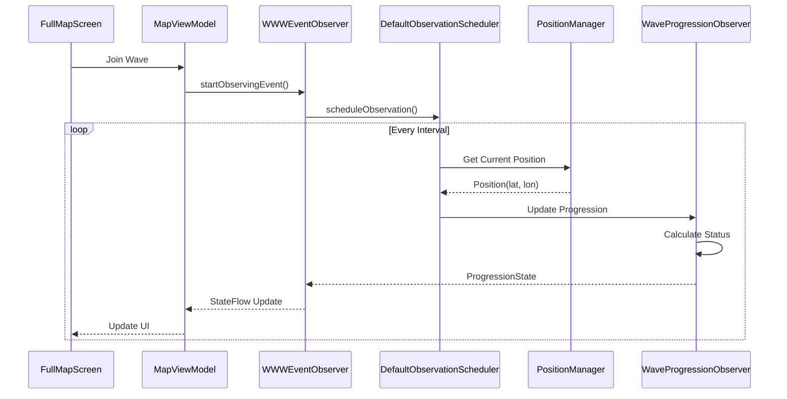
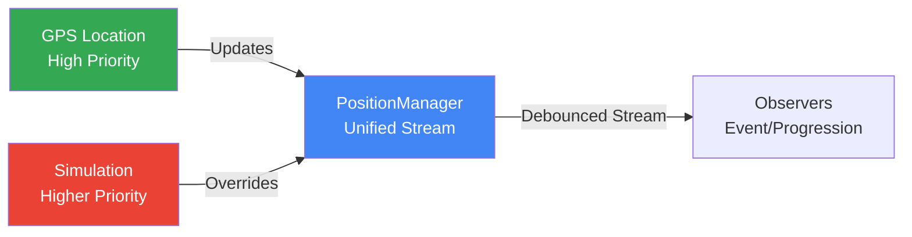

# Architecture

WorldWideWaves implements Clean Architecture principles with Kotlin Multiplatform, achieving approximately 70% code sharing between Android and iOS while maintaining platform-specific optimizations.

## System Context



## High-Level Component Architecture



## Module Responsibilities

### Shared Module (`shared/`)

Cross-platform business logic written in Kotlin Multiplatform.

**Package Structure:**

| Package | Responsibility |
|---------|---------------|
| `domain/observation/` | Event state observation and monitoring |
| `domain/progression/` | Wave progression tracking and simulation |
| `domain/scheduling/` | Adaptive observation intervals and timing |
| `domain/state/` | Event and wave state management |
| `domain/usecases/` | Business use cases (LoadEvents, JoinWave, etc.) |
| `data/` | Data access layer and repositories |
| `position/` | Unified position management (GPS + simulation) |
| `map/` | Platform-agnostic map abstractions |
| `choreographies/` | Wave choreography engine and frame sequencer |
| `sound/` | MIDI parsing and crowd sound simulation |
| `events/` | Event models, validation, and utilities |
| `ui/` | Shared Compose UI components |
| `viewmodels/` | Shared ViewModels for screens |
| `di/` | Koin dependency injection configuration |
| `utils/` | Common utilities (logging, formatting, lifecycle) |

### Android App Module (`composeApp/`)

Android-specific implementation with Compose UI.

**Key Components:**
- `MainActivity.kt` - App entry point
- Compose UI screens (EventsList, EventDetails, FullMap)
- Android instrumented tests (UI, integration, performance)
- MapLibre Android integration
- Firebase Analytics and Crashlytics

### iOS App Module (`iosApp/`)

iOS-specific implementation with SwiftUI.

**Key Components:**
- `AppDelegate.swift` - App lifecycle management
- `SceneDelegate.swift` - UI lifecycle management
- SwiftUI views calling Kotlin business logic
- CoreLocation integration
- MapLibre iOS integration (in progress)

### Map Modules (`maps/`)

Self-contained offline map modules for 40+ cities implemented as Android Dynamic Features.

**Structure:**
- `maps/paris_france/` - Example city module
- Each module contains:
  - `.mbtiles` - MapLibre offline map data
  - `build.gradle.kts` - Dynamic Feature configuration
  - Map style JSON

## Data Flow

### Event Loading Flow



### Wave Participation Flow



### Position Management Architecture

The position system uses a unified architecture with source priority:



**Design Principles:**
- Single source of truth for position
- Simulation overrides GPS (testing priority)
- Debouncing prevents excessive updates (80% emission reduction)
- No map click positioning (user position from GPS only)

## Concurrency Model

### Dispatcher Strategy

| Dispatcher | Use Case | Examples |
|------------|----------|----------|
| `Dispatchers.Main` | UI updates, AudioManager access | StateFlow emissions, sound playback |
| `Dispatchers.Default` | CPU-bound calculations | Geographic distance, polygon operations |
| `Dispatchers.IO` | Avoided | No blocking I/O (use suspend functions) |

### Coroutine Scopes

- **ViewModelScope**: ViewModel lifecycle-bound operations
- **Custom Scopes**: Long-running observers and schedulers
- **Structured Concurrency**: Always use `coroutineScope` or `supervisorScope`

### State Management

**StateFlow Pattern:**
```kotlin
class EventsViewModel : ViewModel() {
    private val _eventsState = MutableStateFlow<EventState>(EventState.Loading)
    val eventsState: StateFlow<EventState> = _eventsState.asStateFlow()
}
```

**Flow Operators:**
- `.stateIn()` for hot state flows
- `.debounce()` for position updates (500ms)
- `.distinctUntilChanged()` for deduplication
- `.conflate()` for backpressure handling

## Performance Optimizations

### Geographic Calculations

**LRU Caching:**
- Distance calculations cached by coordinate pair
- Polygon containment checks cached
- Cache size: 100 entries per operation type

**Spatial Indexing:**
- Bounding box pre-filtering for polygon operations
- R-tree indexing for event queries (future enhancement)

### Position Management

**Smart Throttling:**
- Debounce position updates (500ms)
- Distinct emission (skip duplicates)
- Adaptive observation intervals (5s warming → 1s pre-hit → 250ms active)

**Performance Impact:**
- 80% reduction in StateFlow emissions
- 3x faster polygon operations with spatial indexing
- Smooth 60 FPS during wave choreography

### Map Performance

**Lazy Loading:**
- Dynamic Feature modules loaded on demand
- Map tiles cached locally
- Style JSON preloaded

**Memory Management:**
- MapView recycling
- Bitmap pooling for markers
- Offline tile database optimization

## Extension Points

### Adding New Event Types

1. Define event model in `shared/src/commonMain/kotlin/com/worldwidewaves/shared/events/`
2. Implement validation logic
3. Add UI representation in `shared/src/commonMain/kotlin/com/worldwidewaves/shared/ui/`
4. Update `EventRepository` for loading

### Platform-Specific Services

Use `expect`/`actual` pattern:

```kotlin
// commonMain
expect class AudioPlayer {
    fun play(frequency: Double, duration: Long)
}

// androidMain
actual class AudioPlayer {
    actual fun play(frequency: Double, duration: Long) {
        // Android AudioTrack implementation
    }
}

// iosMain
actual class AudioPlayer {
    actual fun play(frequency: Double, duration: Long) {
        // iOS AVAudioEngine implementation
    }
}
```

### Custom Choreographies

Extend `ChoreographySequence` interface:

```kotlin
class CustomChoreography : ChoreographySequence {
    override val frames: List<ChoreographyFrame>
    override val totalDurationMs: Long

    override fun getFrameAt(timeMs: Long): ChoreographyFrame {
        // Custom frame selection logic
    }
}
```

## Security Architecture

### Data Protection

**Location Privacy:**
- No precise coordinate logging in production
- Configurable precision levels
- Respect user privacy settings

**Secret Management:**
- Secrets stored in `local.properties` (development)
- Environment variables in CI/CD
- Firebase config auto-generated
- API keys restricted by service and app signature

### Network Security

**HTTPS Enforcement:**
- All network traffic over TLS 1.2+
- Certificate pinning (future enhancement)
- Request signing for API calls (future enhancement)

### Build Security

**Gradle Wrapper Validation:**
- SHA-256 checksum verification in CI
- Automated dependency vulnerability scanning

## Testing Strategy

See [docs/development.md](development.md) for detailed testing workflows.

**Test Pyramid:**
- **Unit Tests (902+)**: Business logic, domain layer
- **UI Tests**: Critical paths, accessibility, performance
- **Integration Tests**: Firebase, MapLibre, device coordination
- **Performance Tests**: App launch, runtime, battery

**Key Principles:**
- Test real code, not mocks
- Focus on business logic and integration points
- Avoid testing framework internals
- Use simulation for deterministic testing

## Architectural Decisions

### Why Kotlin Multiplatform?

**Benefits:**
- 70% code sharing between platforms
- Type-safe cross-platform development
- Native performance on both platforms
- Shared testing infrastructure

**Trade-offs:**
- Build complexity (Gradle + Xcode)
- Platform-specific UI required
- Learning curve for iOS developers

### Why Clean Architecture?

**Benefits:**
- Clear separation of concerns
- Testable business logic
- Platform-independent domain layer
- Easy to maintain and extend

**Trade-offs:**
- More boilerplate code
- Steeper learning curve
- Additional abstraction layers

### Why MapLibre?

**Benefits:**
- Open-source (no vendor lock-in)
- Offline-first architecture
- Custom style support
- Active community

**Trade-offs:**
- Manual map data generation required
- Larger APK size (mitigated by Dynamic Features)
- Less polished than Google Maps

## Further Reading

- [CI/CD Pipeline](ci-cd.md)
- [Development Workflow](development.md)
- [Environment Setup](environment-setup.md)
- [Contributing Guidelines](contributing.md)
