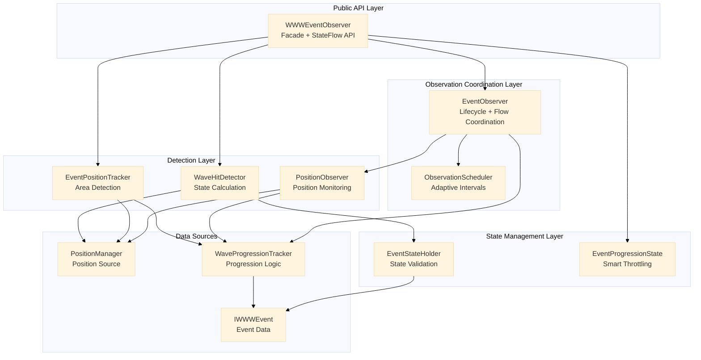
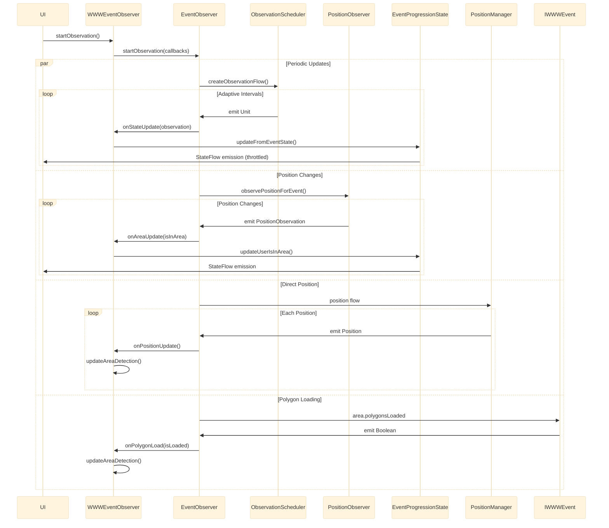
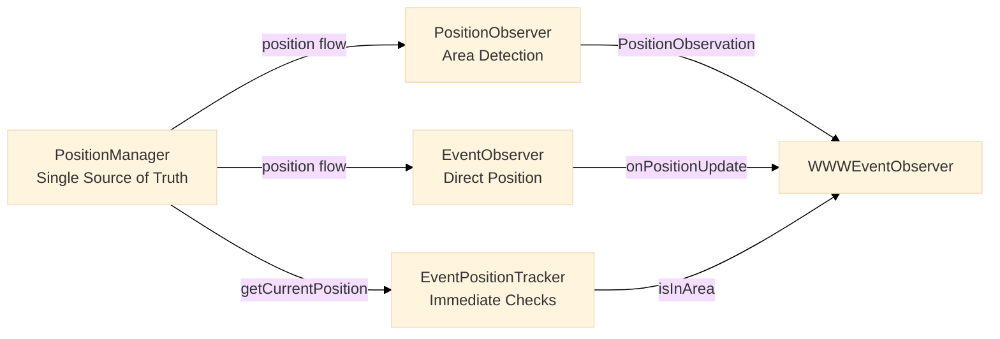

# Event Observation System

> **Status**: Production-Ready | **Layer**: Domain | **Tests**: 902+ passing

## Overview

The Event Observation System coordinates real-time event participation by continuously monitoring event state, user position, and wave progression. It provides reactive StateFlow-based APIs for UI updates and automatically adapts observation intervals based on event timing to optimize battery usage while maintaining timing accuracy for wave hit synchronization.

## Architecture

### Core Components

The system follows a layered architecture with specialized components coordinated through a facade:

- **WWWEventObserver** - Facade orchestrating all observation components, providing public StateFlow API
- **EventObserver** - Lifecycle manager coordinating multiple observation flows (periodic, position, simulation)
- **ObservationScheduler** - Adaptive interval calculator optimizing battery usage based on event proximity
- **PositionObserver** - User position monitoring with area detection logic
- **EventPositionTracker** - Area detection coordinator using PositionManager and WaveProgressionTracker
- **WaveHitDetector** - Event state calculation and wave hit detection
- **EventStateHolder** - State calculation and validation logic
- **EventProgressionState** - StateFlow management with smart throttling (reduces emissions by ~80%)

### Component Relationships



## Observation Flow

### Lifecycle

The observation lifecycle follows a strict start-observe-stop pattern with automatic resource cleanup:

```kotlin
// Start observation
val observer = WWWEventObserver(event)
observer.startObservation()

// Observe state via StateFlow (Compose integration)
val status = observer.eventStatus.collectAsState()
val progression = observer.progression.collectAsState()
val isInArea = observer.userIsInArea.collectAsState()

// Automatic cleanup when event is done
// Manual cleanup if needed
observer.stopObservation()
```

**Lifecycle States**:

1. **Initialization** - Immediate state calculation on observer creation
2. **Active Observation** - Continuous monitoring via coordinated flows
3. **Automatic Cleanup** - Observer stops when event reaches DONE status
4. **Manual Cleanup** - Optional explicit cleanup via `stopObservation()`

### Flow Coordination

The EventObserver coordinates four parallel observation flows to provide comprehensive event monitoring:



**Key Flows**:

1. **Periodic Updates** - Adaptive intervals from ObservationScheduler, emits progression and status
2. **Position Changes** - PositionObserver flow with area detection and debouncing
3. **Direct Position** - Immediate position updates from PositionManager for responsiveness
4. **Polygon Loading** - Event area polygon data loading triggers area detection
5. **Simulation Changes** - Platform simulation state changes trigger observer restart (debounced 500ms)

### Flow Merging Strategy

The EventObserver uses `combine()` to merge periodic and simulation flows:

```kotlin
// Unified observation flow combining periodic ticks and simulation changes
combine(
    createPeriodicObservationFlow(),
    createSimulationFlow()
) { periodicObservation, _ ->
    periodicObservation
}.onEach { observation ->
    onStateUpdate(observation)
    updateAreaDetection()
}
```

**Why Combine**:

- Periodic flow emits at adaptive intervals based on event timing
- Simulation flow emits when simulation state changes (debounced 500ms to prevent restart storm)
- Combined flow ensures state updates on either periodic tick OR simulation change
- Area detection runs on every unified emission for accuracy

### Adaptive Polling Intervals

The ObservationScheduler dynamically adjusts observation intervals based on event timing and user proximity:

**Intervals by Event Proximity**:

| Phase | Time Before Event | Interval | Reason |
|-------|------------------|----------|--------|
| DISTANT | > 1 hour | 1 hour | Minimal battery usage, event far away |
| APPROACHING | 5-60 minutes | 5 minutes | Moderate monitoring, event approaching |
| NEAR | 35 seconds - 5 minutes | 1 second | Active monitoring, event soon |
| ACTIVE | 0-35 seconds or running | 500ms | Real-time updates, event starting/active |
| CRITICAL | < 5 seconds to wave hit | 200ms | Maximum accuracy for timing |
| HIT_CRITICAL | < 1 second to wave hit | 50ms | Sound synchronization accuracy |

**Interval Calculation Logic**:

```kotlin
suspend fun calculateObservationInterval(event: IWWWEvent): Duration {
    val timeBeforeEvent = event.getStartDateTime() - clock.now()
    val timeBeforeHit = event.wave.timeBeforeUserHit()

    return when {
        // Wave hit timing takes priority (most critical)
        timeBeforeHit != null && timeBeforeHit < 1.seconds -> 50.milliseconds
        timeBeforeHit != null && timeBeforeHit < 5.seconds -> 200.milliseconds

        // Event timing (less critical)
        timeBeforeEvent > 1.hours + 5.minutes -> 1.hours
        timeBeforeEvent > 5.minutes + 30.seconds -> 5.minutes
        timeBeforeEvent > 35.seconds -> 1.seconds
        timeBeforeEvent > 0.seconds || event.isRunning() -> 500.milliseconds

        else -> 30.seconds
    }
}
```

**Battery Optimization**:

- CPU wake-ups minimized when event is distant
- Progressive interval reduction as event approaches
- Infinite interval stops observation when event is no longer relevant
- Critical timing accuracy maintained for sound synchronization (±50ms)

## Integration with Other Systems

### Wave Hit Detection

The WaveHitDetector calculates event state and determines when the user is hit by the wave:

**Responsibilities**:

- Calculate all event state properties (progression, status, warming phases, hit timing)
- Validate state consistency and detect invalid transitions
- Provide immediate wave hit notification trigger

**Integration Flow**:

```kotlin
// WWWEventObserver uses WaveHitDetector for state calculation
val calculatedState = waveHitDetector.calculateEventState(
    event = event,
    progression = progression,
    status = status,
    userIsInArea = userIsInArea
)

// Validate calculated state
val validationIssues = waveHitDetector.validateState(stateInput, calculatedState)
if (validationIssues.isNotEmpty()) {
    Log.w("WWWEventObserver", "State validation issues: $validationIssues")
}

// Update StateFlows with validated state
progressionState.updateFromEventState(calculatedState)

// Detect wave hit transition and trigger notification
detectAndNotifyWaveHit(calculatedState)
```

**Wave Hit Notification**:

```kotlin
private suspend fun detectAndNotifyWaveHit(calculatedState: EventState) {
    val currentHit = calculatedState.userHasBeenHit

    // Detect transition: not hit → hit
    if (currentHit && !previousUserHasBeenHit) {
        val isFavorite = favoriteEventsStore.isFavorite(event.id)

        if (isFavorite) {
            val content = notificationContentProvider.generateWaveHitNotification(event)
            notificationManager.deliverNow(
                eventId = event.id,
                trigger = NotificationTrigger.WaveHit,
                content = content
            )
        }
    }

    previousUserHasBeenHit = currentHit
}
```

### Position Management

The system uses PositionManager as the single source of truth for user position:

**Position Flow Architecture**:



**PositionObserver Integration**:

```kotlin
// Combines position changes with polygon loading
fun observePositionForEvent(event: IWWWEvent): Flow<PositionObservation> {
    return combine(
        positionManager.position,
        event.area.polygonsLoaded
    ) { position, polygonsLoaded ->
        val isInArea = if (position != null && polygonsLoaded) {
            val polygons = event.area.getPolygons()
            waveProgressionTracker.isUserInWaveArea(position, event.area, polygons)
        } else {
            false
        }

        PositionObservation(
            position = position,
            isInArea = isInArea,
            timestamp = clock.now()
        )
    }.distinctUntilChanged { old, new ->
        // Only emit if position changed significantly or area status changed
        if (old.isInArea != new.isInArea) {
            false // Always emit if area status changed
        } else if (old.position == null || new.position == null) {
            old.position == new.position
        } else {
            calculateDistance(old.position, new.position) < 1.0 // meters
        }
    }
}
```

**Position Priority**: SIMULATION > GPS (testing > real device)

**Area Detection Strategy**:

1. PositionObserver flow emits when position changes significantly or area status changes
2. EventObserver direct position flow triggers immediate area detection for responsiveness
3. EventPositionTracker performs immediate area checks using current position
4. All three paths ensure UI reflects accurate area status

### State Management

The EventProgressionState provides smart throttling to reduce StateFlow emissions by ~80%:

**Throttling Strategy**:

```kotlin
class EventProgressionState {
    private val _progression = MutableStateFlow(0.0)
    val progression: StateFlow<Double> = _progression

    fun updateFromEventState(state: EventState) {
        // Only update if change is significant
        if (abs(state.progression - _progression.value) > 0.001) { // 0.1% threshold
            _progression.value = state.progression
        }

        // Other state properties updated similarly with appropriate thresholds
    }
}
```

**Throttling Thresholds**:

- **Progression**: Only updates if change > 0.1%
- **Position Ratio**: Only updates if change > 1%
- **Time Before Hit**: Adaptive (50ms during critical hit phase < 2s, 1000ms otherwise)
- **Boolean States**: Always update (no throttling needed)
- **Area Status**: Always update (critical for UI)

**Benefits**:

- Reduces unnecessary UI recomposition
- Minimizes StateFlow collection overhead
- Maintains accuracy for critical timing (wave hit)
- Battery-friendly for long-running observations

## Memory Management

### Cleanup Patterns

The system implements automatic and manual cleanup to prevent memory leaks:

**Automatic Cleanup**:

```kotlin
// EventObserver automatically cancels observation when event is done
fun createObservationFlow(event: IWWWEvent): Flow<Unit> = callbackFlow {
    if (shouldObserveContinuously(event)) {
        while (!event.isDone()) {
            send(Unit)
            val observationDelay = calculateObservationInterval(event)
            if (!observationDelay.isFinite()) break
            clock.delay(observationDelay)
        }
        send(Unit) // Final emission
    } else {
        send(Unit) // Single emission for non-continuous events
    }

    awaitClose {
        Log.v("DefaultObservationScheduler", "Closing observation flow")
    }
}
```

**Manual Cleanup**:

```kotlin
// Immediate cleanup
fun stopObservation() {
    eventObserver.stopObservation()
    unifiedObservationJob?.cancel()
    unifiedObservationJob = null
    isObserving.value = false
}

// Cleanup with wait (for simulation restart)
suspend fun stopObservationAndWait() {
    eventObserver.stopObservation()
    unifiedObservationJob?.cancelAndJoin() // Wait for cancellation
    unifiedObservationJob = null
    isObserving.value = false
}
```

**Parent-Child Job Management**:

```kotlin
// Parent job manages all child observation jobs
private fun setupParentObservationJob(jobs: ObservationJobs) {
    unifiedObservationJob = coroutineScopeProvider.launchDefault {
        // Use invokeOnCompletion for iOS deadlock prevention
        jobs.mainObservationJob.invokeOnCompletion {
            jobs.positionObserverJob.cancel()
            jobs.directPositionObserverJob.cancel()
            jobs.polygonLoadingJob.cancel()
        }
    }
}
```

**Memory Leak Prevention**:

- All observation jobs are tracked and cancelled together
- Coroutine scopes are properly managed
- StateFlows are hot and don't need manual cleanup
- No cyclic references between components
- Resource cleanup in `awaitClose()` blocks

### Coroutine Scopes

The system uses appropriate dispatchers for different workload types:

**Dispatcher Usage**:

```kotlin
// EventObserver flow coordination
createUnifiedObservationFlow()
    .flowOn(Dispatchers.Default) // CPU-bound calculations
    .onEach { observation ->
        handleMainObservationUpdate(observation, onStateUpdate)
    }
    .launchIn(coroutineScopeProvider.scopeDefault())

// Position observation
positionObserver
    .observePositionForEvent(event)
    .flowOn(Dispatchers.Default) // Geometric calculations
    .onEach { observation ->
        handlePositionObservationUpdate(observation, onAreaUpdate)
    }
    .launchIn(coroutineScopeProvider.scopeDefault())
```

**Scope Lifecycle**:

- **CoroutineScopeProvider** - Provides managed scopes for observation lifecycle
- **Default Dispatcher** - Used for CPU-bound calculations (progression, status, area detection)
- **Main Dispatcher** - Not used (avoided for performance, UI updates via StateFlow)
- **Job Cancellation** - Proper cancellation handling with CancellationException re-throwing

## Code Examples

### Starting Observation

```kotlin
// Create observer for an event
val observer = WWWEventObserver(event)

// Start observation (automatic lifecycle management)
observer.startObservation()

// Observe state in Compose UI
@Composable
fun EventScreen(observer: WWWEventObserver) {
    val status by observer.eventStatus.collectAsState()
    val progression by observer.progression.collectAsState()
    val isInArea by observer.userIsInArea.collectAsState()
    val userHasBeenHit by observer.userHasBeenHit.collectAsState()
    val timeBeforeHit by observer.timeBeforeHit.collectAsState()

    // UI updates automatically when StateFlows emit
    Text("Status: $status")
    LinearProgressIndicator(progress = progression.toFloat())
    Text("In Area: $isInArea")
    if (userHasBeenHit) {
        Text("Wave Hit!")
    } else if (timeBeforeHit.isFinite()) {
        Text("Hit in: ${timeBeforeHit.inWholeSeconds}s")
    }
}
```

### Stopping Observation

```kotlin
// Immediate cleanup
fun cleanup() {
    observer.stopObservation()
    // Observer stops, jobs cancelled, resources cleaned up
}

// Cleanup with wait (for simulation restart)
suspend fun restartSimulation() {
    // Stop old observer and wait for full cancellation
    oldObserver.stopObservationAndWait()

    // Reset state to prevent validation errors
    oldObserver.resetState()

    // Start new observer
    newObserver.startObservation()
}
```

### Adaptive Scheduling

```kotlin
// ObservationScheduler automatically adapts intervals
class DefaultObservationScheduler(private val clock: IClock) : ObservationScheduler {

    override suspend fun calculateObservationInterval(event: IWWWEvent): Duration {
        val timeBeforeEvent = event.getStartDateTime() - clock.now()
        val timeBeforeHit = event.wave.timeBeforeUserHit()

        return when {
            // Critical hit timing (highest priority)
            timeBeforeHit != null && timeBeforeHit < 1.seconds -> 50.milliseconds
            timeBeforeHit != null && timeBeforeHit < 5.seconds -> 200.milliseconds

            // Event timing
            timeBeforeEvent > 1.hours + 5.minutes -> 1.hours
            timeBeforeEvent > 5.minutes + 30.seconds -> 5.minutes
            timeBeforeEvent > 35.seconds -> 1.seconds
            timeBeforeEvent > 0.seconds || event.isRunning() -> 500.milliseconds

            else -> 30.seconds
        }
    }

    override fun createObservationFlow(event: IWWWEvent): Flow<Unit> = callbackFlow {
        if (shouldObserveContinuously(event)) {
            while (!event.isDone()) {
                send(Unit) // Emit observation trigger

                val observationDelay = calculateObservationInterval(event)
                if (!observationDelay.isFinite()) break

                clock.delay(observationDelay) // Wait until next observation
            }
            send(Unit) // Final emission when done
        } else {
            send(Unit) // Single emission for non-continuous events
        }

        awaitClose()
    }
}
```

### Force Area Detection Update

```kotlin
// When position source changes (e.g., simulation stop → GPS)
fun onSimulationStopped() {
    observer.forceAreaDetectionUpdate()
    // Immediately recalculates area detection with current position
    // Ensures UI reflects accurate area status without waiting for emission
}
```

### State Reset

```kotlin
// When starting simulation to prevent validation errors
suspend fun startSimulation() {
    // Stop observer and wait for cancellation
    observer.stopObservationAndWait()

    // Reset state to initial values
    observer.resetState()
    // Prevents errors like "DONE -> NEXT" or "userHasBeenHit cannot go to false"

    // Start fresh observation
    observer.startObservation()
}
```

## Performance Optimizations

### Smart Throttling

EventProgressionState reduces StateFlow emissions by ~80% using intelligent thresholds:

```kotlin
// Only emit if progression changed by > 0.1%
if (abs(newProgression - currentProgression) > 0.001) {
    _progression.value = newProgression
}

// Only emit if position ratio changed by > 1%
if (abs(newRatio - currentRatio) > 0.01) {
    _userPositionRatio.value = newRatio
}
```

### Position Debouncing

PositionObserver filters insignificant position changes:

```kotlin
.distinctUntilChanged { old, new ->
    if (old.isInArea != new.isInArea) {
        false // Always emit if area status changed
    } else if (old.position == null || new.position == null) {
        old.position == new.position
    } else {
        calculateDistance(old.position, new.position) < 1.0 // meters
    }
}
```

### Adaptive Intervals

ObservationScheduler minimizes CPU wake-ups when event is distant:

- **> 1 hour away**: 1 hour interval (1 wake-up per hour)
- **5-60 minutes**: 5 minute interval (12 wake-ups per hour)
- **35 seconds - 5 minutes**: 1 second interval (3600 wake-ups per hour)
- **< 35 seconds**: 500ms interval (7200 wake-ups per hour)
- **< 5 seconds to hit**: 200ms interval (18000 wake-ups per hour)
- **< 1 second to hit**: 50ms interval (72000 wake-ups per hour)

### Polygon Caching

Polygon data is fetched once per flow emission and passed to avoid redundant lookups:

```kotlin
// Fetch polygons once per emission
val polygons = event.area.getPolygons()

// Pass to tracker to avoid re-fetching
waveProgressionTracker.isUserInWaveArea(position, event.area, polygons)
```

### Simulation Change Debouncing

Prevents 40+ observer restart storms from rapid simulation toggles:

```kotlin
platform.simulationChanged
    .debounce(500.milliseconds) // Coalesce rapid changes
    .collect {
        Log.v("EventObserver", "Simulation change detected (debounced)")
        send(Unit)
    }
```

## Testing

The Event Observation System is comprehensively tested with 902+ unit tests:

**Test Coverage**:

- **ObservationScheduler**: Adaptive interval calculation, phase determination, flow creation
- **EventObserver**: Lifecycle management, flow coordination, error handling
- **PositionObserver**: Position monitoring, area detection, distance calculations
- **WWWEventObserver**: StateFlow management, state transitions, validation
- **Integration Tests**: End-to-end observation flow with all components

**Test Organization**:

```
shared/src/
├── commonTest/                                    # Platform-independent tests
│   ├── domain/scheduling/
│   │   └── DefaultObservationSchedulerTest.kt     # Interval calculation tests
│   ├── domain/observation/
│   │   ├── DefaultPositionObserverTest.kt         # Position monitoring tests
│   │   └── EventPositionTrackerTest.kt            # Area detection tests
│   └── events/
│       └── WWWEventObserverTest.kt                # StateFlow and integration tests
├── androidUnitTest/                               # Android-specific tests
└── iosTest/                                       # iOS-specific tests
```

**Key Test Patterns**:

```kotlin
// Infinite flow testing - Don't use advanceUntilIdle()
@Test
fun testObservationFlow() = runTest {
    observer.startObservation()
    testScheduler.runCurrent() // Process current only

    // Assertions

    observer.stopObservation() // Cancel first
    testScheduler.advanceUntilIdle() // Now safe
}

// Test isolation
@AfterTest
fun tearDown() {
    runBlocking {
        testScopeProvider.cancelAllCoroutines()
        delay(500) // Cleanup propagation
    }
    stopKoin()
}
```

**See**: `/Users/ldiasdasilva/StudioProjects/WorldWideWaves/docs/testing/test-patterns.md` - Comprehensive test patterns

## Related Documentation

**Architecture**:

- `/Users/ldiasdasilva/StudioProjects/WorldWideWaves/docs/architecture/wave-hit-detection-system.md` - Wave hit detection integration
- `/Users/ldiasdasilva/StudioProjects/WorldWideWaves/docs/architecture/map-download-system.md` - Map system interaction
- `/Users/ldiasdasilva/StudioProjects/WorldWideWaves/docs/architecture.md` - Overall system architecture

**Patterns**:

- `/Users/ldiasdasilva/StudioProjects/WorldWideWaves/docs/patterns/reactive-patterns.md` - Flow patterns used
- `/Users/ldiasdasilva/StudioProjects/WorldWideWaves/docs/patterns/ios-safety-patterns.md` - iOS safety compliance

**Features**:

- `/Users/ldiasdasilva/StudioProjects/WorldWideWaves/docs/features/simulation-mode.md` - Testing with simulation
- `/Users/ldiasdasilva/StudioProjects/WorldWideWaves/docs/features/notification-system.md` - Wave hit notifications

**Testing**:

- `/Users/ldiasdasilva/StudioProjects/WorldWideWaves/docs/testing/test-patterns.md` - Testing strategy and patterns
- `/Users/ldiasdasilva/StudioProjects/WorldWideWaves/docs/testing-strategy.md` - Overall testing approach

## Key Files

**Interfaces**:

- `/Users/ldiasdasilva/StudioProjects/WorldWideWaves/shared/src/commonMain/kotlin/com/worldwidewaves/shared/domain/scheduling/ObservationScheduler.kt` - Scheduling interface
- `/Users/ldiasdasilva/StudioProjects/WorldWideWaves/shared/src/commonMain/kotlin/com/worldwidewaves/shared/domain/observation/PositionObserver.kt` - Position monitoring interface

**Implementations**:

- `/Users/ldiasdasilva/StudioProjects/WorldWideWaves/shared/src/commonMain/kotlin/com/worldwidewaves/shared/events/WWWEventObserver.kt` - Public facade (700+ lines)
- `/Users/ldiasdasilva/StudioProjects/WorldWideWaves/shared/src/commonMain/kotlin/com/worldwidewaves/shared/domain/observation/EventObserver.kt` - Lifecycle manager (460+ lines)
- `/Users/ldiasdasilva/StudioProjects/WorldWideWaves/shared/src/commonMain/kotlin/com/worldwidewaves/shared/domain/scheduling/DefaultObservationScheduler.kt` - Adaptive scheduler (190+ lines)
- `/Users/ldiasdasilva/StudioProjects/WorldWideWaves/shared/src/commonMain/kotlin/com/worldwidewaves/shared/domain/observation/DefaultPositionObserver.kt` - Position monitoring (165+ lines)
- `/Users/ldiasdasilva/StudioProjects/WorldWideWaves/shared/src/commonMain/kotlin/com/worldwidewaves/shared/domain/observation/EventPositionTracker.kt` - Area detection (105+ lines)

**Tests**:

- `/Users/ldiasdasilva/StudioProjects/WorldWideWaves/shared/src/commonTest/kotlin/com/worldwidewaves/shared/domain/scheduling/DefaultObservationSchedulerTest.kt` - Scheduler tests

---

**Last Updated**: November 11, 2025
**Version**: 1.0
**Maintainer**: WorldWideWaves Development Team
