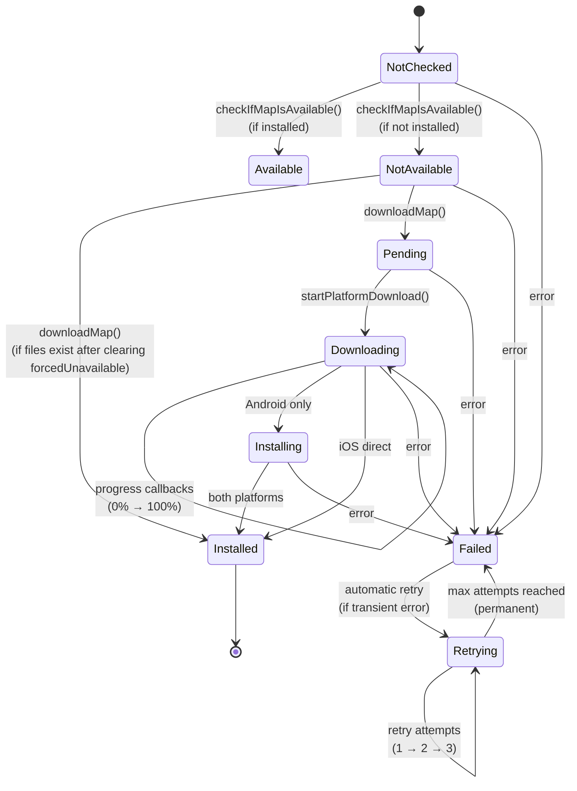

# Map Download System Architecture

**Status**: ✅ Production
**Version**: 1.0

---

## Overview

WorldWideWaves uses offline maps for 40+ cities to enable precise wave visualization and event area detection without requiring internet connectivity during events. The map download system manages the complete lifecycle of map modules across Android and iOS platforms, handling download, caching, uninstall, and re-download scenarios.

**Key Components**:

- **MapDownloadCoordinator** (shared) - Platform-agnostic download orchestration
- **AndroidMapViewModel** - Android Play Core integration
- **IosMapViewModel** - iOS On-Demand Resources (ODR) integration
- **AndroidMapAvailabilityChecker** - Android availability tracking with persistence
- **IosMapAvailabilityChecker** - iOS availability tracking with resource pinning

---

## Platform Differences (Critical)

### Android: Play Core Dynamic Features

**Technology**: Google Play Core Library - Dynamic Feature Modules

**Key Characteristics**:

- **Deferred Uninstall**: Files remain in cache after uninstall until next app update
- **Module State Tracking**: `SplitInstallManager` tracks installation state
- **Session-Based Downloads**: Downloads are async with progress callbacks
- **State Persistence**: Required to survive app restarts

**Why forcedUnavailable Flag is Needed**:

Play Core's deferred uninstall means files exist after uninstall. Without a flag, the app would think the map is still installed. The `forcedUnavailable` flag overrides file-based checks to respect user intent.

**Cache Location**: `application.cacheDir`

### iOS: On-Demand Resources (ODR)

**Technology**: Apple NSBundleResourceRequest

**Key Characteristics**:

- **Immediate Uninstall**: Resources deleted immediately on `endAccessingResources()`
- **Resource Pinning**: `beginAccessingResources()` pins resources to prevent system purge
- **Two Tag Types**: Initial Install Tags (bundled) vs On-Demand Tags (downloadable)
- **No State Persistence**: Resources fully managed by OS

**Why NO forcedUnavailable Flag**:

iOS deletes resources immediately on uninstall. There's no scenario where "files exist but user uninstalled", so no flag is needed.

**Cache Location**: `Library/Application Support/Maps/`

---

## Download Flow

### 1. User Initiates Download

**Entry Points**:

- EventDetailScreen: Auto-download when map required for simulation
- AndroidEventMap: Download button when map not available
- EventsListScreen: Bulk download (future feature)

**Code Path**:

```kotlin
UI → mapViewModel.downloadMap(eventId)
  → MapDownloadCoordinator.downloadMap(mapId, onMapDownloaded)
```

### 2. Pre-Download Checks

**Step 1: Concurrent Download Prevention**

```kotlin
if (MapDownloadUtils.isActiveDownload(_featureState.value)) {
    return  // Already downloading
}
```

**Step 2: Clear forcedUnavailable (CRITICAL for Re-download)**

```kotlin
platformAdapter.clearForcedUnavailableIfNeeded(mapId)
```

**Why this happens FIRST**:

- On Android, re-downloading after uninstall requires clearing the `forcedUnavailable` flag
- This MUST happen BEFORE `isMapInstalled()` check
- Otherwise the check sees `forcedUnavailable=true` and returns `false` even if files exist
- Result: State set to `NotAvailable` → simulation blocked forever

**Android Implementation**:

```kotlin
override suspend fun clearForcedUnavailableIfNeeded(mapId: String) {
    androidChecker.clearForcedUnavailable(mapId)  // Removes from set + persists + refreshes
}
```

**iOS Implementation**: Uses default no-op (not needed)

**Step 3: Already Installed Check**

```kotlin
if (platformAdapter.isMapInstalled(mapId)) {
    _featureState.value = MapFeatureState.Installed
    onMapDownloaded?.invoke()
    return  // Skip download
}
```

**Why this check exists**:

- On Android re-download: Files may still exist (deferred uninstall)
- After clearing forcedUnavailable, files are accessible again
- Skip download if files valid → mark Installed immediately
- Saves bandwidth and time

### 3. Download Execution

**State Update**:

```kotlin
_featureState.value = MapFeatureState.Pending
currentMapId = mapId
```

**Platform-Specific Download**:

```kotlin
platformAdapter.startPlatformDownload(mapId, onMapDownloaded)
```

**Android**:

- Creates `SplitInstallRequest` with module name
- Calls `splitInstallManager.startInstall(request)`
- Registers listeners for progress/success/failure
- Progress callbacks update `MapFeatureState.Downloading(progress)`

**iOS**:

- Creates `NSBundleResourceRequest` with ODR tag
- Calls `beginAccessingResources()`
- Pins resources to prevent system purge
- Tracks in `pinnedRequests` map for lifecycle management

### 4. Download Progress

**Android State Updates**:

```
Pending → Downloading(0%) → Downloading(50%) → Downloading(100%) → Installing → Installed
```

**iOS State Updates**:

```
Pending → Downloading(0%) → Downloading(100%) → Installed
```

(iOS doesn't have separate "Installing" phase)

### 5. Download Completion

**Common**:

```kotlin
_featureState.value = MapFeatureState.Installed
MapDownloadGate.allow(mapId)  // Enable caching in MapStore
clearUnavailableGeoJsonCache(mapId)  // Clear error cache
onMapDownloaded?.invoke()  // Callback to UI
```

**Android Additional**:

- Play Core INSTALLED listener fires
- Clears forcedUnavailable (redundant but harmless)
- Updates `mapStates` reactive flow

**iOS Additional**:

- Resource pinned in `pinnedRequests` map
- Resource tag added to tracking

### 6. Error Handling

**On Download Failure**:

```kotlin
_featureState.value = MapFeatureState.Failed(errorCode)
```

**Retry Logic**:

- Automatic retry for transient errors (SERVICE_DIED)
- Exponential backoff: 2s, 4s, 8s
- Max 3 retries
- User can manually retry from UI

---

## Uninstall Flow

### Android: Deferred Uninstall

**User Action**: Click uninstall in EventsListScreen

**Code Path**:

```kotlin
mapAvailabilityChecker.requestMapUninstall(eventId)
  → AndroidMapAvailabilityChecker.uninstallMap(eventId)
```

**Step-by-Step**:

1. **Schedule Uninstall**:

   ```kotlin
   splitInstallManager.deferredUninstall(listOf(eventId))
   ```

   - Returns immediately (doesn't delete files)
   - Files marked for deletion on next app update
   - **Files remain accessible** until update

2. **Set forcedUnavailable Flag**:

   ```kotlin
   forcedUnavailable.add(eventId)
   ```

   - Marks map as "user intended to uninstall"
   - Overrides file-based availability checks

3. **Persist to SharedPreferences**:

   ```kotlin
   saveForcedUnavailable()  // Persists to SharedPreferences
   ```

   - Key: "forced_unavailable"
   - File: "map_availability.xml"
   - Survives app restart

4. **Update Reactive State**:

   ```kotlin
   _mapStates.value = updatedStates.plus(eventId to false)
   ```

   - Immediate UI feedback
   - SimulationButton sees NotAvailable
   - EventsListScreen shows "Download" button

5. **Clear Cache Files**:

   ```kotlin
   clearEventCache(eventId)  // Delete .mbtiles and .geojson from cache
   ```

   - **Important**: Files in cache are deleted immediately
   - Files in split context (bundled assets) remain
   - Next check will see "files not in cache"

**Critical Note**: Even though cache files are deleted, the module is still "installed" from Play Core's perspective. The forcedUnavailable flag is what makes the map appear unavailable.

### iOS: Immediate Uninstall

**Code Path**:

```kotlin
mapAvailabilityChecker.requestMapUninstall(eventId)
  → IosMapAvailabilityChecker.requestMapUninstall(eventId)
```

**Step-by-Step**:

1. **Cleanup Map Wrapper** (CRITICAL - Must happen FIRST):

   ```kotlin
   mapWrapperRegistry.clearMapWrapper(eventId)
   ```

   - Disposes MapLibre map instance
   - Releases native resources
   - **MUST happen before file deletion** to prevent crashes

2. **Release ODR Resources**:

   ```kotlin
   pinnedRequest?.endAccessingResources()
   ```

   - OS immediately marks resources for deletion
   - Files deleted by system

3. **Clear Tracking**:

   ```kotlin
   pinnedRequests.remove(eventId)
   _mapStates.value = updatedStates.plus(eventId to false)
   ```

   - Remove from tracking
   - Update UI immediately

**No Persistence Needed**: iOS re-checks availability on app launch, no need to persist uninstall intent.

---

## Re-download Flow (CRITICAL)

This is the most complex scenario, especially on Android after app restart.

### Android Re-download (App Running)

**User Action**: Click download on previously uninstalled map

**Timeline**:

1. **User navigates to event** → `EventDetailScreen` loads
2. **checkIfMapIsAvailable()** called:
   - Reads `forcedUnavailable` → contains `eventId`
   - Sets `mapFeatureState = NotAvailable`
   - UI shows "Download" button ✅
3. **User clicks download** → `downloadMap(eventId)` called
4. **clearForcedUnavailableIfNeeded()** called FIRST:
   - `forcedUnavailable.remove(eventId)`
   - `saveForcedUnavailable()` → persists removal
   - `refreshAvailability()` → updates `mapStates` flow
5. **isMapInstalled()** check:
   - Reads `mapStates[eventId]` → now `true` (if files exist)
   - Returns `true` → Skip download, mark Installed ✅
   - OR Returns `false` → Proceed with download
6. **State updated** → `mapFeatureState = Installed`
7. **SimulationButton** sees `Installed` → allows simulation ✅

**Key Fix**: Step 4 happens BEFORE step 5, ensuring accurate state.

### Android Re-download (After App Restart) - THE BUG FIX

**Scenario**: Download → Uninstall → **App Restart** → Re-download

**Before Fix (BROKEN)**:

1. App restarts → `loadForcedUnavailable()` → loads from SharedPreferences
2. `forcedUnavailable` contains `eventId` (persisted from uninstall)
3. User navigates to event → `checkIfMapIsAvailable()`
4. `isMapInstalled()` sees `forcedUnavailable=true` → returns `false`
5. Sets `mapFeatureState = NotAvailable`
6. User clicks download → `startPlatformDownload()` clears `forcedUnavailable`
7. **BUT** `mapFeatureState` already set to `NotAvailable`!
8. Play Core INSTALLED listener doesn't fire (files already exist)
9. **State stuck at NotAvailable** → simulation blocked forever ❌

**After Fix (WORKS)**:

1. App restarts → `loadForcedUnavailable()` → loads from SharedPreferences
2. `forcedUnavailable` contains `eventId`
3. User navigates to event → `checkIfMapIsAvailable()`
4. Sets `mapFeatureState = NotAvailable` (correct based on forcedUnavailable)
5. User clicks download → `downloadMap(eventId)`
6. **clearForcedUnavailableIfNeeded()** called FIRST:
   - Removes from `forcedUnavailable`
   - Persists removal
   - Updates `mapStates` flow
7. **isMapInstalled()** check runs AFTER clearing:
   - Sees `forcedUnavailable=false`
   - Checks files → exist
   - Returns `true`
8. Sets `mapFeatureState = Installed` ✅
9. **Simulation works** ✅

**The Critical Difference**: Clearing happens BEFORE the availability check, not after.

### iOS Re-download

**Simpler Flow**: No forcedUnavailable concept

1. User uninstalls → Resources released immediately, files deleted
2. App restart → Map not available
3. User clicks download → Normal download flow
4. `beginAccessingResources()` → Download from App Store
5. Works immediately

---

## ViewModel State Persistence Issue (Critical)

### The Problem

**AndroidMapViewModel** is scoped and survives navigation within the same Activity. After uninstall, if user navigates away and back to the same event, the ViewModel's `featureState` may still show `Installed` or `Available` (stale state from before uninstall).

**Impact Without Defense**:

```kotlin
// After uninstall:
AndroidMapAvailabilityChecker.mapStates[eventId] = false  ✅ (updated)
AndroidMapViewModel.featureState = Installed              ❌ (stale)

// When user returns to event screen:
HandleMapAvailability sees featureState = Installed
  → Sets isMapAvailable = true  ❌
  → Map loads instead of showing download button  ❌❌❌
```

### The Defense-in-Depth Solution

**Philosophy**: `forcedUnavailable` is the **authoritative source of truth** for user's uninstall intent. ALL UI decisions must check it, even if ViewModel shows Installed/Available.

**Implementation**: Added `isForcedUnavailable(eventId)` checks at TWO critical decision points:

#### 1. HandleMapAvailability Guard

**Location**: `AndroidEventMap.kt` lines 286-295

**Purpose**: Prevent stale ViewModel state from setting `isMapAvailable = true`

```kotlin
is MapFeatureState.Installed -> {
    val isForcedUnavailable = androidChecker?.isForcedUnavailable(event.id) ?: false
    if (!isForcedUnavailable) {
        mapState.setIsMapAvailable(true)  // Only if NOT uninstalled
    } else {
        // Keep isMapAvailable = false despite ViewModel showing Installed
        Log.w(TAG, "Map in forcedUnavailable, ignoring stale featureState")
    }
}
```

**Result**: After uninstall, `isMapAvailable` stays `false` → download button shows ✅

#### 2. Map Loading Guard

**Location**: `AndroidEventMap.kt` lines 594-607

**Purpose**: Prevent map from loading when user uninstalled it

```kotlin
val mapFilesReady =
    when (mapState.mapFeatureState) {
        is MapFeatureState.Installed,
        is MapFeatureState.Available -> {
            val isForcedUnavailable = androidChecker?.isForcedUnavailable(event.id) ?: false
            !isForcedUnavailable  // Only ready if NOT forcedUnavailable
        }
        else -> false
    }

if (mapFilesReady) loadMap()  // Won't load if forcedUnavailable
```

**Result**: After uninstall, `mapFilesReady = false` → map doesn't load ✅

#### 3. Helper Method

**Location**: `AndroidMapAvailabilityChecker.kt` lines 407-418

```kotlin
/**
 * Checks if a map is in the forcedUnavailable set.
 * Used by UI components to verify user's uninstall intent.
 */
fun isForcedUnavailable(eventId: String): Boolean {
    return forcedUnavailable.contains(eventId)
}
```

### Why Defense-in-Depth is Needed

**Alternative approaches considered**:

1. **Reset ViewModel state on uninstall** - ❌ Complex lifecycle management, tight coupling
2. **Make ViewModel stateless** - ❌ Would break download progress tracking
3. **Use reactive state derivation only** - ❌ Attempted previously, broke map detection

**Defense-in-depth advantages**:

- ✅ Simple: Just check forcedUnavailable before critical operations
- ✅ Safe: Works even if ViewModel state is stale
- ✅ Explicit: Clear intention at each decision point
- ✅ Maintainable: Future developers see the guard and understand why

### Testing the Defense

**Scenario**: Download → Uninstall → Navigate Away → Return

**Without defense**:

```
1. Uninstall → forcedUnavailable.add()
2. Navigate away → ViewModel survives (Installed state)
3. Navigate back → HandleMapAvailability sees Installed
4. Sets isMapAvailable = true  ❌
5. Map loads  ❌❌❌
```

**With defense**:

```
1. Uninstall → forcedUnavailable.add()
2. Navigate away → ViewModel survives (Installed state)
3. Navigate back → HandleMapAvailability sees Installed
4. Checks isForcedUnavailable() → true
5. Keeps isMapAvailable = false  ✅
6. Download button shows  ✅
7. Map doesn't load  ✅
```

---

## State Management

### MapFeatureState Enum

```kotlin
sealed class MapFeatureState {
    object NotChecked            // Initial state, no check performed yet
    object NotAvailable          // Not installed, files don't exist
    object Available             // Installed and verified, files exist
    object Pending               // Download request initiated
    data class Downloading(val progress: Int)  // Download in progress (0-100)
    object Installing            // Android only: files downloaded, installing module
    data class Installed         // Fully installed and ready
    data class Failed(val errorCode: Int)  // Download/install failed
    object Canceling             // Cancellation in progress
    data class Retrying(val attempt: Int, val maxAttempts: Int)  // Retry with backoff
}
```

### State Transitions



**Error Path**: Any state can transition to Failed, then to Retrying (up to 3 attempts) before permanent failure.

### Reactive State Flows

**MapDownloadCoordinator**:

```kotlin
val featureState: StateFlow<MapFeatureState>
```

- Observed by UI (EventDetailScreen, SimulationButton)
- Updated throughout download lifecycle
- Platform-agnostic

**AndroidMapAvailabilityChecker**:

```kotlin
val mapStates: StateFlow<Map<String, Boolean>>
```

- Reactive map of `mapId → isAvailable`
- Updated by `refreshAvailability()`
- Respects `forcedUnavailable` flag
- Used by `isMapInstalled()` as first check

---

## forcedUnavailable Mechanism (Android Only)

### Purpose

Handles Android Play Core's **deferred uninstall** behavior where map files remain accessible after uninstall until the next app update.

### Data Structure

```kotlin
private val forcedUnavailable: MutableSet<String> =
    Collections.synchronizedSet(mutableSetOf())
```

- **Type**: Thread-safe set of event IDs
- **Persistence**: SharedPreferences ("map_availability.xml", key "forced_unavailable")
- **Scope**: Application-wide, survives app restart
- **Purpose**: Override file-based availability checks

### Lifecycle

**1. Initialization (App Start)**:

```kotlin
// AndroidMapAvailabilityChecker init block
forcedUnavailable = loadForcedUnavailable()  // From SharedPreferences
```

**2. Set on Uninstall**:

```kotlin
fun uninstallMap(eventId: String) {
    forcedUnavailable.add(eventId)        // Add to in-memory set
    saveForcedUnavailable()               // Persist to SharedPreferences
    _mapStates.value = updated            // Update reactive flow
    clearEventCache(eventId)              // Delete cache files
}
```

**3. Cleared on Re-download**:

```kotlin
fun clearForcedUnavailable(eventId: String) {
    forcedUnavailable.remove(eventId)     // Remove from in-memory set
    saveForcedUnavailable()               // Persist removal
    refreshAvailability()                 // Update mapStates flow
}
```

**Called from**: `MapDownloadCoordinator.downloadMap()` via `clearForcedUnavailableIfNeeded()`

**4. Also Cleared by Play Core Listener**:

```kotlin
// When Play Core confirms installation
splitInstallListener.onStateUpdate { state ->
    if (state.status() == INSTALLED) {
        state.moduleNames().forEach { id ->
            forcedUnavailable.remove(id)  // Redundant clear (defense-in-depth)
        }
    }
}
```

### Persistence Details

**Save Method**:

```kotlin
private fun saveForcedUnavailable() {
    val prefs = context.getSharedPreferences("map_availability", MODE_PRIVATE)
    prefs.edit()
        .putStringSet("forced_unavailable", forcedUnavailable.toSet())
        .apply()  // Async write (doesn't block)
}
```

**Load Method**:

```kotlin
private fun loadForcedUnavailable(): MutableSet<String> {
    val prefs = context.getSharedPreferences("map_availability", MODE_PRIVATE)
    val saved = prefs.getStringSet("forced_unavailable", emptySet()) ?: emptySet()
    return Collections.synchronizedSet(saved.toMutableSet())
}
```

**Why .apply() Instead of .commit()**:

- `.apply()` writes asynchronously (doesn't block main thread)
- forcedUnavailable changes don't require immediate disk confirmation
- If app crashes before write completes, next download clears again (self-healing)

### How forcedUnavailable Affects Checks

**In isMapInstalled()**:

```kotlin
override suspend fun isMapInstalled(mapId: String): Boolean {
    // Check forcedUnavailable FIRST (user intention overrides system state)
    val checkerState = androidChecker.mapStates.value[mapId]
    if (checkerState != null) {
        return checkerState  // Respects forcedUnavailable
    }

    // Fallback to file-based check
    return filesExist && moduleInstalled
}
```

**In refreshAvailability()**:

```kotlin
queriedMaps.forEach { mapId ->
    val moduleInstalled = splitInstallManager.installedModules.contains(mapId)
    val filesExist = checkFiles(mapId)
    val forcedUnavail = forcedUnavailable.contains(mapId)

    // forcedUnavailable OVERRIDES file checks
    val isAvailable = if (forcedUnavail) {
        false  // Respect user's uninstall intent
    } else {
        moduleInstalled && filesExist
    }

    updatedStates[mapId] = isAvailable
}
```

**The Override Logic**:

- `forcedUnavailable=true` → Always returns `false` (respects uninstall)
- `forcedUnavailable=false` → Check files (normal behavior)

---

## Cache System

### File Structure

**Per Map**:

- `$eventId.mbtiles` - Vector tiles database (MapLibre format)
- `$eventId.geojson` - Event area polygons (GeoJSON format)
- `$eventId.json` - Style JSON (MapLibre style spec)
- `sprites/` - Map sprites (icons, patterns)

### Cache Locations

**Android**:

```
/data/data/com.worldwidewaves/cache/
├── new_york_usa.mbtiles
├── new_york_usa.geojson
├── paris_france.mbtiles
├── paris_france.geojson
└── ...
```

**iOS**:

```
Library/Application Support/Maps/
├── new_york_usa.mbtiles
├── new_york_usa.geojson
└── ...
```

### MapDownloadGate

**Purpose**: Prevent caching during active downloads

**Problem without gate**:

- MapStore tries to copy files from assets during download
- Download not complete → files partial/corrupt
- Copy succeeds with bad data → Broken map

**Solution**:

```kotlin
object MapDownloadGate {
    private val disallowedDownloads = ConcurrentHashMap.newKeySet<String>()

    fun disallow(mapId: String)  // Called at download start
    fun allow(mapId: String)     // Called on download complete/error
    fun isAllowed(mapId: String): Boolean  // Checked by MapStore
}
```

**Usage**:

```kotlin
// In downloadMap()
MapDownloadGate.disallow(mapId)  // Before download

// In MapStore.getMapFileAbsolutePath()
if (!MapDownloadGate.isAllowed(mapId) && !isInBundleOrCache) {
    return null  // Don't copy during download
}

// On download complete/error
MapDownloadGate.allow(mapId)  // Enable caching
```

### Cache Invalidation

**On Uninstall**:

```kotlin
clearEventCache(eventId)
```

- Deletes .mbtiles and .geojson from cache
- Leaves bundled assets untouched (can't delete)

**On Download Error**:

```kotlin
clearUnavailableGeoJsonCache(eventId)
```

- Removes eventId from `unavailableGeoJsonCache` set
- Allows retry without cached error preventing load

---

## The Critical Bug Fix

### Bug Description

**Symptom**: After download → uninstall → re-download, simulation shows "Map required" dialog even though map is downloaded. Persists even after app restart.

**Root Cause**:

The `forcedUnavailable` flag clearing happened **after** availability checks:

```kotlin
// OLD CODE (BROKEN)
downloadMap(mapId) {
    checkIfMapIsAvailable()           // Sees forcedUnavailable=true → NotAvailable
    if (isMapInstalled()) return      // Returns false (forcedUnavailable set)
    startPlatformDownload() {
        clearForcedUnavailable(mapId) // TOO LATE! State already NotAvailable
    }
}
```

Result: `mapFeatureState` stuck at `NotAvailable` even after re-download completes.

### The Fix

**Solution**: Clear forcedUnavailable BEFORE any availability checks

**Changes**:

1. Added `clearForcedUnavailableIfNeeded()` to `PlatformMapDownloadAdapter` interface (default no-op)
2. Call it at START of `downloadMap()` BEFORE `isMapInstalled()` check
3. Android implements it, iOS uses default
4. Removed redundant clear from `startPlatformDownload()`

**NEW CODE (WORKS)**:

```kotlin
// NEW CODE
downloadMap(mapId) {
    clearForcedUnavailableIfNeeded(mapId) // Clear FIRST
    if (isMapInstalled()) return          // Now sees correct state!
    startPlatformDownload()               // Download if needed
}
```

Result: `mapFeatureState` correctly set to `Installed` if files exist, simulation works ✅

**Testing Verified**:

- ✅ Download → Uninstall → Re-download → Works
- ✅ Download → Uninstall → Restart → Re-download → **Works** (key fix)
- ✅ Normal download still works
- ✅ Normal uninstall still works
- ✅ iOS unaffected (uses default no-op)

---

## Component Responsibilities

### MapDownloadCoordinator (shared/commonMain)

**Responsibilities**:

- Platform-agnostic download orchestration
- State management (`MapFeatureState`)
- Retry logic with exponential backoff
- Download gate management
- Download/cancel/check API

**Does NOT handle**:

- Platform-specific downloads (delegated to adapter)
- Persistence (handled by availability checkers)
- File management (handled by MapStore)

**Key Methods**:

- `downloadMap()` - Main entry point, clears forcedUnavailable FIRST
- `checkIfMapIsAvailable()` - Queries platform adapter for installation status
- `cancelDownload()` - Cancels active download
- `handleDownloadProgress()` - Updates state with progress percentage

### AndroidMapViewModel (composeApp/androidMain)

**Responsibilities**:

- Android UI lifecycle (extends AndroidViewModel)
- Play Core SplitInstallManager integration
- Implements PlatformMapDownloadAdapter for Android
- Session tracking and reconnection

**Does NOT handle**:

- Download business logic (handled by MapDownloadCoordinator)
- Availability persistence (handled by AndroidMapAvailabilityChecker)

**Key Methods**:

- `isMapInstalled()` - Checks forcedUnavailable THEN files
- `clearForcedUnavailableIfNeeded()` - Calls AndroidMapAvailabilityChecker.clearForcedUnavailable()
- `startPlatformDownload()` - Initiates Play Core download
- `queryExistingDownloadSession()` - Reconnects to in-progress downloads

### AndroidMapAvailabilityChecker (composeApp/androidMain)

**Responsibilities**:

- Reactive availability tracking via `mapStates: StateFlow<Map<String, Boolean>>`
- forcedUnavailable flag management
- SharedPreferences persistence
- Play Core listener registration
- File accessibility validation

**Does NOT handle**:

- Download initiation (handled by AndroidMapViewModel)
- UI state (handled by MapDownloadCoordinator)

**Key Methods**:

- `refreshAvailability()` - Updates mapStates flow by checking all tracked maps
- `clearForcedUnavailable()` - Removes flag, persists, refreshes flow
- `loadForcedUnavailable()` - Loads from SharedPreferences on init
- `saveForcedUnavailable()` - Persists to SharedPreferences (async .apply())
- `uninstallMap()` - Sets forcedUnavailable, clears cache, updates state

### IosMapAvailabilityChecker (shared/iosMain)

**Responsibilities**:

- NSBundleResourceRequest lifecycle management
- Resource pinning (prevent OS purge)
- Distinction between Initial vs On-Demand tags
- MapWrapperRegistry cleanup coordination

**Does NOT handle**:

- forcedUnavailable (not needed on iOS)
- Persistence (iOS re-checks on launch)

**Key Methods**:

- `requestMapDownload()` - Begins accessing ODR resources
- `requestMapUninstall()` - Ends accessing resources (immediate delete)
- `checkIfMapIsAvailable()` - Checks if resource tag exists
- `refreshAvailability()` - Updates mapStates for tracked maps

---

## Edge Cases

### 1. Files Exist, forcedUnavailable Set (Deferred Uninstall)

**Scenario**: User uninstalls map on Android, files remain due to deferred uninstall

**Behavior**:

- `isMapInstalled()` returns `false` (forcedUnavailable overrides)
- Map appears unavailable in UI ✅
- Simulation shows "Map required" dialog ✅
- **Correct**: Respects user's uninstall intent

### 2. Files Deleted, forcedUnavailable Set (Stale State)

**Scenario**: Play Core eventually deletes files, but forcedUnavailable still set

**Behavior**:

- `refreshAvailability()` returns `false` (both indicate unavailable)
- Harmless - both checks agree
- Next re-download clears forcedUnavailable ✅

### 3. Concurrent Downloads (Same Map, Different Events)

**Scenario**: Event A and Event B both use "paris" map, both try to download

**Behavior**:

```kotlin
// Event A clicks download
downloadMap("paris") → isActiveDownload()==false → Proceeds

// Event B clicks download (before A completes)
downloadMap("paris") → isActiveDownload()==true → Returns early ✅
```

**Protection**: `isActiveDownload()` guard clause prevents concurrent sessions

### 4. App Kill During Download

**Scenario**: Download in progress, user force-closes app

**On Next Launch**:

```kotlin
// In AndroidMapViewModel.init
checkExistingDownloads()  // Queries SplitInstallManager
  → sessionStates.forEach { state ->
      when (state.status()) {
          DOWNLOADING -> handleDownloadProgress(state)
          INSTALLED -> handleDownloadComplete(state)
          FAILED -> handleDownloadFailed(state)
      }
  }
```

**Result**: Download resumes or completes, state synchronized ✅

### 5. Multiple Events, Same Map Module

**Scenario**: 3 events in New York, 1 map module "new_york_usa"

**Behavior**:

- Download from Event A → All 3 events show map available ✅
- Uninstall from Event B → All 3 events show map unavailable ✅
- Re-download from Event C → All 3 events show map available ✅

**Reason**: State tracked by `mapId` (module name), not individual event

### 6. Storage Full During Download

**Scenario**: Device storage exhausted mid-download

**Behavior**:

```kotlin
SplitInstallErrorCode.INSUFFICIENT_STORAGE → Failed state
User sees: "Insufficient storage" message
Retry: Disabled (won't succeed until user frees space)
```

### 7. Network Loss During Download

**Scenario**: WiFi disconnected mid-download

**Behavior**:

```kotlin
SplitInstallErrorCode.NETWORK_ERROR → Automatic retry
Delay: 2s (first attempt)
Max retries: 3 with exponential backoff
```

---

## Debugging Guide

### Check forcedUnavailable State

**Android**:

```bash
# View SharedPreferences
adb shell run-as com.worldwidewaves cat shared_prefs/map_availability.xml

# Expected output:
# <set name="forced_unavailable">
#   <string>paris_france</string>
# </set>
```

### Monitor Download State

**Android**:

```bash
# Filter relevant logs
adb logcat -s \
  "WWW.ViewModel.MapAndroid:V" \
  "WWW.Utils.MapAvail:V" \
  "WWW.ViewModel.MapCoord:V"

# Key logs to watch:
# - "downloadMap called for X"
# - "Cleared forcedUnavailable for X"
# - "Map already installed: X"
# - "startInstall success session=Y"
```

**iOS**:

```bash
# Xcode console, filter by:
# WWW.ViewModel.MapIOS
# WWW.Utils.MapAvail

# Key logs:
# - "beginAccessingResources for X"
# - "endAccessingResources for X"
# - "Map available from initial tags: X"
```

### Verify File Accessibility

**Android**:

```bash
# Check cache files
adb shell ls -la /data/data/com.worldwidewaves/cache/*.mbtiles
adb shell ls -la /data/data/com.worldwidewaves/cache/*.geojson

# Check if module installed
adb shell pm list packages -f | grep worldwidewaves
```

**iOS**:

```bash
# Check app container
xcrun simctl get_app_container booted com.worldwidewaves data

# Navigate to Library/Application Support/Maps/
```

### Common Issues

| Symptom | Likely Cause | Solution |
|---------|--------------|----------|
| "Map required" after re-download | forcedUnavailable not cleared before check | Verify fix is applied (see git history) |
| Map downloads every time | forcedUnavailable set incorrectly | Check SharedPreferences, clear manually |
| Download stuck at Pending | Play Core service issue | Clear Play Store cache, restart device |
| Files exist but unavailable | forcedUnavailable set | Check logs for uninstall, clear flag |
| Crash on iOS uninstall | Map wrapper not cleared first | Verify cleanup order in requestMapUninstall() |

---

## Testing Strategy

### Unit Tests

**MapDownloadCoordinatorTest.kt** (shared/commonTest):

- State transitions
- Retry logic
- Error handling
- Concurrent download prevention

**AndroidMapViewModelTest.kt** (shared/androidUnitTest):

- forcedUnavailable lifecycle
- Persistence load/save
- Play Core integration
- Session reconnection

**IosMapAvailabilityCheckerTest.kt** (shared/iosTest):

- ODR resource pinning
- Resource release
- Initial vs On-Demand tag handling

### Integration Tests

**Download→Uninstall→Re-download Cycle**:

```kotlin
@Test
fun `complete download uninstall redownload cycle`() {
    // 1. Download map
    downloadManager.downloadMap("paris")
    verify { state is Installed }
    verify { files exist }

    // 2. Uninstall
    checker.requestMapUninstall("paris")
    verify { forcedUnavailable.contains("paris") }
    verify { state is NotAvailable }

    // 3. Re-download
    downloadManager.downloadMap("paris")
    verify { forcedUnavailable does NOT contain "paris" }
    verify { state is Installed }

    // 4. Simulation works
    simulationButton.onClick()
    verify { no "Map required" dialog }
}
```

**App Restart Scenario**:

```kotlin
@Test
fun `forcedUnavailable persists across app restart`() {
    // 1. Uninstall
    checker.requestMapUninstall("paris")

    // 2. Simulate app restart
    val newChecker = AndroidMapAvailabilityChecker(context)

    // 3. Verify persistence
    verify { newChecker.mapStates.value["paris"] == false }

    // 4. Re-download
    downloadManager.downloadMap("paris")

    // 5. Verify cleared
    verify { newChecker.mapStates.value["paris"] == true }
}
```

### Manual Testing Checklist

- [ ] Normal download: Map appears, simulation works
- [ ] Normal uninstall: Map disappears, simulation blocked
- [ ] Re-download without restart: Map reappears, simulation works
- [ ] Re-download with restart: Map reappears, simulation works (**critical test**)
- [ ] Multiple events same map: All sync correctly
- [ ] Network loss during download: Auto-retry works
- [ ] Storage full: Error message shown
- [ ] App kill during download: Resumes on launch

---

## Future Improvements

### Potential Enhancements

1. **Bulk Operations**:
   - Download multiple maps in one session
   - Uninstall unused maps automatically

2. **Storage Optimization**:
   - Automatic cleanup of least-used maps
   - Smart pre-download based on user location

3. **Progress Granularity**:
   - Per-file progress (tiles vs geojson)
   - Estimated time remaining

4. **Offline-First**:
   - Download all favorited event maps on WiFi
   - Background download queue

### Known Limitations

1. **Android Deferred Uninstall**:
   - Files remain until app update
   - Storage not freed immediately
   - forcedUnavailable flag is workaround

2. **iOS ODR Purge Risk**:
   - OS can purge on-demand resources under storage pressure
   - Mitigation: Keep resources pinned while event is active
   - Re-download automatic if purged

3. **Download Size**:
   - Maps are 5-20 MB each
   - No delta updates (full download on update)

---

## Related Documentation

- [Map Architecture Analysis](./map-architecture-analysis.md) - Historical analysis
- [iOS ODR Setup](../setup/odr-bundle.md) - Implementation details
- [Maps README](../../maps/README.md) - Map data structure
- [Android Development Guide](../android/android-development-guide.md) - Platform specifics

---

**Document Version**: 1.0
**Author**: WorldWideWaves Development Team
**Maintainer**: @ldiasdasilva
