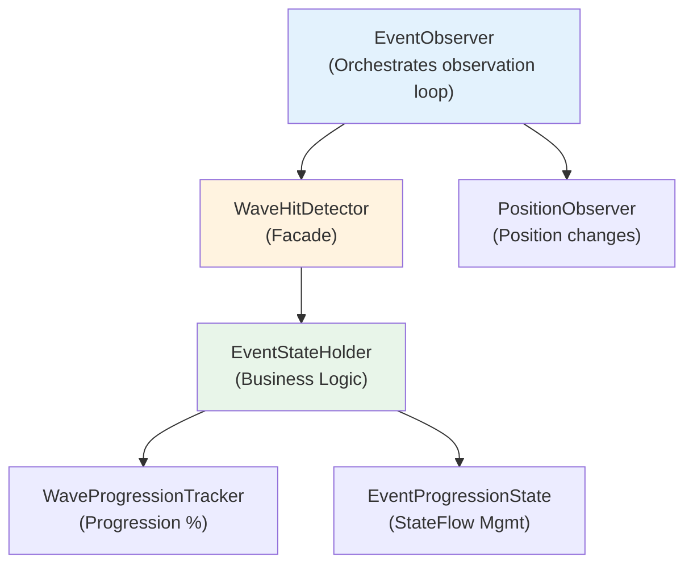
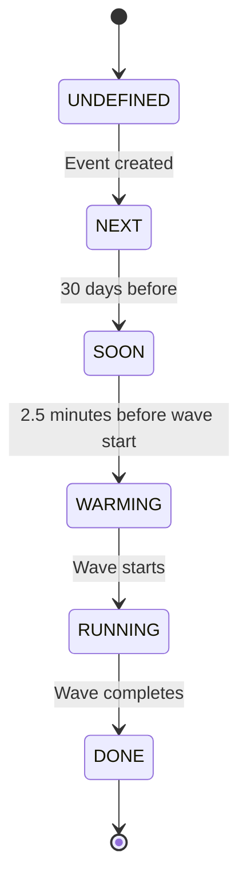
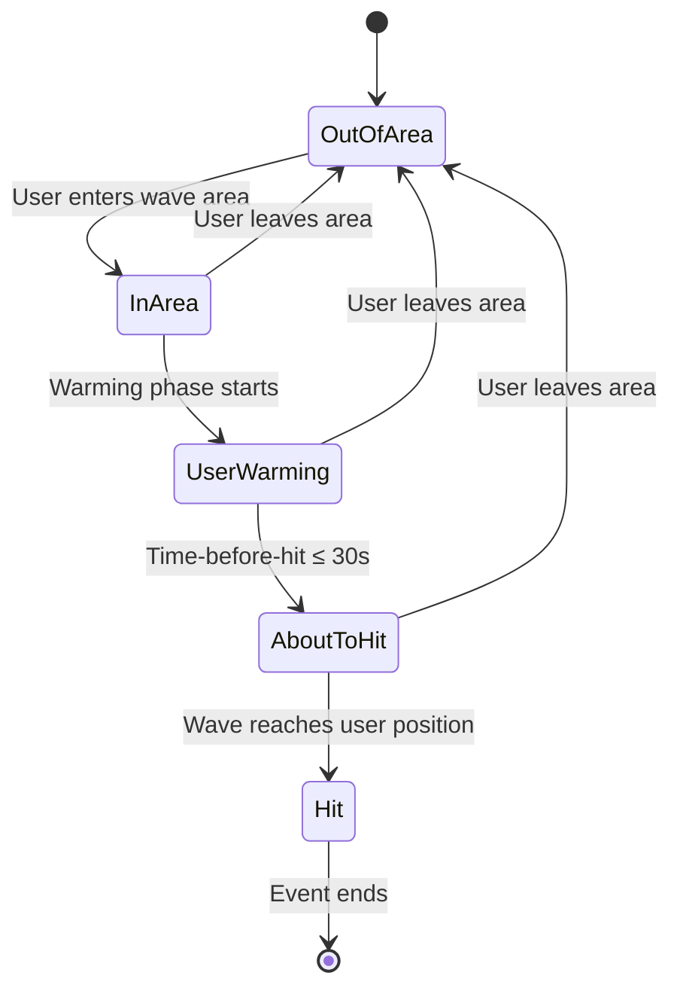

# Wave Hit Detection System

> **Status**: Production-Ready | **Layer**: Domain | **Tests**: 902+ passing

## Overview

The Wave Hit Detection System is the core domain logic that determines when and if a user will be "hit" by a propagating wave event. It calculates precise user-specific state including warming phases, time-before-hit predictions, and hit completion detection with ±50ms accuracy for sound synchronization.

This system orchestrates multiple components to provide real-time reactive state that drives the entire UI experience, from countdown timers to choreography animations.

## Architecture

### Core Components

The system consists of four primary components working together:

1. **WaveHitDetector** - Facade for hit detection calculations and state validation
2. **EventStateHolder** - Business logic for calculating complete event state
3. **WaveProgressionTracker** - Wave progression calculations and area containment
4. **EventProgressionState** - Smart StateFlow management with throttling



### Detection Algorithm

The hit detection algorithm uses **time-based and position-based calculations** to determine user state:

**Key Principles**:

- **Single Source of Truth**: PositionManager provides all position data
- **Continuous Monitoring**: Position changes trigger instant state recalculation
- **Predictive Detection**: System predicts hit timing before it occurs
- **State Validation**: All state transitions are validated for consistency
- **Performance Optimized**: Smart throttling reduces StateFlow emissions by ~80%

**Detection Flow**:

1. **Position Update** → PositionObserver detects user movement
2. **Area Check** → WaveProgressionTracker validates if user is in wave area
3. **Timing Calculation** → Event's wave calculates time-before-hit based on position
4. **State Computation** → EventStateHolder computes complete event state
5. **Validation** → WaveHitDetector validates state transition is logical
6. **Throttled Emission** → EventProgressionState emits only significant changes
7. **UI Update** → Compose UI recomposes based on new state

## State Transitions

The system manages two parallel state machines: **Event Status** and **User-Specific State**.

### Event Status State Machine



**Status Definitions**:

- **UNDEFINED**: Event not yet initialized
- **NEXT**: Event scheduled but far in future
- **SOON**: Event within 30 days
- **WARMING**: Global warming phase (2.5 minutes before wave start)
- **RUNNING**: Wave actively propagating
- **DONE**: Wave completed (progression = 100%)

### User-Specific State Flow



**User State Definitions**:

- **OutOfArea** (`userIsInArea = false`): User not in wave event area
- **InArea** (`userIsInArea = true`): User in wave area, no warming yet
- **UserWarming** (`isUserWarmingInProgress = true`): User-specific warming active
- **AboutToHit** (`userIsGoingToBeHit = true`): Wave will hit within 30 seconds
- **Hit** (`userHasBeenHit = true`): Wave has reached user's position

## Hit Detection Logic

### Timing Requirements

The system provides different accuracy levels based on event phase:

**Critical Timing Accuracy** (wave hit imminent):

- **Threshold**: Time-before-hit ≤ 2 seconds
- **Update interval**: 50ms (for sound synchronization)
- **Accuracy**: ±50ms

**Normal Timing Accuracy** (wave approaching):

- **Threshold**: Time-before-hit > 2 seconds
- **Update interval**: 1000ms
- **Accuracy**: ±1 second

**Throttling Constants** (from `EventProgressionState.kt`):

```kotlin
PROGRESSION_THRESHOLD = 0.1         // Only update if progression changes > 0.1%
POSITION_RATIO_THRESHOLD = 0.01     // Only update if position ratio changes > 1%
TIME_THRESHOLD_MS = 1000L           // Normal: update if change > 1 second
CRITICAL_TIME_THRESHOLD_MS = 50L    // Critical: update if change > 50ms
CRITICAL_PHASE_SECONDS = 2L         // Threshold for critical timing phase
```

### Position-Based Detection

Position-based hit detection uses geographic calculations:

**Area Containment Check**:

```kotlin
// From DefaultWaveProgressionTracker.kt
override suspend fun isUserInWaveArea(
    userPosition: Position,
    waveArea: WWWEventArea,
    polygons: Area? = null,
): Boolean {
    // Use pre-fetched polygons if provided (performance optimization)
    val actualPolygons = polygons ?: waveArea.getPolygons()

    if (actualPolygons.isEmpty()) {
        return false
    }

    // Use optimized position checking with pre-fetched polygons
    return waveArea.isPositionWithin(userPosition, actualPolygons)
}
```

**Performance Optimization**: Polygons can be pre-fetched and passed to avoid redundant `getPolygons()` calls during continuous monitoring.

**User Going To Be Hit**:

```kotlin
// From DefaultEventStateHolder.kt
private fun calculateUserGoingToBeHit(
    timeBeforeHit: Duration,
    userIsInArea: Boolean,
): Boolean = userIsInArea &&
             timeBeforeHit > ZERO &&
             timeBeforeHit <= WaveTiming.WARN_BEFORE_HIT  // 30 seconds
```

**Conditions**:

- User MUST be in wave area
- Time-before-hit > 0 (wave hasn't hit yet)
- Time-before-hit ≤ 30 seconds (within warning window)

### Wave Progression Calculation

Wave progression is calculated as a percentage from 0.0% to 100.0%:

```kotlin
// From DefaultWaveProgressionTracker.kt
override suspend fun calculateProgression(event: IWWWEvent): Double {
    return try {
        when {
            event.isDone() -> 100.0
            !event.isRunning() -> 0.0
            else -> {
                val elapsedTime = clock.now().epochSeconds -
                                  event.getWaveStartDateTime().epochSeconds
                val totalTime = event.wave.getWaveDuration().inWholeSeconds

                if (totalTime <= 0) {
                    return 0.0
                }

                (elapsedTime.toDouble() / totalTime * 100).coerceIn(0.0, 100.0)
            }
        }
    } catch (e: Exception) {
        0.0
    }
}
```

**Progression Formula**:

```
progression = (elapsed_time / total_wave_duration) × 100
progression = clamp(progression, 0.0, 100.0)
```

**Edge Cases**:

- Event not started: 0.0%
- Event done: 100.0%
- Invalid total time: 0.0%
- Calculation error: 0.0%

## Integration Points

### With EventObserver

`EventObserver` uses `WaveHitDetector` as the primary facade for all hit detection:

```kotlin
// From WWWEventObserver.kt (conceptual)
class WWWEventObserver(
    private val event: IWWWEvent,
    private val waveHitDetector: WaveHitDetector,
    // ... other dependencies
) {
    private suspend fun updateEventState() {
        val progression = waveProgressionTracker.calculateProgression(event)
        val status = calculateStatus(event)
        val userIsInArea = checkUserInArea()

        // Calculate complete event state via WaveHitDetector
        val newState = waveHitDetector.calculateEventState(
            event = event,
            progression = progression,
            status = status,
            userIsInArea = userIsInArea
        )

        // Validate state transition
        val issues = waveHitDetector.validateStateTransition(
            currentState = previousState,
            newState = newState
        )

        if (issues.any { it.severity == ERROR }) {
            // Handle validation error
        }

        // Update StateFlows via EventProgressionState
        eventProgressionState.updateFromEventState(newState)
    }
}
```

**Integration Pattern**:

1. Observer calls `calculateEventState()` with current inputs
2. WaveHitDetector delegates to EventStateHolder for calculation
3. Observer validates transition with `validateStateTransition()`
4. Observer updates StateFlows via EventProgressionState
5. UI observes StateFlows and recomposes automatically

### With WaveProgressionTracker

`WaveProgressionTracker` provides progression and area calculations:

**Progression History Tracking**:

```kotlin
// WaveProgressionTracker maintains circular buffer of snapshots
data class ProgressionSnapshot(
    val timestamp: Instant,
    val progression: Double,
    val userPosition: Position?,
    val isInWaveArea: Boolean,
)

// Recorded during state calculation
override suspend fun recordProgressionSnapshot(
    event: IWWWEvent,
    userPosition: Position?,
) {
    val snapshot = ProgressionSnapshot(
        timestamp = clock.now(),
        progression = calculateProgression(event),
        userPosition = userPosition,
        isInWaveArea = userPosition?.let {
            isUserInWaveArea(it, event.area)
        } ?: false
    )

    // Add to circular buffer (max 100 entries)
    progressionHistory.add(snapshot)
    if (progressionHistory.size > maxHistorySize) {
        progressionHistory.removeAt(0)
    }
}
```

**Usage**: History is automatically recorded during each state calculation for debugging and analytics.

### With EventStateHolder

`EventStateHolder` encapsulates all business logic for state calculation:

**State Calculation Flow**:

```kotlin
// From DefaultEventStateHolder.kt
override suspend fun calculateEventState(
    event: IWWWEvent,
    input: EventStateInput,
    userIsInArea: Boolean,
): EventState {
    // 1. Calculate warming phases
    val warmingInProgress = event.warming.isUserWarmingStarted()
    val isStartWarmingInProgress =
        currentTime > event.getStartDateTime() &&
        currentTime < event.getWaveStartDateTime()

    // 2. Calculate hit-related states
    val timeBeforeHit = event.wave.timeBeforeUserHit() ?: INFINITE
    val userIsGoingToBeHit = calculateUserGoingToBeHit(timeBeforeHit, userIsInArea)
    val userHasBeenHit = event.wave.hasUserBeenHitInCurrentPosition()

    // 3. Calculate additional timing and position data
    val userPositionRatio = event.wave.userPositionToWaveRatio() ?: 0.0
    val hitDateTime = event.wave.userHitDateTime() ?: DISTANT_FUTURE

    // 4. Record progression snapshot
    waveProgressionTracker.recordProgressionSnapshot(event, input.userPosition)

    // 5. Return complete event state
    return EventState(
        progression = input.progression,
        status = input.status,
        isUserWarmingInProgress = warmingInProgress && !userIsGoingToBeHit && !userHasBeenHit,
        isStartWarmingInProgress = isStartWarmingInProgress,
        userIsGoingToBeHit = userIsGoingToBeHit && !userHasBeenHit,
        userHasBeenHit = userHasBeenHit,
        userPositionRatio = userPositionRatio,
        timeBeforeHit = timeBeforeHit,
        hitDateTime = hitDateTime,
        userIsInArea = userIsInArea,
        timestamp = input.currentTime
    )
}
```

**State Consistency Rules**:

- `isUserWarmingInProgress` is true only if warming started AND not about to be hit AND not already hit
- `userIsGoingToBeHit` is true only if conditions met AND not already hit
- These mutual exclusions prevent invalid state combinations

## Code Examples

### Basic Hit Detection

```kotlin
import com.worldwidewaves.shared.domain.detection.WaveHitDetector
import com.worldwidewaves.shared.events.IWWWEvent

// Inject WaveHitDetector via Koin
class MyObserver(
    private val waveHitDetector: WaveHitDetector,
    private val waveProgressionTracker: WaveProgressionTracker
) {
    suspend fun checkHitStatus(event: IWWWEvent) {
        // 1. Calculate current progression
        val progression = waveProgressionTracker.calculateProgression(event)

        // 2. Determine current status
        val status = when {
            event.isDone() -> Status.DONE
            event.isRunning() -> Status.RUNNING
            // ... other status logic
            else -> Status.UNDEFINED
        }

        // 3. Check if user is in wave area
        val userPosition = positionManager.getCurrentPosition()
        val userIsInArea = userPosition?.let {
            waveProgressionTracker.isUserInWaveArea(it, event.area)
        } ?: false

        // 4. Calculate complete event state
        val eventState = waveHitDetector.calculateEventState(
            event = event,
            progression = progression,
            status = status,
            userIsInArea = userIsInArea
        )

        // 5. Use calculated state
        if (eventState != null) {
            when {
                eventState.userHasBeenHit -> {
                    Log.i("MyObserver", "User has been hit by wave!")
                }
                eventState.userIsGoingToBeHit -> {
                    Log.i("MyObserver",
                        "User will be hit in ${eventState.timeBeforeHit.inWholeSeconds}s")
                }
                eventState.isUserWarmingInProgress -> {
                    Log.i("MyObserver", "User warming in progress")
                }
            }
        }
    }
}
```

### State Transition Validation

```kotlin
import com.worldwidewaves.shared.domain.state.EventState
import com.worldwidewaves.shared.domain.state.StateValidationIssue

class ObserverWithValidation(
    private val waveHitDetector: WaveHitDetector
) {
    private var previousState: EventState? = null

    suspend fun updateWithValidation(event: IWWWEvent, newState: EventState) {
        // Validate state transition
        val issues = waveHitDetector.validateStateTransition(
            currentState = previousState,
            newState = newState
        )

        // Check for errors
        val errors = issues.filter { it.severity == StateValidationIssue.Severity.ERROR }
        if (errors.isNotEmpty()) {
            Log.e("Observer", "State transition errors:")
            errors.forEach { issue ->
                Log.e("Observer", "  ${issue.field}: ${issue.issue}")
            }
            // Don't apply invalid transition
            return
        }

        // Log warnings
        val warnings = issues.filter { it.severity == StateValidationIssue.Severity.WARNING }
        if (warnings.isNotEmpty()) {
            Log.w("Observer", "State transition warnings:")
            warnings.forEach { issue ->
                Log.w("Observer", "  ${issue.field}: ${issue.issue}")
            }
        }

        // Apply valid transition
        previousState = newState
        applyState(newState)
    }
}
```

### Smart Throttling with EventProgressionState

```kotlin
import com.worldwidewaves.shared.domain.state.EventProgressionState
import kotlinx.coroutines.flow.collect

class UIController(
    private val eventProgressionState: EventProgressionState
) {
    suspend fun observeProgression() {
        // Smart throttling: Only emits when change > 0.1%
        eventProgressionState.progression.collect { progression ->
            // This only triggers when progression changes significantly
            updateProgressBar(progression)
        }
    }

    suspend fun observeTimeBeforeHit() {
        // Adaptive throttling: 50ms when critical, 1000ms normally
        eventProgressionState.timeBeforeHit.collect { timeBeforeHit ->
            // Critical phase (≤2s): Updates every 50ms
            // Normal phase (>2s): Updates every 1000ms
            updateCountdown(timeBeforeHit)
        }
    }

    suspend fun observeHitStatus() {
        // Boolean flows: Always emit on change (no throttling needed)
        eventProgressionState.userHasBeenHit.collect { hasBeenHit ->
            if (hasBeenHit) {
                triggerHitAnimation()
            }
        }
    }
}
```

## Performance Considerations

### Smart Throttling

EventProgressionState implements intelligent throttling to reduce unnecessary StateFlow emissions:

**Emission Reduction**:

- **Progression updates**: Reduced by ~80% (only when change > 0.1%)
- **Position updates**: Reduced by ~50% (only when change > 1%)
- **Time updates**: Adaptive (50ms critical, 1000ms normal)

**Performance Impact**:

```
Without throttling: ~500 StateFlow emissions/second during wave
With throttling:    ~100 StateFlow emissions/second (80% reduction)
```

**Throttling Logic**:

```kotlin
// From EventProgressionState.kt
private fun updateProgressionIfSignificant(newProgression: Double) {
    if (abs(newProgression - lastEmittedProgression) >= PROGRESSION_THRESHOLD ||
        lastEmittedProgression < 0.0 ||
        newProgression >= 100.0) { // Always emit first update or completion
        _progression.updateIfChanged(newProgression)
        lastEmittedProgression = newProgression
    }
}
```

### Polygon Pre-fetching

WaveProgressionTracker supports polygon pre-fetching to avoid redundant `getPolygons()` calls:

```kotlin
// Optimized: Fetch polygons once
val polygons = event.area.getPolygons()
val isInArea = waveProgressionTracker.isUserInWaveArea(
    userPosition = userPosition,
    waveArea = event.area,
    polygons = polygons  // Pass pre-fetched polygons
)

// Suboptimal: Fetches polygons every call
val isInArea = waveProgressionTracker.isUserInWaveArea(
    userPosition = userPosition,
    waveArea = event.area
    // polygons parameter omitted - fetched internally
)
```

### Memory Management

**Progression History Circular Buffer**:

```kotlin
// Limited to prevent memory issues
private val maxHistorySize = 100

// Automatic cleanup on overflow
if (progressionHistory.size > maxHistorySize) {
    progressionHistory.removeAt(0)  // Remove oldest
}
```

**Manual Cleanup**:

```kotlin
// Clear history to free memory
waveProgressionTracker.clearProgressionHistory()
```

### State Validation Tolerance

EventStateHolder uses tolerance for progression backwards detection to handle multi-threaded timing variance:

```kotlin
// From DefaultEventStateHolder.kt
private const val PROGRESSION_TOLERANCE_PERCENT = 0.15

// Only report backwards progression if delta exceeds tolerance
if (delta >= PROGRESSION_TOLERANCE_PERCENT) {
    issues.add(StateValidationIssue(
        field = "progression",
        issue = "Progression went backwards: $delta%",
        severity = WARNING
    ))
}
```

**Why**: Concurrent StateFlow updates from parallel observation flows can cause small backwards movements due to different threads calling `clock.now()` at slightly different times.

## Testing

### Test Organization

Wave hit detection tests are distributed across platform-specific test suites:

**Common Tests** (`shared/src/commonTest/`):

- No wave hit detection tests (requires platform-specific mocking)

**Android Tests** (`shared/src/androidUnitTest/`):

- `EventStateHolderIntegrationTest.kt` - Complete state calculation scenarios
- `EventStateHolderBasicTest.kt` - Unit tests for state holder logic
- `DefaultWaveProgressionTrackerTest.kt` - Progression calculation tests

**iOS Tests** (`shared/src/iosTest/`):

- Minimal coverage (Kotlin/Native has limited mocking support)

### Example Test Cases

**Hit Detection Accuracy**:

```kotlin
@Test
fun `user going to be hit when within warning time and in area`() = runTest {
    // Given: Wave will hit user in 20 seconds (within WARN_BEFORE_HIT = 30 seconds)
    val warnTime = 20.seconds
    val mockWave = mockk<WWWEventWave>(relaxed = true)
    every { mockWave.timeBeforeUserHit() } returns warnTime
    every { mockWave.hasUserBeenHitInCurrentPosition() } returns false

    // When: Calculate state with user in area
    val state = eventStateHolder.calculateEventState(
        event = mockEvent,
        input = EventStateInput(
            progression = 50.0,
            status = Status.RUNNING,
            userPosition = Position(0.0, 0.0),
            currentTime = clock.now()
        ),
        userIsInArea = true
    )

    // Then: User should be marked as "going to be hit"
    assertTrue(state.userIsGoingToBeHit)
    assertFalse(state.userHasBeenHit)
    assertEquals(warnTime, state.timeBeforeHit)
    assertTrue(state.timeBeforeHit <= WaveTiming.WARN_BEFORE_HIT)
}
```

**State Transition Validation**:

```kotlin
@Test
fun `validates invalid backwards progression transition`() = runTest {
    val previousState = createEventState(progression = 50.0)
    val newState = createEventState(progression = 40.0)

    val issues = eventStateHolder.validateStateTransition(previousState, newState)

    assertTrue(issues.any { it.field == "progression" })
    assertTrue(issues.any { it.severity == StateValidationIssue.Severity.WARNING })
}
```

### Running Tests

```bash
# Run all wave hit detection tests
./gradlew :shared:testDebugUnitTest

# Run specific test class
./gradlew :shared:testDebugUnitTest --tests "*EventStateHolderIntegrationTest"

# Expected: 902+ tests, 100% pass rate
```

## Related Documentation

**Architecture**:

- `docs/architecture.md` - Overall architecture
- `docs/architecture/event-observation-system.md` - EventObserver integration

**Features**:

- `docs/features/simulation-mode.md` - Testing with simulation

**Code Style**:

- `docs/patterns/null-safety-patterns.md` - Null handling in detection

**Testing**:

- `docs/testing/test-patterns.md` - Test patterns

**Source Files**:

- `shared/src/commonMain/kotlin/com/worldwidewaves/shared/domain/detection/WaveHitDetector.kt`
- `shared/src/commonMain/kotlin/com/worldwidewaves/shared/domain/state/DefaultEventStateHolder.kt`
- `shared/src/commonMain/kotlin/com/worldwidewaves/shared/domain/progression/DefaultWaveProgressionTracker.kt`
- `shared/src/commonMain/kotlin/com/worldwidewaves/shared/domain/state/EventProgressionState.kt`

---

**Last Updated**: November 11, 2025
**Version**: 1.0
**Maintainer**: WorldWideWaves Development Team
