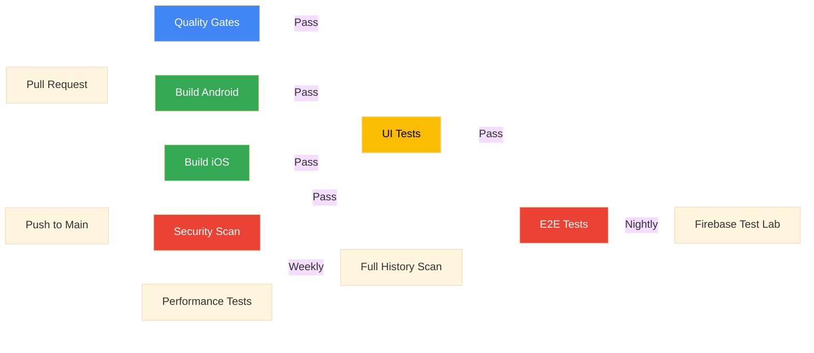

# CI/CD Pipeline

WorldWideWaves uses GitHub Actions for continuous integration and delivery, implementing a multi-stage pipeline with quality gates, automated testing, and multi-platform builds.

## Pipeline Overview



## Workflows

### 01 - Build Android

**File:** `.github/workflows/01-build-android.yml`

**Purpose:** Fast compilation feedback for Android platform without full APK assembly.

**Trigger:**
- Push to `main`
- Pull requests to `main`

**Environment:**
- Runner: `ubuntu-latest`
- JDK: 17 (Temurin)
- Timeout: 30 minutes

**Steps:**
1. Validate Gradle wrapper (security check)
2. Setup JDK 17
3. Restore Gradle cache
4. Compile debug Kotlin (`:shared:compileDebugKotlinAndroid`, `:composeApp:compileDebugKotlin`)
5. Compile release Kotlin
6. Store Gradle cache (main branch only)

**Optimizations:**
- Cache read-only for non-main branches
- Parallel compilation
- Skip APK assembly for faster feedback

### 02 - Build iOS

**File:** `.github/workflows/02-build-ios.yml`

**Purpose:** Verify iOS compilation and framework generation.

**Trigger:**
- Push to `main`
- Pull requests to `main`

**Environment:**
- Runner: `macos-15`
- Xcode: 16.0
- JDK: 17 (Temurin)
- Timeout: 30 minutes per job

**Jobs:**

#### 1. Build Framework
Compiles Kotlin Multiplatform iOS framework.

**Steps:**
- Setup JDK 17
- Restore Gradle cache
- `./gradlew :shared:linkDebugFrameworkIosSimulatorArm64` (Simulator)
- `./gradlew :shared:linkDebugFrameworkIosArm64` (Device)

#### 2. Build App
Builds iOS app using Xcode.

**Steps:**
- Checkout code
- Setup Xcode 16.0
- Select iPhone 15 Simulator (iOS 18.0)
- Xcodebuild with `CODE_SIGNING_ALLOWED=NO`
- Upload build logs on failure

**Output:**
- iOS app binary (unsigned)
- Framework for Simulator and Device

### 03 - Quality & Security Gates

**File:** `.github/workflows/03-code-quality.yml`

**Purpose:** Enforce code quality, run tests, and check security vulnerabilities.

**Trigger:**
- Push to `main`
- Pull requests to `main`

**Jobs (5 parallel):**

#### 1. Lint
**Tools:**
- ktlint (Kotlin linting)
- detekt (static analysis)

**Commands:**
```bash
./gradlew ktlintCheck
./gradlew detekt
```

**Output:** Lint reports uploaded as artifacts

#### 2. Test
**Tests:**
- Unit tests (`./gradlew :shared:testDebugUnitTest`)
- Test results published with EnricoMi/publish-unit-test-result-action

**Coverage:** 902+ tests

#### 3. UI Test Compilation
**Purpose:** Verify UI test classes compile without running emulator

**Command:**
```bash
./gradlew :composeApp:compileDebugAndroidTestKotlin
```

#### 4. Dependency Check
**Purpose:** Scan for known vulnerabilities in dependencies

**Tool:** OWASP Dependency-Check (main branch only)

**Command:**
```bash
./gradlew dependencyCheckAnalyze
```

#### 5. License Check
**Purpose:** Ensure license compliance

**Command:**
```bash
./gradlew generateLicenseReport
```

**Output:** JSON report in `build/reports/licenses/`

#### Quality Summary
Aggregates results from all jobs and fails if critical issues found.

### 04 - UI Tests (Android)

**File:** `.github/workflows/04-ui-tests-android.yml`

**Purpose:** Run comprehensive UI tests on Android emulator.

**Trigger:**
- Pull requests to `main`
- Daily scheduled run (2 AM UTC)
- Manual dispatch

**Environment:**
- Runner: `ubuntu-latest` with KVM acceleration
- Android Emulator: API 30 (Android 11), Pixel 3a
- Timeout: 45 minutes

**Steps:**
1. Setup JDK 17
2. Restore Gradle cache
3. Generate Firebase config
4. Launch Android Emulator (headless with AVD caching)
5. Run UI tests (`./gradlew :composeApp:connectedDebugAndroidTest`)
6. Capture screenshots from device
7. Publish test results
8. Analyze performance (main branch only)

**Test Categories:**
- Critical path tests (splash → events → join wave)
- Edge cases (rotation, memory pressure, multi-window)
- Accessibility (screen readers, keyboard navigation, WCAG)
- Screenshot tests (visual regression)
- Integration tests (maps, real-time coordination)

**Artifacts:**
- Test reports (HTML)
- Screenshots
- Logcat output

### 05 - End-to-End Tests

**File:** `.github/workflows/05-e2e-tests.yml`

**Purpose:** Execute critical integration tests and multi-device testing.

**Trigger:**
- Push to `main`
- Daily scheduled run (2 AM UTC)
- Manual dispatch

**Timeout:** 60 minutes

**Jobs:**

#### 1. Real Integration Tests
Run critical tests on Android emulator with real services.

**Steps:**
- Setup Android emulator (API 30)
- Run integration test suite
- Analyze performance regressions for PRs

#### 2. Firebase Test Lab
Multi-device testing on physical devices (main branch only).

**Devices:**
- Pixel 2 (API 28)
- Pixel 4 (API 30)
- Pixel 5 (API 33)

**Steps:**
- Build debug APK and test APK
- Upload to Firebase Test Lab
- Execute tests across device matrix
- Download results from GCS bucket

**Configuration:**
```bash
gcloud firebase test android run \
  --type instrumentation \
  --app app-debug.apk \
  --test app-debug-androidTest.apk \
  --device model=Pixel2,version=28 \
  --device model=Pixel4,version=30 \
  --device model=Pixel5,version=33 \
  --results-bucket=gs://worldwidewaves-test-results \
  --timeout=30m
```

#### 3. Notify Results
Send notifications on failure:
- Slack webhook (if configured)
- Create GitHub issue with failure details

### 06 - Security Scan

**File:** `.github/workflows/security-scan.yml`

**Purpose:** Continuous security monitoring to prevent secrets and sensitive data from being committed.

**Trigger:**
- Push to `main` or `develop`
- Pull requests to `main` or `develop`
- Weekly scheduled run (Sunday 00:00 UTC)
- Manual dispatch

**Jobs (4 parallel):**

#### 1. Gitleaks Secret Scanning
**Tool:** [Gitleaks](https://github.com/gitleaks/gitleaks)

**Purpose:** Scan entire git history for exposed secrets and API keys.

**Features:**
- Full repository history scan
- Pattern matching for 100+ secret types
- Automatic detection of entropy-based secrets
- Upload report artifacts on failure

**Coverage:**
- API keys (Firebase, AWS, OpenAI, GitHub, Slack, Stripe)
- OAuth tokens
- Private keys
- Database connection strings
- JWT secrets

#### 2. Firebase Configuration Check
**Purpose:** Ensure sensitive Firebase config files are not tracked in git.

**Checks:**
- Verifies `composeApp/google-services.json` is not tracked
- Verifies `iosApp/**/GoogleService-Info.plist` is not tracked
- Scans codebase for hardcoded Firebase API keys (excluding templates/docs)
- Fails build if sensitive files found

#### 3. API Key Pattern Scan
**Purpose:** Detect common API key patterns in codebase.

**Patterns Detected:**
- OpenAI API keys (`sk-proj-...`)
- GitHub Personal Access Tokens (`ghp_...`, `gho_...`, `ghs_...`)
- Slack Bot Tokens (`xoxb-...`, `xoxp-...`)
- Stripe Keys (`sk_live_...`, `pk_live_...`)
- AWS Access Keys (`AKIA...`)

**Exclusions:**
- Documentation files (`*.md`)
- Template files (`*.template`)
- Security tooling files (`.git-hooks/`, `.github/workflows/`)

#### 4. TruffleHog Secret Scanning
**Tool:** [TruffleHog](https://github.com/trufflesecurity/trufflehog)

**Purpose:** Entropy-based secret detection for custom or unknown secret types.

**Features:**
- High-entropy string detection
- Regex pattern matching
- Historical commit scanning
- Informational (doesn't block builds, but flags potential issues)

#### Security Summary
Aggregates results from all security jobs and fails build if critical secrets detected.

**Local Pre-commit Protection:**

The repository includes pre-commit hooks that prevent accidental secret commits:

```bash
# Located in .git-hooks/pre-commit
# Automatically blocks:
# - Firebase config files (google-services.json, GoogleService-Info.plist)
# - Firebase API key patterns (AIzaSy...)
# - Common API keys (OpenAI, GitHub, Slack, Stripe, AWS)
# - Runs gitleaks on staged changes if available
```

**Best Practices:**
- Never commit `google-services.json` or `GoogleService-Info.plist`
- Use `*.template` files with placeholders for config examples
- Store secrets in `local.properties` (gitignored) or GitHub Secrets
- Use environment variables for sensitive data
- Run `gitleaks detect` locally before pushing

### 07 - Performance Tests

**File:** `.github/workflows/06-performance-tests.yml`

**Purpose:** Measure app performance and detect regressions.

**Trigger:**
- Nightly scheduled run (3 AM UTC)
- Manual dispatch

**Test Suites:**
1. **App Launch Performance**
   - Cold start time
   - Time to interactive
   - Memory footprint

2. **Runtime Performance**
   - Frame rate during choreography
   - Position update latency
   - State flow emission frequency

3. **Battery Optimization**
   - GPS usage efficiency
   - Wake lock duration
   - Background service impact

**Configuration:**
- Higher resources (4GB RAM, 1GB heap, 8GB disk)
- Continue on error (informational only)

**Output:**
- Performance metrics JSON
- Regression analysis
- GitHub issue on significant regression

### 99 - Pipeline Status

**File:** `.github/workflows/99-pipeline-status.yml`

**Purpose:** Aggregate status for single badge display.

**Trigger:**
- Push to any branch
- Pull requests
- Manual dispatch

**Process:**
1. Wait for workflows to complete (45 min timeout)
2. Check status of:
   - Quality Gates (03)
   - Build Android (01)
   - Build iOS (02)
   - Security Scan (06)
   - E2E Tests (05)
3. Generate summary in GitHub Actions UI
4. Return overall success/failure

**Badge URL:**
```markdown
[](https://github.com/mglcel/WorldWideWaves/actions/workflows/99-pipeline-status.yml)
```

### Test Quality Validation

**File:** `.github/workflows/test-quality.yml`

**Purpose:** Enforce test quality standards and detect anti-patterns.

**Trigger:**
- Push to `main` or `develop`
- Pull requests to `main`

**Checks:**
1. **Anti-pattern Detection**
   ```bash
   ./scripts/detect-test-antipatterns.sh
   ```
   Detects:
   - Excessive mocking
   - Framework testing
   - Trivial tests
   - Missing assertions

2. **Performance Budget**
   ```bash
   ./gradlew testFast
   ```
   Enforces 100ms budget per test

3. **Mutation Testing** (main branch only)
   Uses pitest to verify test effectiveness

## Secrets & Environment Variables

### Required Secrets

Configure in GitHub repository settings:

| Secret | Purpose | Used In |
|--------|---------|---------|
| `FIREBASE_SERVICE_ACCOUNT_KEY` | Firebase Test Lab authentication | 05-e2e-tests.yml |
| `SLACK_WEBHOOK_URL` | Failure notifications (optional) | 05-e2e-tests.yml |

### Local Development Secrets

Store in `local.properties` (not committed):

```properties
# Firebase configuration
FIREBASE_PROJECT_ID=your-project-id
FIREBASE_PROJECT_NUMBER=123456789
FIREBASE_MOBILE_SDK_APP_ID=1:123456789:android:abc123
FIREBASE_API_KEY=AIza...

# Translation (optional)
OPENAI_API_KEY=sk-...
```

## Environments

### Development
- Branch: Any feature branch
- Tests: Unit + UI compilation only
- Caching: Read-only

### Staging
- Branch: `develop` (if used)
- Tests: Full test suite
- Firebase: Separate staging project

### Production
- Branch: `main`
- Tests: All tests including performance
- Firebase Test Lab: Multi-device testing
- Deployment: Manual approval required

## Running Workflows Locally

### Emulate CI Build

```bash
# Run quality gates locally
./gradlew ktlintCheck detekt testDebugUnitTest

# Compile Android
./gradlew :shared:compileDebugKotlinAndroid :composeApp:compileDebugKotlin

# Build iOS framework
./gradlew :shared:linkDebugFrameworkIosSimulatorArm64
```

### Run UI Tests Locally

```bash
# Launch emulator
emulator -avd Pixel_3a_API_30 -no-window &

# Wait for boot
adb wait-for-device

# Run UI tests
./gradlew :composeApp:connectedDebugAndroidTest
```

### Firebase Test Lab Locally

Requires `gcloud` CLI installed and authenticated:

```bash
# Build APKs
./gradlew :composeApp:assembleDebug :composeApp:assembleDebugAndroidTest

# Run on Firebase Test Lab
gcloud firebase test android run \
  --type instrumentation \
  --app composeApp/build/outputs/apk/debug/composeApp-debug.apk \
  --test composeApp/build/outputs/apk/androidTest/debug/composeApp-debug-androidTest.apk \
  --device model=Pixel2,version=28
```

## Release Process

### Version Bumping

Update version in `composeApp/build.gradle.kts`:

```kotlin
defaultConfig {
    versionCode = 27  // Increment
    versionName = "v0.23"  // Update
}
```

### Tag Release

```bash
git tag -a v0.23 -m "Release v0.23"
git push origin v0.23
```

### Manual Deployment

Android release builds require:
1. Signing configuration in `local.properties`
2. Release build: `./gradlew :composeApp:assembleRelease`
3. Upload to Play Console

iOS release builds require:
1. Xcode code signing configuration
2. Archive in Xcode
3. Upload to TestFlight/App Store Connect

## Performance Benchmarks

**CI Build Times (approx):**
- Quality Gates: 8-12 minutes
- Build Android: 5-8 minutes
- Build iOS: 12-18 minutes
- UI Tests: 25-35 minutes
- E2E Tests: 45-60 minutes
- Performance Tests: 30-45 minutes

**Optimization Tips:**
- Use Gradle cache (50% faster builds)
- Run tests in parallel where possible
- Skip unnecessary test suites for PR validation
- Use AVD caching for UI tests (3x faster emulator startup)

## Troubleshooting

### Build Failures

**Gradle dependency resolution errors:**
```bash
./gradlew --refresh-dependencies
```

**Out of memory:**
Increase heap in `gradle.properties`:
```properties
org.gradle.jvmargs=-Xmx8g
```

### Test Failures

**Emulator fails to start:**
- Check KVM acceleration on Linux
- Ensure sufficient disk space (8GB+)
- Use AVD with lower API level (API 28-30)

**Firebase Test Lab timeouts:**
- Reduce test suite size
- Increase timeout in workflow
- Check Firebase quota limits

### iOS Build Failures

**Framework linking errors:**
```bash
# Clean build
./gradlew clean
rm -rf shared/build/

# Rebuild framework
./gradlew :shared:linkDebugFrameworkIosSimulatorArm64
```

**Xcode build errors:**
- Verify Xcode version (16.0+)
- Clean derived data: `rm -rf ~/Library/Developer/Xcode/DerivedData`
- Ensure code signing is disabled for CI builds

## Further Reading

- [Architecture](architecture.md)
- [Development Workflow](development.md)
- [Environment Setup](environment-setup.md)
- [Contributing Guidelines](contributing.md)
