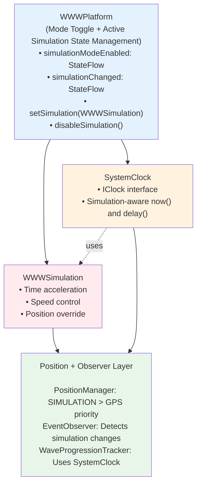
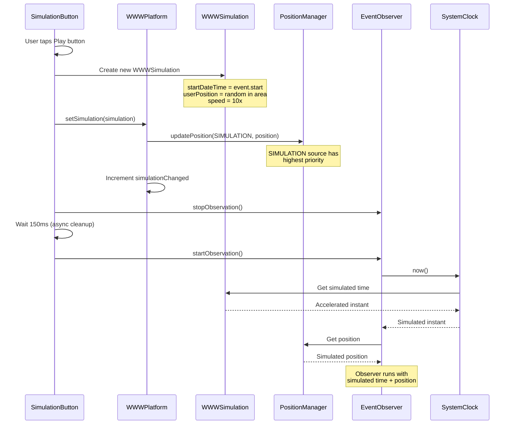

# Simulation Mode

> **Status**: Production-Ready
> **Platforms**: Android + iOS | **Tests**: 911+ passing

## Table of Contents

1. [Overview](#overview)
2. [Architecture](#architecture)
3. [User Guide](#user-guide)
4. [Implementation Details](#implementation-details)
5. [Integration Points](#integration-points)
6. [Testing](#testing)
7. [Troubleshooting](#troubleshooting)
8. [FAQ](#faq)

---

## Overview

**Simulation Mode** is a debug-only feature that enables developers and testers to experience wave events in accelerated time without waiting for real events to occur. It provides a powerful testing environment for validating event participation, wave progression, choreography, and location-based features.

### What is Simulation Mode?

Simulation mode allows you to:

1. **Time Travel**: Fast-forward through events at 1-500x speed (default 10x)
2. **Position Override**: Test event participation from any location within event areas
3. **Instant Testing**: Start events immediately without waiting for scheduled start times
4. **Full Integration**: Experience complete event flow including warming, wave hit detection, and choreographies

### Key Concept: Two-Tier Architecture

Simulation mode operates on two distinct levels:

1. **Simulation Mode** (the toggle): Enables/disables simulation UI controls globally
2. **Active Simulation** (the instance): A running simulation for a specific event with position and time acceleration

**Example**: Mode can be ON while no simulation is running, or a simulation can be active for Event A while viewing Event B.

### User Experience Flow

```
1. User enables simulation mode → FAQ button appears on event screens
2. User taps FAQ button → Simulation mode activated (Play button appears)
3. User taps Play button → Active simulation starts
   ├─ Random position generated within event area
   ├─ Time accelerated 10x (configurable)
   ├─ Event observer restarted with simulation context
   └─ User experiences event as if physically present
4. User taps Stop button (X icon) → Simulation stops
5. User disables FAQ button → Simulation mode deactivated
```

---

## Architecture

### System Components



### Data Flow: Starting Simulation



### Key Classes

| Class | Location | Responsibility |
| ------- | ---------- | ---------------- |

| `WWWPlatform` | `/shared/src/commonMain/.../Platform.kt` | Mode toggle, simulation state, reactive change tracking |
| `WWWSimulation` | `/shared/src/commonMain/.../WWWSimulation.kt` | Time acceleration, speed control, position storage |
| `SystemClock` | `/shared/src/commonMain/.../events/utils/ClockProvider.kt` | Time abstraction with simulation awareness |
| `SimulationButton` | `/shared/src/commonMain/.../ui/components/shared/SimulationButton.kt` | UI control for starting/stopping simulations |
| `PositionManager` | `/shared/src/commonMain/.../position/PositionManager.kt` | Position priority system (SIMULATION > GPS) |
| `EventObserver` | `/shared/src/commonMain/.../domain/observation/EventObserver.kt` | Simulation change detection, observer restart |

---

## User Guide

### Activating Simulation Mode

**Prerequisite**: Debug builds only (controlled by `PlatformEnabler.isDebugBuild`)

**Steps**:

1. Navigate to any event detail screen
2. Tap the **FAQ button** (question mark icon) in the top-right corner
3. Simulation mode is now **enabled** globally
4. A **Play button** (red play icon) appears on the right side of the screen

**Visual Indicators**:

- FAQ button visible: Simulation mode can be activated
- Play button visible: Simulation mode is active, can start simulations

### Starting a Simulation

**Prerequisites**:

- Simulation mode is enabled (Play button visible)
- Event map is available (downloaded for offline use)

**Steps**:

1. Tap the **Play button** (▶️ red icon)
2. Button shows loading indicator (circular spinner)
3. Shortly after, button changes to **Stop button** (✕ red icon)
4. Simulation is now **active**:
   - Your position is set to a random location within the event area
   - Time is accelerated 10x (10 real seconds = 100 simulated seconds)
   - Event observer is restarted with simulation context

**What Happens During Simulation**:

```
Timeline (10x speed):
─────────────────────────────────────────────────────►
Real Time:     0s      6s      12s     18s     24s
Simulated:     0s      60s     120s    180s    240s
               │       │       │       │       │
               Event   Warming Wave    Hit     Post-Hit
               Start   Phase   Approaches
```

- **Warming Phase** (60s simulated = 6s real): Progressive animations play
- **Waiting Phase** (5s simulated = 0.5s real): Countdown before wave hit
- **Hit Moment**: Sound plays, hit animation displays, haptic feedback
- **Progression Updates**: Wave progresses across map in accelerated time

### Stopping a Simulation

**Steps**:

1. Tap the **Stop button** (✕ red icon)
2. Button changes back to **Play button** (▶️)
3. Simulation is now **stopped**:
   - Position reverts to real GPS location
   - Time reverts to real system time
   - Event observer is restarted with real context

### Deactivating Simulation Mode

**Steps**:

1. Ensure no simulation is running (tap Stop button if needed)
2. Tap the **FAQ button** again
3. Simulation mode is now **disabled**
4. Play button disappears from all screens

---

## Implementation Details

### Time Acceleration Mechanism

**File**: `/shared/src/commonMain/kotlin/com/worldwidewaves/shared/WWWSimulation.kt`

Time acceleration uses a **checkpoint-based system** for accurate time calculation:

```kotlin
// WWWSimulation.kt:44-58
private data class TimeCheckpoint(
    val realTime: Instant,
    val simulatedTime: Instant,
)

// Calculate current simulated time
fun now(): Instant {
    // Real time elapsed since last checkpoint
    val elapsedRealTime = Clock.System.now() - lastCheckpoint.realTime

    // Apply speed multiplier
    val simulatedElapsed = elapsedRealTime * speed

    // Add to checkpoint's simulated time
    return lastCheckpoint.simulatedTime + simulatedElapsed
}
```

**Key Features**:

- **Speed Range**: 1-500x (default 10x)
- **Checkpoint Updates**: New checkpoint created when speed changes
- **Accuracy**: Millisecond-precise across speed changes
- **Speed Control**: `setSpeed()`, `pause()`, `resume()`, `reset()`

**Example**: 10x speed simulation

```kotlin
// Real elapsed time: 1 second
// Simulated elapsed time: 10 seconds
// If event started at 14:00:00, after 1 real second: 14:00:10
```

### Position Simulation with Priority System

**File**: `/shared/src/commonMain/kotlin/com/worldwidewaves/shared/position/PositionManager.kt`

Position sources have explicit priority ordering:

```kotlin
// PositionManager.kt:59-62
enum class PositionSource {
    SIMULATION, // Highest priority - debug/testing
    GPS,        // Standard priority - real device location
}
```

**Priority Resolution** (`PositionManager.kt:176-201`):

```kotlin
private fun shouldAcceptUpdate(current: PositionState, new: PositionState): Boolean {
    // Always accept if no current position
    if (current.position == null) return true

    // Always accept clearing operations
    if (new.position == null) return true

    // Accept if new source has higher priority (lower ordinal)
    if (new.source.ordinal <= current.source.ordinal) return true

    return false
}
```

**Result**: Simulation position always overrides GPS, enabling reliable testing regardless of device location.

**Lifecycle**:

```kotlin
// When simulation starts
platform.setSimulation(simulation)
→ positionManager.updatePosition(SIMULATION, simulationPosition)

// When simulation stops
platform.disableSimulation()
→ positionManager.clearPosition(SIMULATION)
→ GPS position becomes active again
```

### Observer Integration

**File**: `/shared/src/commonMain/kotlin/com/worldwidewaves/shared/domain/observation/EventObserver.kt`

Event observers detect simulation changes and restart observation:

```kotlin
// EventObserver.kt:210-245
private fun createSimulationFlow() = callbackFlow {
    val platform = get<WWWPlatform>()

    send(Unit) // Initial value

    // Collect simulation changes
    platform.simulationChanged.collect {
        Log.v("EventObserver", "Simulation change detected for event ${event.id}")
        send(Unit)
    }

    awaitClose()
}
```

**Integration** (`EventObserver.kt:161-178`):

```kotlin
fun createUnifiedObservationFlow() = combine(
    createPeriodicObservationFlow(),
    createSimulationFlow(), // Reacts to simulationChanged
) { periodicObservation, _ ->
    periodicObservation
}
```

**Effect**: When simulation starts/stops, `simulationChanged` increments, triggering observer to recalculate wave progression with new time context.

### Critical Fixes Applied

#### Fix 1: Button State Keying

**Problem**: Button state persisted across different events, causing wrong simulation to appear active.

**Solution** (`SimulationButton.kt:174, 189`):

```kotlin
// Add event.id key to LaunchedEffect to isolate state per event
LaunchedEffect(event.id, pendingAction) { /* ... */ }
LaunchedEffect(event.id, isSimulationEnabled) { /* ... */ }
```

**Result**: Each event has independent simulation button state.

#### Fix 2: Race Condition in Observer Restart

**Problem**: Calling `stopObservation()` (async) then immediately `startObservation()` caused race condition.

**Solution** (`SimulationButton.kt:302, 335`):

```kotlin
// After stopObservation(), add cleanup delay
event.observer.stopObservation()
delay(150.milliseconds) // Allow async cancellation to complete (timing verified through testing)
event.observer.startObservation()
```

**Result**: Observer properly cancels before restarting, preventing duplicate flows.

#### Fix 3: Duplicate Simulation Prevention

**Problem**: Multiple rapid clicks could start concurrent simulations.

**Solution** (`SimulationButton.kt:271-274`):

```kotlin
if (platform.isOnSimulation()) {
    Log.w("SimulationButton", "Simulation already running, ignoring duplicate request")
    return
}
```

**Result**: Only one simulation can be active at a time.

---

## Integration Points

### SystemClock Integration

**File**: `/shared/src/commonMain/kotlin/com/worldwidewaves/shared/events/utils/ClockProvider.kt`

All time-dependent components use `IClock` interface instead of `Clock.System.now()`:

```kotlin
// SystemClock.kt:210-215
override fun now(): Instant =
    if (getPlatformSafely()?.isOnSimulation() == true) {
        platform?.getSimulation()?.now() ?: Clock.System.now()
    } else {
        Clock.System.now()
    }
```

**Components Using SystemClock**:

| Component | Usage | Effect |
| ----------- | ------- | -------- |

| `WaveProgressionTracker` | `clock.now()` for progression calculation | Wave progresses at simulated speed |
| `ObservationScheduler` | `clock.now()` and `clock.delay()` for timing | Observations trigger at simulated intervals |
| `SoundChoreographyPlayer` | `clock.now()` for MIDI position | Sound plays at correct simulated position |
| `ChoreographySequenceBuilder` | `clock.now()` for animation timing | Visual sequences sync with simulated time |

**Delay Scaling** (`SystemClock.kt:217-231`):

```kotlin
override suspend fun delay(duration: Duration) {
    val simulation = getPlatformSafely()?.getSimulation()

    if (simulation != null) {
        val speed = simulation.speed
        val adjustedDuration = maxOf(duration / speed, 50.milliseconds) // Min 50ms
        kotlinx.coroutines.delay(adjustedDuration)
    } else {
        kotlinx.coroutines.delay(duration)
    }
}
```

**Example**: 10x speed, requested delay 1000ms

- Actual delay: `max(1000ms / 10, 50ms) = max(100ms, 50ms) = 100ms`

### PositionManager Integration

**File**: `/shared/src/commonMain/kotlin/com/worldwidewaves/shared/position/PositionManager.kt`

Position priority ensures simulation always takes precedence:

**When Simulation Starts** (`Platform.kt:85-92`):

```kotlin
fun setSimulation(simulation: WWWSimulation) {
    _simulation = simulation
    // Update PositionManager with SIMULATION priority
    positionManager?.updatePosition(
        PositionManager.PositionSource.SIMULATION,
        simulation.getUserPosition()
    )
    _simulationChanged.value += 1
}
```

**When Simulation Stops** (`Platform.kt:77-83`):

```kotlin
fun disableSimulation() {
    _simulation = null
    // Clear SIMULATION source, GPS becomes active
    positionManager?.clearPosition(PositionManager.PositionSource.SIMULATION)
    _simulationChanged.value += 1
}
```

**Result**:

- Components observing `positionManager.position` automatically receive simulated position
- No component needs simulation-specific code
- Automatic fallback to GPS when simulation stops

### EventObserver Integration

**File**: `/shared/src/commonMain/kotlin/com/worldwidewaves/shared/domain/observation/EventObserver.kt`

Observers react to simulation changes through reactive flows:

**Simulation Change Detection** (`EventObserver.kt:161-178`):

```kotlin
fun createUnifiedObservationFlow() = combine(
    createPeriodicObservationFlow(),    // Regular ticks
    createSimulationFlow(),              // Simulation changes
) { periodicObservation, _ ->
    periodicObservation
}.onEach { _ ->
    // Ensure area detection is called on every update
    onAreaDetection()
}
```

**Automatic Recalculation**:

When `simulationChanged` increments:

1. `createSimulationFlow()` emits new value
2. Combined flow triggers
3. Observer recalculates progression with new time
4. Area detection re-runs with new position
5. UI updates to reflect simulated state

**Manual Restart** (for immediate effect):

```kotlin
// SimulationButton.kt:300-303, 333-336
event.observer.stopObservation()
delay(150.milliseconds)
event.observer.startObservation()
```

This ensures clean observer restart when switching simulation contexts.

---

## Testing

### Unit Tests

**Key Test Files**:

| Test File | Focus | Location |
| ----------- | ------- | ---------- |

| `WWWSimulationTest.kt` | Time acceleration, speed changes, checkpoints | `/shared/src/androidUnitTest/.../` |
| `PositionManagerTest.kt` | Source priority, simulation override | `/shared/src/commonTest/.../position/` |
| `SystemClockTest.kt` | Simulation-aware time and delay | `/shared/src/commonTest/.../events/utils/` |
| `EventObserverTest.kt` | Simulation change detection | `/shared/src/commonTest/.../domain/observation/` |

### Running Unit Tests

```bash
# All simulation-related tests
./gradlew :shared:testDebugUnitTest --tests "*Simulation*"

# Position priority tests
./gradlew :shared:testDebugUnitTest --tests "*PositionManager*"

# Clock simulation tests
./gradlew :shared:testDebugUnitTest --tests "*SystemClock*"

# Observer integration tests
./gradlew :shared:testDebugUnitTest --tests "*EventObserver*"
```

### Manual Testing Procedures

**1. Time Acceleration Testing**:

```kotlin
// Test 10x speed progression
1. Enable simulation mode (FAQ button)
2. Tap Play button on future event (e.g., starts in 10 minutes)
3. Observe: Event should start in ~60 real seconds (10 minutes / 10)
4. Verify: Wave progression updates at 10x speed
5. Check: Choreographies play at correct simulated positions
```

**2. Position Override Testing**:

```kotlin
// Test position priority
1. Note your real GPS location
2. Start simulation on event in different city
3. Verify: Map shows simulated position (not GPS)
4. Stop simulation
5. Verify: Map returns to GPS position
```

**3. Observer Restart Testing**:

```kotlin
// Test clean observation restart
1. Start observing event normally (no simulation)
2. Note current wave progression
3. Start simulation
4. Verify: Progression immediately updates to simulated time
5. Stop simulation
6. Verify: Progression returns to real time
```

### Integration Testing Workflow

**End-to-End Simulation Test**:

```
1. Prerequisites:
   - Debug build installed
   - Event with future start time loaded
   - Map downloaded for event area

2. Test Flow:
   ├─ Activate simulation mode (FAQ button)
   ├─ Start simulation (Play button)
   ├─ Observe warming phase (6s real time for 60s simulated)
   ├─ Wait for wave hit (varies by position in event area)
   ├─ Verify hit detection and choreography
   ├─ Stop simulation (X button)
   └─ Deactivate simulation mode (FAQ button)

3. Verification Points:
   ✓ Button states correct (idle → loading → active → idle)
   ✓ Position shown on map is within event area
   ✓ Wave progression accelerates at 10x speed
   ✓ Choreographies play at correct simulated time
   ✓ Sound plays when hit
   ✓ Position returns to GPS after stop
   ✓ Time returns to real after stop
```

---

## Troubleshooting

### Simulation Not Starting

**Symptoms**: Play button shows loading indefinitely, no simulation starts

**Diagnosis**:

```kotlin
// Check logs for common errors
adb logcat | grep "SimulationButton"

// Common log messages:
// "Simulation already running, ignoring duplicate request"
// "Map not available for simulation"
// "Invalid state for simulation setup"
```

**Common Causes**:

| Issue | Cause | Solution |
| ------- | ------- | ---------- |

| Map not available | Event map not downloaded | Download map via "Download" button on event screen |
| Simulation already active | Previous simulation not properly stopped | Restart app or call `platform.disableSimulation()` |
| Invalid event time | Event start/end times malformed | Verify event has valid `startDateTime` and `endDateTime` |
| Position generation failed | Event area polygon invalid | Check event area definition in Firestore |

**Fix**: Verify map state before starting simulation:

```kotlin
// SimulationButton.kt:87-92
val isMapAvailableForSimulation = when (mapFeatureState) {
    is MapFeatureState.Installed -> true
    is MapFeatureState.Available -> true
    else -> false
}
```

### Button State Incorrect

**Symptoms**: Button shows wrong icon (Play when simulation active, or X when idle)

**Diagnosis**:

```kotlin
// Add debug logging to LaunchedEffect
LaunchedEffect(event.id, isSimulationEnabled) {
    Log.d("SimulationButton", "Button state: $simulationButtonState, " +
        "simulation enabled: $isSimulationEnabled, event: ${event.id}")
}
```

**Common Causes**:

| Issue | Cause | Solution |
| ------- | ------- | ---------- |

| State persists across events | Missing `event.id` key in LaunchedEffect | Add `event.id` to all LaunchedEffect keys (already fixed) |
| Simulation stopped externally | `simulationModeEnabled` changed outside button | Verify FAQ button state matches simulation state |
| Race condition | Button clicked during loading | Disable button during `loading` state (already implemented) |

**Fix**: Ensure LaunchedEffect keys include `event.id`:

```kotlin
// SimulationButton.kt:174, 189
LaunchedEffect(event.id, pendingAction) { /* ... */ }
LaunchedEffect(event.id, isSimulationEnabled) { /* ... */ }
```

### Position Not Updating

**Symptoms**: Map shows GPS location instead of simulated position during simulation

**Diagnosis**:

```kotlin
// Check position source
val currentSource = positionManager.getCurrentSource()
Log.d("PositionManager", "Current source: $currentSource")

// Should be: SIMULATION during active simulation
// Should be: GPS after simulation stops
```

**Common Causes**:

| Issue | Cause | Solution |
| ------- | ------- | ---------- |

| PositionManager not updated | `setSimulation()` not calling `updatePosition()` | Verify Platform.kt:89 calls `positionManager?.updatePosition()` |
| GPS overriding simulation | Priority logic broken | Check `shouldAcceptUpdate()` in PositionManager.kt:176 |
| Position not cleared on stop | `disableSimulation()` not calling `clearPosition()` | Verify Platform.kt:80 calls `clearPosition(SIMULATION)` |

**Fix**: Verify platform integration:

```kotlin
// Platform.kt:85-92
fun setSimulation(simulation: WWWSimulation) {
    _simulation = simulation
    positionManager?.updatePosition(
        PositionManager.PositionSource.SIMULATION,
        simulation.getUserPosition()
    )
    _simulationChanged.value += 1
}
```

### Time Not Accelerating

**Symptoms**: Event progresses at real-time speed even with simulation active

**Diagnosis**:

```kotlin
// Check if SystemClock detects simulation
val clock = get<IClock>()
val platform = get<WWWPlatform>()

Log.d("SystemClock", "Simulation active: ${platform.isOnSimulation()}")
Log.d("SystemClock", "Current time: ${clock.now()}")
Log.d("SystemClock", "System time: ${Clock.System.now()}")
// Should differ during simulation
```

**Common Causes**:

| Issue | Cause | Solution |
| ------- | ------- | ---------- |

| Component not using IClock | Using `Clock.System.now()` directly | Replace with injected `IClock` instance |
| Simulation speed = 1 | Default speed not applied | Verify WWWSimulation created with `DEFAULT_SPEED_SIMULATION` (10) |
| Platform not passed to SystemClock | DI resolution failing | Check Koin module provides WWWPlatform |

**Fix**: Ensure components use IClock:

```kotlin
// Example: WaveProgressionTracker
class WaveProgressionTracker(
    private val clock: IClock // Injected via constructor
) {
    suspend fun calculateProgression(event: IWWWEvent): Double {
        val now = clock.now() // Uses simulation time if active
        // ...
    }
}
```

### Observer Not Restarting

**Symptoms**: Simulation starts but wave progression doesn't update

**Diagnosis**:

```kotlin
// Check observer state
Log.d("EventObserver", "Observation job: ${unifiedObservationJob?.isActive}")

// Check simulation change signal
platform.simulationChanged.collect { count ->
    Log.d("Platform", "Simulation changed count: $count")
}
```

**Common Causes**:

| Issue | Cause | Solution |
| ------- | ------- | ---------- |

| Race condition | `startObservation()` called before `stopObservation()` completes | Add 150ms delay between stop and start (already fixed) |
| Observer not observing simulationChanged | Flow not included in unified flow | Verify `createSimulationFlow()` in EventObserver.kt:210 |
| Simulation change not signaled | `_simulationChanged` not incremented | Verify Platform.kt:82, 91 increment counter |

**Fix**: Ensure proper observer restart:

```kotlin
// SimulationButton.kt:300-303
event.observer.stopObservation()
delay(150.milliseconds) // Critical: wait for async cancellation
event.observer.startObservation()
```

---

## FAQ

### What's the difference between simulation mode and an active simulation?

**Simulation Mode** is the global toggle (FAQ button) that enables simulation UI controls. It can be ON with no simulation running.

**Active Simulation** is a running simulation instance for a specific event with accelerated time and position override.

Think of it as: Mode = feature enabled, Simulation = feature in use.

### Can I run simulations in production builds?

No. Simulation mode is debug-only, controlled by `PlatformEnabler.isDebugBuild`. The FAQ button won't appear in release builds.

This is intentional to prevent accidental simulation activation by end users.

### Can I have multiple simulations running simultaneously?

No. Only one simulation can be active at a time (`platform.isOnSimulation()` returns boolean).

Starting a new simulation automatically stops any existing simulation. This prevents conflicting time and position contexts.

### Why do I need to wait 150ms between stop and start?

`EventObserver.stopObservation()` is asynchronous. It launches a coroutine to cancel observation jobs using `cancelAndJoin()`.

Without the delay, `startObservation()` might start before the previous observation fully cancels, causing:

- Duplicate observation flows
- Race conditions in state updates
- Memory leaks from uncanceled jobs

The 150ms delay ensures clean cancellation before restart.

### How does simulation affect choreographies?

Choreographies use `SystemClock` (IClock) for timing, so they automatically accelerate with simulation:

- **Visual sequences**: Progress at simulated speed
- **Sound playback**: MIDI position calculated from simulated time
- **Warming phases**: Complete in 6s real time (60s simulated at 10x)
- **Hit timing**: Occurs at correct simulated wave position

No choreography-specific simulation code needed—they just work.

### Can I change simulation speed during an active simulation?

Yes! Call `simulation.setSpeed(newSpeed)`:

```kotlin
val simulation = platform.getSimulation()
simulation?.setSpeed(50) // 50x speed
```

This creates a new time checkpoint and continues from the current simulated time at the new speed.

**Note**: SimulationButton doesn't expose speed control UI currently. Speed changes require code modification.

### What happens to real GPS during simulation?

GPS continues running in the background. PositionManager receives both GPS and simulation updates but always prioritizes simulation (lower ordinal in PositionSource enum).

When simulation stops, `clearPosition(SIMULATION)` removes the simulation source, and GPS position becomes active again automatically.

### Does simulation work with background app state?

Yes. Simulation state persists across app backgrounding:

- Time continues accelerating (system clock keeps ticking)
- Position remains at simulated location
- Observers continue running (if not explicitly paused)

However, iOS may suspend the app after ~3 minutes background time, pausing all timers. This affects both real and simulated time equally.

### How do I test a specific moment in an event?

1. Calculate desired time offset from event start
2. Create simulation with adjusted start time:

```kotlin
val desiredOffset = 90.seconds // 90 seconds into event
val adjustedStart = event.getStartDateTime() + desiredOffset
val simulation = WWWSimulation(
    startDateTime = adjustedStart,
    userPosition = position,
    initialSpeed = 1 // Real-time speed to hold position
)
platform.setSimulation(simulation)
```

Alternatively, use `simulation.pause()` to freeze at current simulated time.

### Can I simulate events that haven't been created yet?

No. Simulation requires an actual event document loaded from Firestore. You need:

- Valid event ID
- Event area polygon (for position generation)
- Event start/end times
- Event status and metadata

For testing without real events, create test events in a development Firebase environment.

### Why does simulation require map download?

The Play button checks map availability (`isMapAvailableForSimulation`) because:

1. **Position validation**: Simulation generates random position within event area polygon
2. **Area detection**: Observer needs polygon to detect "user in area"
3. **Map rendering**: Simulated position displayed on map

Without downloaded map:

- Event area polygon not loaded
- Position generation fails
- Map rendering breaks

**Solution**: Download map before starting simulation, or test in areas with already-downloaded maps.

---

## Related Documentation

- **[Architecture Guide](../architecture.md)** - Overall system architecture
- **[Choreography System](./choreography-system.md)** - How choreographies use simulation time
- **[Position System](../patterns/position-management.md)** - Position priority and management
- **[Testing Guide](../testing/README.md)** - Comprehensive testing strategies
- **[iOS Development](../../CLAUDE_iOS.md)** - iOS-specific threading considerations

---

**Version**: 1.0
**Maintainer**: WorldWideWaves Development Team
