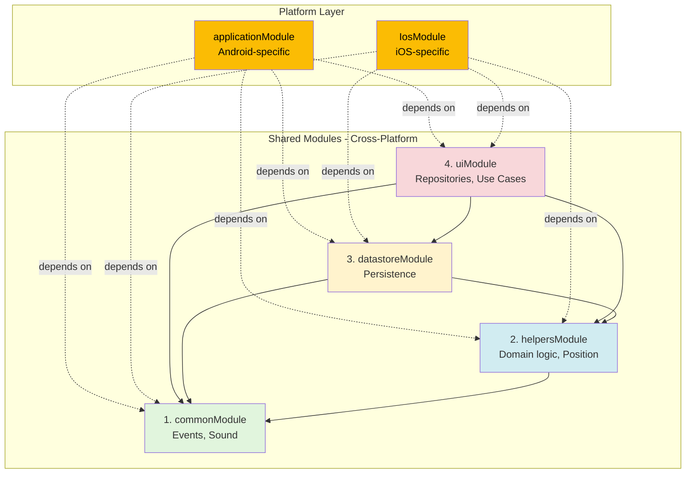

# Dependency Injection Patterns in WorldWideWaves

> **Framework**: Koin 3.x (Kotlin Multiplatform)
> **Status**: Production-ready patterns with iOS safety guarantees

## Table of Contents

1. [Module Organization](#module-organization)
2. [Scope Decisions](#scope-decisions)
3. [iOS-Safe DI Patterns](#ios-safe-di-patterns)
4. [Platform-Specific DI](#platform-specific-di)
5. [Test Module Overrides](#test-module-overrides)
6. [Best Practices](#best-practices)
7. [Common Pitfalls](#common-pitfalls)

---

## Module Organization

WorldWideWaves uses a **layered module architecture** with strict dependency ordering.

### Module Hierarchy



### Load Order (Critical)

Modules MUST be loaded in this exact order:

```kotlin
// SharedModule.kt
val sharedModule = listOf(
    commonModule,      // 1. Core (no dependencies)
    helpersModule,     // 2. Domain (depends on common)
    datastoreModule,   // 3. Data (depends on helpers)
    uiModule,          // 4. UI (depends on all above)
)
```

**Why order matters**:

- Each module depends on dependencies from previous modules
- iOS Kotlin/Native requires deterministic initialization order
- Wrong order = runtime crashes during DI resolution

---

## Common Module: Core Infrastructure

**Purpose**: Provides essential global components (events, sound choreography)

**File**: `/Users/ldiasdasilva/StudioProjects/WorldWideWaves/shared/src/commonMain/kotlin/com/worldwidewaves/shared/di/CommonModule.kt`

```kotlin
val commonModule = module {
    // ✅ Singleton: Single source of truth for event data
    single { WWWEvents() }

    // ✅ Eager singleton: MIDI subsystem initialized at startup
    single(createdAtStart = true) { SoundChoreographyPlayer() }

    // ✅ Singleton: Audio-visual coordination
    single { SoundChoreographyCoordinator() }
}
```

### Key Decisions

| Component | Scope | Justification |
|-----------|-------|---------------|
| `WWWEvents` | `single` | Single source of truth for all event data |
| `SoundChoreographyPlayer` | `single(createdAtStart = true)` | Eager init prepares MIDI subsystem before first wave |
| `SoundChoreographyCoordinator` | `single` | Coordinates timing across all events |

**Eager initialization rationale**:

- MIDI initialization can take 100-200ms on some devices
- Eager creation prevents latency on first wave playback
- User experience: instant sound when wave triggers

---

## Helpers Module: Domain Services

**Purpose**: Position tracking, wave progression, event state management

**File**: `/Users/ldiasdasilva/StudioProjects/WorldWideWaves/shared/src/commonMain/kotlin/com/worldwidewaves/shared/di/HelpersModule.kt`

```kotlin
val helpersModule = module {
    // ✅ CRITICAL: PositionManager is THE ONLY position source
    single<PositionManager> { PositionManager(get()) }

    // ✅ Singleton: Wave progression tracking
    single<WaveProgressionTracker> { DefaultWaveProgressionTracker(get()) }

    // ✅ Singleton: Position observation (unified stream)
    single<PositionObserver> { DefaultPositionObserver(get(), get(), get()) }

    // ✅ Singleton: Event lifecycle state
    single<EventStateHolder> { DefaultEventStateHolder(get()) }

    // ✅ Singleton: Observation scheduling
    single<ObservationScheduler> { DefaultObservationScheduler(get()) }

    // ✅ Factory: Cleanup is transient operation
    factory { WWWShutdownHandler(get(), get()) }

    // ✅ Singleton: Time abstraction (testable)
    single<IClock> { SystemClock() }

    // ✅ Data providers (singletons)
    single<EventsConfigurationProvider> { DefaultEventsConfigurationProvider(get()) }
    single<GeoJsonDataProvider> { DefaultGeoJsonDataProvider() }
    single<MapDataProvider> { DefaultMapDataProvider() }
    single<EventsDecoder> { DefaultEventsDecoder() }

    // ✅ Coroutine scope management
    single<CoroutineScopeProvider> { DefaultCoroutineScopeProvider() }
    single { CloseableCoroutineScope() }
}
```

### Critical Pattern: PositionManager

```kotlin
// ✅ CORRECT: Observe position from centralized manager
class MyComponent(
    private val positionManager: PositionManager
) {
    fun observePosition() {
        positionManager.positionFlow.collect { position ->
            handlePosition(position)
        }
    }
}

// ❌ WRONG: Don't create separate position sources
class MyComponent {
    private val gpsProvider = GPSProvider()  // WRONG!
}
```

**Why PositionManager is critical**:

- **Single source of truth**: All position consumers see same data
- **Priority handling**: Simulation positions override GPS (for testing)
- **Debouncing**: Prevents excessive position updates
- **Memory efficient**: One GPS subscription for entire app

---

## Datastore Module: Persistence

**Purpose**: Event favorites, user preferences

**File**: `/Users/ldiasdasilva/StudioProjects/WorldWideWaves/shared/src/commonMain/kotlin/com/worldwidewaves/shared/di/DatastoreModule.kt`

```kotlin
val datastoreModule = module {
    // ✅ Factory: Command/action objects (single operation)
    factory { InitFavoriteEvent(favoriteEventsStore = get()) }
    factory { SetEventFavorite(favoriteEventsStore = get()) }
}
```

### Why Factory Scope?

These are **command objects** that:

1. Execute a single operation
2. Don't maintain long-lived state
3. Should be garbage collected after operation completes

```kotlin
// ✅ Usage pattern: Create, execute, dispose
suspend fun markAsFavorite(eventId: String) {
    val setFavorite: SetEventFavorite = get()  // New instance
    setFavorite.execute(eventId, isFavorite = true)
    // Garbage collected when function exits
}

// ❌ ANTI-PATTERN: Don't store command instances
class MyClass {
    private val setFavorite: SetEventFavorite = get()  // WRONG!
}
```

**Memory efficiency**: Factory scope prevents accumulation of unused command objects.

---

## UI Module: Repositories & Use Cases

**Purpose**: UI-related dependencies, business logic

**File**: `/Users/ldiasdasilva/StudioProjects/WorldWideWaves/shared/src/commonMain/kotlin/com/worldwidewaves/shared/di/UIModule.kt`

```kotlin
val uiModule = module {
    // ✅ Singleton: Shared Compose screens (stateless)
    single { AboutTabScreen(get()) }
    single { EventsListScreen(viewModel = get(), mapChecker = get(), setEventFavorite = get()) }

    // ✅ Repository layer
    single<EventsRepository> { EventsRepositoryImpl(get()) }

    // ✅ Use cases (stateless business logic)
    single { GetSortedEventsUseCase(get()) }
    single { FilterEventsUseCase(get()) }
    single { CheckEventFavoritesUseCase() }
}
```

### Screen Components as Singletons

```kotlin
// ✅ SAFE: Stateless Compose components are singleton-safe
single { EventsListScreen(viewModel = get(), mapChecker = get(), setEventFavorite = get()) }

// Why safe:
// - Component is stateless (all state in ViewModel)
// - Lightweight (just Composable function references)
// - No per-instance resources
```

### Use Cases as Singletons

```kotlin
// ✅ SAFE: Stateless business logic
single { GetSortedEventsUseCase(get()) }

// Why safe:
// - Pure functions (deterministic)
// - No mutable state
// - Thread-safe operations
```

---

## Scope Decisions

### When to Use `single` (Singleton)

Use `single` when the dependency:

- ✅ Maintains app-wide state (e.g., `WWWEvents`, `PositionManager`)
- ✅ Is expensive to create (e.g., `SoundChoreographyPlayer`)
- ✅ Requires single source of truth (e.g., `EventsRepository`)
- ✅ Is stateless (e.g., use cases, Compose screens)
- ✅ Has no per-request lifecycle (most domain services)

```kotlin
// ✅ Examples of singleton scope
single { WWWEvents() }                    // App-wide state
single { PositionManager(get()) }         // Single source of truth
single { GetSortedEventsUseCase(get()) }  // Stateless logic
```

### When to Use `factory`

Use `factory` when the dependency:

- ✅ Represents a transient operation (e.g., command objects)
- ✅ Has per-request state
- ✅ Should be garbage collected after use
- ✅ Is cheap to create

```kotlin
// ✅ Examples of factory scope
factory { WWWShutdownHandler(get(), get()) }  // Cleanup is transient
factory { InitFavoriteEvent(get()) }          // Command object
factory { SetEventFavorite(get()) }           // Single operation
```

### When to Use `viewModel` (Android)

Use `viewModel` for Android ViewModels with lifecycle awareness:

```kotlin
// ✅ Android-specific ViewModel with lifecycle
viewModel {
    EventsViewModel(
        eventsRepository = get(),
        getSortedEventsUseCase = get(),
        filterEventsUseCase = get(),
        checkEventFavoritesUseCase = get(),
        platform = get(),
    )
}
```

**iOS difference**: iOS uses `single` for ViewModels because it lacks Android's ViewModel lifecycle.

### When to Use `createdAtStart = true` (Eager)

Use eager initialization when:

- ✅ Component requires time-consuming setup (MIDI, database)
- ✅ Initialization must happen before user interaction
- ✅ Lazy creation would cause noticeable latency

```kotlin
// ✅ Eager initialization: MIDI subsystem
single(createdAtStart = true) { SoundChoreographyPlayer() }

// ❌ Don't overuse: Most components should lazy-load
single(createdAtStart = true) { MyUnusedService() }  // WRONG!
```

---

## iOS-Safe DI Patterns

### The iOS Threading Problem

iOS Kotlin/Native has **strict threading requirements**. Violating these rules causes **immediate deadlocks** on app launch.

### Critical iOS Rules

| Rule | ❌ Forbidden | ✅ Allowed |
|------|-------------|-----------|
| **No DI in @Composable** | `object : KoinComponent { val x by inject() }` | `IosSafeDI.platform` |
| **No init{} coroutines** | `init { scope.launch { } }` | `suspend fun initialize()` |
| **No init{} DI** | `init { val x = get<Type>() }` | `by inject()` at class level |
| **No runBlocking** | `runBlocking { }` | `suspend` functions |
| **No Dispatchers.Main in constructors** | `init { launch(Main) }` | Lazy property delegation |

### iOS-Safe Pattern: IosSafeDI Singleton

**File**: `/Users/ldiasdasilva/StudioProjects/WorldWideWaves/shared/src/commonMain/kotlin/com/worldwidewaves/shared/ui/utils/IosSafeDI.kt`

```kotlin
// ✅ CORRECT: File-level singleton (iOS-safe)
object IosSafeDI : KoinComponent {
    val platform: WWWPlatform by inject()
    val clock: IClock by inject()
}

// ✅ Helper functions for Compose
fun getIosSafePlatform(): WWWPlatform = IosSafeDI.platform
fun getIosSafeClock(): IClock = IosSafeDI.clock
```

**Why this works**:

- File-level object initializes during class loading (before composition)
- Dependencies resolved once, cached forever
- Safe to access from @Composable functions

### iOS-Safe Usage in Compose

```kotlin
// ✅ CORRECT: Use IosSafeDI pattern
@Composable
fun MyScreen() {
    val platform = getIosSafePlatform()
    val clock = getIosSafeClock()

    Text("Running on: ${platform.name}")
}

// ❌ WRONG: DI in Composable (iOS DEADLOCK)
@Composable
fun MyScreen() {
    val deps = object : KoinComponent {
        val platform by inject()  // DEADLOCKS iOS!
    }
}
```

### iOS-Safe Class Initialization

```kotlin
// ✅ CORRECT: Lazy property delegation
class MyClass : KoinComponent {
    private val platform: WWWPlatform by inject()  // ✅ Lazy, safe
}

// ✅ CORRECT: Parameter injection
class MyClass(
    private val platform: WWWPlatform  // ✅ Injected by Koin
)

// ❌ WRONG: Eager resolution in init{}
class MyClass : KoinComponent {
    private val platform: WWWPlatform

    init {
        platform = get()  // ❌ iOS DEADLOCK
    }
}
```

### iOS-Safe Coroutine Initialization

```kotlin
// ✅ CORRECT: Suspend initialization
class MyViewModel {
    private lateinit var data: Data

    suspend fun initialize() {
        data = loadData()  // ✅ Safe async init
    }
}

@Composable
fun UseViewModel() {
    val viewModel = remember { MyViewModel() }
    LaunchedEffect(Unit) {
        viewModel.initialize()  // ✅ iOS-safe
    }
}

// ❌ WRONG: init{} coroutine launch
class MyViewModel {
    init {
        scope.launch {  // ❌ iOS DEADLOCK
            loadData()
        }
    }
}
```

### Verification Script

**Before every commit to shared code**:

```bash
./scripts/verify-ios-safety.sh
```

This script checks for:

- No `object : KoinComponent` inside @Composable functions
- No coroutine launches in init{} blocks
- No DI access in init{} blocks
- No runBlocking usage
- No Dispatchers.Main in constructors

**See Also**: [CLAUDE.md - iOS Requirements](../CLAUDE.md#-ios-requirements-critical)

---

## Platform-Specific DI

### Android Module

**File**: `/Users/ldiasdasilva/StudioProjects/WorldWideWaves/shared/src/androidMain/kotlin/com/worldwidewaves/shared/di/AndroidModule.kt`

```kotlin
val androidModule = module {
    // ✅ Platform descriptor
    single<WWWPlatform> {
        WWWPlatform("Android ${Build.VERSION.SDK_INT}", get())
    }

    // ✅ Platform-specific image resolver
    single<ImageResolver<DrawableResource>> { AndroidImageResolver() }

    // ✅ Eager init: Choreography builder
    single(createdAtStart = true) { ChoreographySequenceBuilder<DrawableResource>() }

    // ✅ Platform sound player
    single<SoundPlayer> { AndroidSoundPlayer(get()) }

    // ✅ Data persistence
    single<DataStoreFactory> { DefaultDataStoreFactory() }
    single { get<DataStoreFactory>().create { keyValueStorePath() } }
    single<FavoriteEventsStore> { AndroidFavoriteEventsStore(get()) }
}
```

### iOS Module

**File**: `/Users/ldiasdasilva/StudioProjects/WorldWideWaves/shared/src/iosMain/kotlin/com/worldwidewaves/shared/di/IosModule.kt`

```kotlin
val IosModule = module {
    // ✅ Platform sound player
    single<SoundPlayer> { IosSoundPlayer() }

    // ✅ Platform-specific image resolver
    single<ImageResolver<DrawableResource>> { IosImageResolver() }

    // ✅ Location provider
    single<LocationProvider> { IosLocationProvider() }

    // ✅ Platform descriptor
    single<WWWPlatform> {
        val device = UIDevice.currentDevice
        WWWPlatform("iOS ${device.systemVersion}", get())
    }

    // ✅ iOS ViewModel (singleton, not viewModel scope)
    single {
        EventsViewModel(
            eventsRepository = get(),
            getSortedEventsUseCase = get(),
            filterEventsUseCase = get(),
            checkEventFavoritesUseCase = get(),
            platform = get(),
        )
    }

    // ✅ Eager init: Choreography builder
    single(createdAtStart = true) { ChoreographySequenceBuilder<DrawableResource>() }

    // ✅ iOS map availability checker
    single<MapAvailabilityChecker> { IosMapAvailabilityChecker() }

    // ✅ Debug screen (iOS)
    single<DebugTabScreen?> { DebugTabScreen() }

    // ✅ Data persistence
    single<FavoriteEventsStore> { IosFavoriteEventsStore() }

    // ✅ Map services
    single<PlatformMapManager> { IosPlatformMapManager() }
    single { MapStateHolder(get()) }
    single<MapViewModel> { IosMapViewModel(get()) }
}
```

### Android Application Module

**File**: `/Users/ldiasdasilva/StudioProjects/WorldWideWaves/composeApp/src/androidMain/kotlin/com/worldwidewaves/di/ApplicationModule.kt`

```kotlin
val applicationModule = module {
    // ✅ Platform enabler (Android-specific)
    single<PlatformEnabler> { AndroidPlatformEnabler() }

    // ✅ Map availability with cleanup registration
    single {
        AndroidMapAvailabilityChecker(androidContext()).apply {
            get<CloseableCoroutineScope>().registerForCleanup {
                this.destroy()
            }
        }
    }
    single<MapAvailabilityChecker> { get<AndroidMapAvailabilityChecker>() }

    // ✅ Android ViewModels (lifecycle-aware)
    viewModel {
        EventsViewModel(
            eventsRepository = get(),
            getSortedEventsUseCase = get(),
            filterEventsUseCase = get(),
            checkEventFavoritesUseCase = get(),
            platform = get(),
        )
    }
    viewModel { AndroidMapViewModel(get()) }

    // ✅ Location services
    single { SimulationLocationEngine(get()) }
    factory { AndroidLocationProvider() }

    // ✅ Debug screen (only in debug builds)
    single<DebugTabScreen?> {
        if (BuildConfig.DEBUG) DebugTabScreen() else null
    }
}
```

### Platform Initialization

**Android** (`MainApplication.kt`):

```kotlin
override fun onCreate() {
    super.onCreate()

    startKoin {
        androidContext(this@MainApplication)
        androidLogger()
        modules(sharedModule + androidModule + applicationModule)
    }

    // Post-initialization configuration
    val platform = get<WWWPlatform>()
    initializeSimulationMode(platform, BuildConfig.ENABLE_SIMULATION_MODE)
    setupDebugSimulation()
}
```

**iOS** (`SceneDelegate.swift`):

```swift
func scene(_ scene: UIScene, willConnectTo session: UISceneSession, ...) {
    // Initialize Koin DI
    let platformEnabler = IOSPlatformEnabler()
    PlatformIosKt.doInitPlatform(platformEnabler: platformEnabler)

    // iOS modules loaded in Platform.ios.kt via initKoin()
    // initKoin { modules(sharedModule + IosModule) }
}
```

---

## Test Module Overrides

### Test Module Pattern

```kotlin
class EventsViewModelTest : KoinTest {
    private lateinit var sharedTestClock: TestClock
    private lateinit var testScopeProvider: CoroutineScopeProvider

    @BeforeTest
    fun setUp() {
        sharedTestClock = TestClock(currentTime = Instant.fromEpochMilliseconds(0))
        testScopeProvider = DefaultCoroutineScopeProvider()

        // ✅ Start Koin with test overrides
        startKoin {
            modules(
                module {
                    single<IClock> { sharedTestClock }
                    single<CoroutineScopeProvider> { testScopeProvider }
                },
            )
        }
    }

    @AfterTest
    fun tearDown() {
        runBlocking {
            testScopeProvider.cancelAllCoroutines()
            delay(500)  // Wait for cleanup propagation
        }
        stopKoin()
    }
}
```

### iOS Deadlock Prevention Test

**File**: `/Users/ldiasdasilva/StudioProjects/WorldWideWaves/shared/src/iosTest/kotlin/com/worldwidewaves/shared/ios/IosDeadlockPreventionTest.kt`

```kotlin
class IosDeadlockPreventionTest : KoinTest {
    private lateinit var testModule: Module

    @BeforeTest
    fun setUp() {
        testClock = TestClock(currentTime = Instant.fromEpochMilliseconds(0))
        val testScopeProvider = DefaultCoroutineScopeProvider()
        val testPositionManager = PositionManager(testScopeProvider)

        testPlatform = WWWPlatform(
            name = "Test Platform (iOS Deadlock Prevention)",
            positionManager = testPositionManager,
        )

        // ✅ Test module with mock dependencies
        testModule = module {
            single<IClock> { testClock }
            single<CoroutineScopeProvider> { testScopeProvider }
            single<WWWPlatform> { testPlatform }
            single<PositionManager> { testPositionManager }
        }

        startKoin {
            modules(testModule, commonModule)
        }
    }

    @Test
    fun test_iosSafeDIInitialization() = runTest {
        // ✅ Access IosSafeDI - should NOT deadlock
        val platform = IosSafeDI.platform
        val clock = IosSafeDI.clock

        assertNotNull(platform)
        assertNotNull(clock)
    }
}
```

### Test Isolation Best Practices

```kotlin
// ✅ CORRECT: Clean teardown prevents test interference
@AfterTest
fun tearDown() {
    runBlocking {
        testScopeProvider.cancelAllCoroutines()
        delay(500)  // Allow cleanup propagation
    }
    stopKoin()
}

// ❌ WRONG: No cleanup between tests
@AfterTest
fun tearDown() {
    // Missing stopKoin() - Koin state leaks to next test
}
```

**Why delay(500) is important**:

- Coroutine cancellation is asynchronous
- Jobs need time to complete cleanup
- Prevents flaky tests due to race conditions

---

## Best Practices

### 1. Parameter Injection Over Field Injection

```kotlin
// ✅ BEST: Constructor parameter injection
class EventsViewModel(
    private val eventsRepository: EventsRepository,
    private val getSortedEventsUseCase: GetSortedEventsUseCase,
) : BaseViewModel() {
    // Clear dependencies in signature
}

// ⚠️ ACCEPTABLE: Lazy property delegation
class MyClass : KoinComponent {
    private val platform: WWWPlatform by inject()  // Lazy, testable
}

// ❌ AVOID: Eager field injection in init{}
class MyClass : KoinComponent {
    private val platform: WWWPlatform

    init {
        platform = get()  // Eager, iOS-unsafe
    }
}
```

**Benefits of parameter injection**:

- Dependencies visible in constructor
- Easy to mock in tests
- No KoinComponent dependency
- iOS-safe by design

### 2. Interface-Based DI

```kotlin
// ✅ CORRECT: Register interface, provide implementation
single<EventsRepository> { EventsRepositoryImpl(get()) }
single<PositionManager> { PositionManager(get()) }
single<IClock> { SystemClock() }

// Usage: Depend on interface
class MyViewModel(
    private val repository: EventsRepository,  // Interface
    private val clock: IClock,                 // Interface
)
```

**Benefits**:

- Easy to swap implementations
- Testability (mock interfaces)
- Loose coupling

### 3. Avoid Circular Dependencies

```kotlin
// ❌ WRONG: Circular dependency
module {
    single { ServiceA(get<ServiceB>()) }
    single { ServiceB(get<ServiceA>()) }  // A → B → A (circular!)
}

// ✅ CORRECT: Extract shared dependency
module {
    single { SharedService() }
    single { ServiceA(get<SharedService>()) }
    single { ServiceB(get<SharedService>()) }
}
```

**iOS impact**: Circular dependencies cause immediate deadlocks on iOS.

### 4. Scope Dependencies to Modules

```kotlin
// ✅ CORRECT: Related dependencies in same module
val helpersModule = module {
    single<PositionManager> { PositionManager(get()) }
    single<PositionObserver> { DefaultPositionObserver(get(), get(), get()) }
    single<WaveProgressionTracker> { DefaultWaveProgressionTracker(get()) }
}

// ❌ WRONG: Related dependencies scattered across modules
// Makes dependency graph harder to understand
```

### 5. Document Scope Decisions

```kotlin
/**
 * Provides [SoundChoreographyPlayer] as eager singleton.
 *
 * **Scope**: Singleton - single audio player for entire app
 * **Thread-safety**: Yes - MIDI API is thread-safe
 * **Lifecycle**: Created immediately at app startup (createdAtStart = true)
 * **Eager initialization**: Required to prepare MIDI subsystem before first wave
 */
single(createdAtStart = true) { SoundChoreographyPlayer() }
```

**Why document**:

- Future developers understand scope choices
- Prevents accidental scope changes
- Clarifies performance implications

### 6. Use Type Aliases for Complex Types

```kotlin
// ✅ CORRECT: Type alias for clarity
typealias EventFilter = (IWWWEvent) -> Boolean

single<EventFilter> { { event -> event.favorite } }

// ❌ CONFUSING: Direct function type
single<(IWWWEvent) -> Boolean> { { event -> event.favorite } }
```

### 7. Cleanup Resources in Lifecycle Hooks

```kotlin
// ✅ CORRECT: Register cleanup with CloseableCoroutineScope
single {
    AndroidMapAvailabilityChecker(androidContext()).apply {
        get<CloseableCoroutineScope>().registerForCleanup {
            this.destroy()  // Cleanup when app terminates
        }
    }
}
```

**Prevents**:

- Memory leaks
- Unclosed resources
- Background job leaks

---

## Common Pitfalls

### 1. iOS Deadlock: DI in @Composable

```kotlin
// ❌ CRITICAL ERROR: iOS DEADLOCK
@Composable
fun MyScreen() {
    val deps = object : KoinComponent {
        val platform by inject()  // DEADLOCKS iOS!
    }

    Text("Platform: ${deps.platform.name}")
}

// ✅ SOLUTION: Use IosSafeDI pattern
@Composable
fun MyScreen() {
    val platform = getIosSafePlatform()  // Safe on iOS

    Text("Platform: ${platform.name}")
}
```

**Detection**: Run `./scripts/verify-ios-safety.sh`

### 2. iOS Deadlock: init{} Coroutine Launch

```kotlin
// ❌ CRITICAL ERROR: iOS DEADLOCK
class MyViewModel : KoinComponent {
    init {
        scope.launch {  // DEADLOCKS iOS!
            loadData()
        }
    }
}

// ✅ SOLUTION: Suspend initialization
class MyViewModel {
    suspend fun initialize() {
        loadData()  // Called from LaunchedEffect
    }
}

@Composable
fun UseViewModel() {
    val viewModel = remember { MyViewModel() }
    LaunchedEffect(Unit) {
        viewModel.initialize()  // iOS-safe
    }
}
```

### 3. Mixing viewModel and single Scopes

```kotlin
// ❌ WRONG: Android ViewModel registered as singleton
single {
    EventsViewModel(get(), get(), get(), get(), get())
}

// ✅ CORRECT: Use viewModel scope on Android
viewModel {
    EventsViewModel(get(), get(), get(), get(), get())
}

// ✅ CORRECT: iOS uses single (no AndroidViewModel)
single {
    EventsViewModel(get(), get(), get(), get(), get())
}
```

### 4. Over-Using Eager Initialization

```kotlin
// ❌ WRONG: Eager init for rarely-used service
single(createdAtStart = true) { RarelyUsedService() }

// ✅ CORRECT: Lazy initialization (default)
single { RarelyUsedService() }  // Created on first use

// ✅ CORRECT: Eager only when necessary
single(createdAtStart = true) { SoundChoreographyPlayer() }  // MIDI prep
```

**Performance impact**: Every `createdAtStart = true` increases app launch time.

### 5. Forgetting to Stop Koin in Tests

```kotlin
// ❌ WRONG: No cleanup
class MyTest : KoinTest {
    @BeforeTest
    fun setUp() {
        startKoin { modules(testModule) }
    }

    // Missing @AfterTest with stopKoin()
}

// ✅ CORRECT: Clean teardown
class MyTest : KoinTest {
    @BeforeTest
    fun setUp() {
        startKoin { modules(testModule) }
    }

    @AfterTest
    fun tearDown() {
        runBlocking { delay(500) }  // Cleanup propagation
        stopKoin()
    }
}
```

**Symptom**: Flaky tests, "Koin already started" errors.

### 6. Accessing DI Before Initialization

```kotlin
// ❌ WRONG: Access before startKoin()
val platform = get<WWWPlatform>()  // CRASH: Koin not initialized

startKoin { modules(sharedModule) }

// ✅ CORRECT: Initialize Koin first
startKoin { modules(sharedModule) }

val platform = get<WWWPlatform>()  // Safe
```

### 7. Platform-Specific Dependencies in Shared Code

```kotlin
// ❌ WRONG: Android-specific in shared module
val sharedModule = module {
    single { AndroidContext() }  // Android-specific!
}

// ✅ CORRECT: Platform-specific dependencies in platform modules
val androidModule = module {
    single { AndroidContext() }  // Android module
}

val iosModule = module {
    single { IosContext() }  // iOS module
}
```

### 8. Mutable State in Singleton Use Cases

```kotlin
// ❌ WRONG: Mutable state in singleton use case
class FilterEventsUseCase {
    private var lastFilter: FilterCriteria? = null  // State!

    fun execute(events: List<IWWWEvent>, criteria: FilterCriteria): List<IWWWEvent> {
        lastFilter = criteria  // Shared state between calls
        return events.filter { criteria.matches(it) }
    }
}

// ✅ CORRECT: Stateless use case
class FilterEventsUseCase {
    fun execute(events: List<IWWWEvent>, criteria: FilterCriteria): List<IWWWEvent> {
        return events.filter { criteria.matches(it) }  // Pure function
    }
}
```

**Why dangerous**: Singleton with mutable state = shared state bugs.

### 9. Not Using get() for Transitive Dependencies

```kotlin
// ❌ WRONG: Manually create transitive dependencies
module {
    single {
        MyService(
            dependency1 = Dependency1(),        // Manual creation
            dependency2 = Dependency2(),        // Not managed by Koin
        )
    }
}

// ✅ CORRECT: Let Koin resolve all dependencies
module {
    single { Dependency1() }
    single { Dependency2() }
    single {
        MyService(
            dependency1 = get(),  // Koin-managed
            dependency2 = get(),  // Koin-managed
        )
    }
}
```

### 10. Forgetting createdAtStart Implications

```kotlin
// ⚠️ REMEMBER: createdAtStart executes during startKoin()
single(createdAtStart = true) {
    HeavyInitializationService()  // Blocks app launch
}

// This delays app startup by X milliseconds
// Only use when absolutely necessary
```

**Measure impact**:

```kotlin
val startTime = System.currentTimeMillis()
startKoin { modules(sharedModule) }
val duration = System.currentTimeMillis() - startTime
Log.d("Koin", "Initialization took ${duration}ms")
```

---

## Quick Reference

### Module Organization Summary

| Module | Purpose | Load Order | Key Dependencies |
|--------|---------|------------|------------------|
| `commonModule` | Events, sound | 1st | None |
| `helpersModule` | Domain logic, position | 2nd | `commonModule` |
| `datastoreModule` | Persistence | 3rd | `helpersModule` |
| `uiModule` | Repositories, use cases | 4th | All above |
| `androidModule` | Android platform | After shared | `sharedModule` |
| `IosModule` | iOS platform | After shared | `sharedModule` |
| `applicationModule` | Android app | After shared+android | All |

### Scope Decision Matrix

| Dependency Type | Scope | Example |
|----------------|-------|---------|
| App-wide state | `single` | `WWWEvents`, `PositionManager` |
| Expensive to create | `single(createdAtStart = true)` | `SoundChoreographyPlayer` |
| Stateless logic | `single` | Use cases, repositories |
| Transient operation | `factory` | Command objects, cleanup handlers |
| Android ViewModel | `viewModel` | `EventsViewModel` (Android) |
| iOS ViewModel | `single` | `EventsViewModel` (iOS) |

### iOS Safety Checklist

- [ ] No `object : KoinComponent` inside @Composable
- [ ] No coroutine launches in init{} blocks
- [ ] No DI `get()` calls in init{} blocks
- [ ] No `runBlocking` anywhere
- [ ] No Dispatchers.Main in constructors
- [ ] Use `IosSafeDI` for Compose DI access
- [ ] Use `suspend fun initialize()` pattern
- [ ] Run `./scripts/verify-ios-safety.sh` before commit

### Test Setup Template

```kotlin
class MyTest : KoinTest {
    private lateinit var testClock: IClock
    private lateinit var testScopeProvider: CoroutineScopeProvider

    @BeforeTest
    fun setUp() {
        testClock = TestClock()
        testScopeProvider = DefaultCoroutineScopeProvider()

        startKoin {
            modules(
                module {
                    single<IClock> { testClock }
                    single<CoroutineScopeProvider> { testScopeProvider }
                }
            )
        }
    }

    @AfterTest
    fun tearDown() {
        runBlocking {
            testScopeProvider.cancelAllCoroutines()
            delay(500)
        }
        stopKoin()
    }
}
```

---

## Related Documentation

- **[CLAUDE.md - iOS Requirements](../CLAUDE.md#-ios-requirements-critical)** - Complete iOS deadlock prevention guide
- **[iOS Violation Tracker](../docs/ios/ios-violation-tracker.md)** - Historical violations and fixes
- **[iOS Success State](../docs/ios/ios-success-state.md)** - iOS success criteria verification
- **Verification Script**: `./scripts/verify-ios-safety.sh`

---

**Maintainer**: WorldWideWaves Development Team
