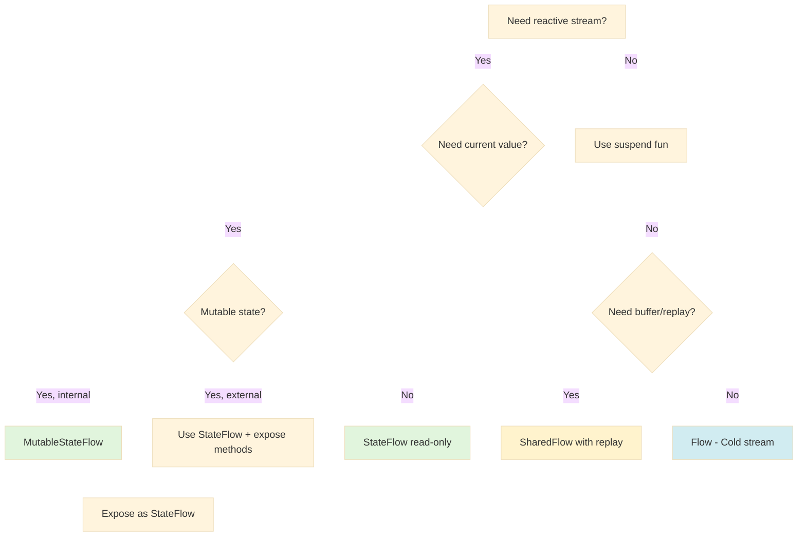

# Reactive Programming Patterns in WorldWideWaves

> **Version**: 1.0
> **Last Updated**: October 27, 2025
> **Maintainer**: WorldWideWaves Development Team

## Table of Contents

1. [Overview](#overview)
2. [StateFlow vs SharedFlow vs Flow](#stateflow-vs-sharedflow-vs-flow)
3. [Flow Operators](#flow-operators)
4. [ViewModel State Management](#viewmodel-state-management)
5. [Compose Integration](#compose-integration)
6. [Backpressure Strategies](#backpressure-strategies)
7. [Error Handling in Flows](#error-handling-in-flows)
8. [Testing Reactive Code](#testing-reactive-code)
9. [Common Pitfalls](#common-pitfalls)
10. [iOS-Specific Patterns](#ios-specific-patterns)

---

## Overview

WorldWideWaves uses Kotlin Coroutines Flow as the foundation for reactive programming across Android and iOS platforms. This document captures proven patterns from the codebase that ensure:

- **Thread safety**: Proper dispatcher usage and synchronization
- **Memory efficiency**: Lifecycle-aware subscriptions and cleanup
- **iOS compatibility**: Avoiding deadlocks and threading issues
- **Testability**: Clear patterns for testing reactive code

### Architecture Principles

```
┌─────────────────────────────────────────────────┐
│           UI Layer (Compose)                     │
│  • collectAsState() / collectAsStateWithLifecycle│
│  • LaunchedEffect for side effects              │
│  • State<T> for UI reactivity                   │
└─────────────────────────────────────────────────┘
                      │
                      ▼
┌─────────────────────────────────────────────────┐
│         ViewModel Layer                          │
│  • Private MutableStateFlow<T>                  │
│  • Public StateFlow<T> (immutable)              │
│  • Business logic triggers state updates        │
└─────────────────────────────────────────────────┘
                      │
                      ▼
┌─────────────────────────────────────────────────┐
│         Domain/Repository Layer                  │
│  • Flow<T> for streams                          │
│  • suspend fun for single operations            │
│  • Use cases combine/transform flows            │
└─────────────────────────────────────────────────┘
                      │
                      ▼
┌─────────────────────────────────────────────────┐
│         Data Sources                             │
│  • Cold flows from data sources                 │
│  • callbackFlow for external sources            │
│  • StateFlow for cached state                   │
└─────────────────────────────────────────────────┘
```

---

## StateFlow vs SharedFlow vs Flow

### Decision Tree



### StateFlow: Hot State with Current Value

**When to use**:
- Need to expose current UI state
- Consumers need immediate value upon subscription
- Single source of truth for state
- ViewModel state management

**Example from EventsViewModel** (`shared/src/commonMain/kotlin/com/worldwidewaves/shared/viewmodels/EventsViewModel.kt:63-67`):

```kotlin
// Private mutable, public immutable pattern
private val _events = MutableStateFlow<List<IWWWEvent>>(emptyList())
val events: StateFlow<List<IWWWEvent>> = _events.asStateFlow()

private val _isLoading = MutableStateFlow(false)
val isLoading: StateFlow<Boolean> = _isLoading.asStateFlow()
```

**Key characteristics**:
- Always has a value (requires initial value)
- New subscribers immediately get current value
- Conflates rapid updates (only latest value matters)
- Hot flow (active regardless of collectors)

### SharedFlow: Event Stream with Replay Buffer

**When to use**:
- Event broadcasts (no current state concept)
- Need replay buffer for late subscribers
- Multiple independent consumers
- Navigation events, one-time actions

**Example pattern** (not heavily used in WorldWideWaves):

```kotlin
private val _navigationEvents = MutableSharedFlow<NavigationEvent>(
    replay = 0,        // No replay for events
    extraBufferCapacity = 1,  // Buffer one event
    onBufferOverflow = BufferOverflow.DROP_OLDEST
)
val navigationEvents: SharedFlow<NavigationEvent> = _navigationEvents.asSharedFlow()
```

**Key characteristics**:
- No initial value required
- Can have replay buffer for late subscribers
- Hot flow (broadcasts to all active collectors)
- Useful for one-time events

### Flow: Cold Streams

**When to use**:
- Data transformations
- Repository layer data streams
- Each collector needs independent execution
- Composition of multiple sources

**Example from PositionObserver** (`shared/src/commonMain/kotlin/com/worldwidewaves/shared/domain/observation/DefaultPositionObserver.kt:69-108`):

```kotlin
override fun observePositionForEvent(event: IWWWEvent): Flow<PositionObservation> {
    return combine(
        positionManager.position,
        event.area.polygonsLoaded,
    ) { position, polygonsLoaded ->
        val isInArea =
            if (position != null && polygonsLoaded) {
                try {
                    val polygons = event.area.getPolygons()
                    waveProgressionTracker.isUserInWaveArea(position, event.area, polygons)
                } catch (e: Exception) {
                    Log.e("DefaultPositionObserver", "Error checking if user in area: $e")
                    false
                }
            } else {
                false
            }

        PositionObservation(
            position = position,
            isInArea = isInArea,
            timestamp = clock.now(),
        )
    }.distinctUntilChanged { old, new ->
        // Custom deduplication logic
        if (old.isInArea != new.isInArea) {
            false // Always emit if area status changed
        } else if (old.position == null || new.position == null) {
            old.position == new.position
        } else {
            calculateDistance(old.position!!, new.position!!) < MIN_POSITION_CHANGE_METERS
        }
    }.flowOn(Dispatchers.Default)
}
```

**Key characteristics**:
- Cold (executes on each collection)
- No state between collectors
- Perfect for transformations
- Can be converted to hot flows with `stateIn`/`shareIn`

---

## Flow Operators

### Custom Extensions

WorldWideWaves defines a minimal custom extension for state updates:

**`updateIfChanged`** (`shared/src/commonMain/kotlin/com/worldwidewaves/shared/utils/extensions/FlowExtensions.kt:32-36`):

```kotlin
/**
 * Updates the value of this MutableStateFlow only if the new value is different.
 * Prevents unnecessary emissions and observer triggers when value hasn't changed.
 */
fun <T> MutableStateFlow<T>.updateIfChanged(newValue: T) {
    if (value != newValue) {
        value = newValue
    }
}
```

### Standard Operators in Use

#### 1. `combine` - Merge Multiple Sources

**Example from EventObserver** (`shared/src/commonMain/kotlin/com/worldwidewaves/shared/domain/observation/EventObserver.kt:161-178`):

```kotlin
fun createUnifiedObservationFlow(onAreaDetection: suspend () -> Unit) =
    combine(
        createPeriodicObservationFlow(),
        createSimulationFlow(),
    ) { periodicObservation, _ ->
        periodicObservation
    }.onEach { _ ->
        // Area detection on every unified update
        try {
            onAreaDetection()
        } catch (e: Exception) {
            Log.e("EventObserver", "Error in area detection: $e")
        }
    }
```

**When to use**:
- Need to react to changes from multiple sources
- All sources must emit at least once
- Latest values from all sources required

#### 2. `distinctUntilChanged` - Deduplication

**Example from PositionObserver** (`shared/src/commonMain/kotlin/com/worldwidewaves/shared/domain/observation/DefaultPositionObserver.kt:99-107`):

```kotlin
.distinctUntilChanged { old, new ->
    // Custom comparison: Only emit if meaningful change occurred
    if (old.isInArea != new.isInArea) {
        false // Always emit if area status changed
    } else if (old.position == null || new.position == null) {
        old.position == new.position
    } else {
        // Use distance threshold to filter GPS noise
        calculateDistance(old.position!!, new.position!!) < MIN_POSITION_CHANGE_METERS
    }
}
```

**When to use**:
- Filter out duplicate emissions
- Implement custom equality logic
- Reduce downstream processing

**Performance impact**: Minimal overhead, significant savings in downstream processing

#### 3. `sample` / Manual Throttling - Rate Limiting

**Example from WaveProgressionObserver** (`shared/src/commonMain/kotlin/com/worldwidewaves/shared/utils/WaveProgressionObserver.kt:88-103`):

```kotlin
@OptIn(FlowPreview::class)
private fun startPolygonsObservation(event: IWWWEvent, eventMap: AbstractEventMap<*>?) {
    polygonsJob = scope.launch {
        event.observer.progression
            .sample(250.milliseconds) // Built-in throttling for better performance
            .collect {
                updateWavePolygons(event, eventMap)
            }
    }
}
```

**When to use**:
- Limit UI update frequency (e.g., map polygon updates)
- Reduce CPU/GPU load
- Battery optimization

**Alternative: Manual debouncing** (`shared/src/commonMain/kotlin/com/worldwidewaves/shared/position/PositionManager.kt:107-119`):

```kotlin
// Manual debounce implementation for precise control
debounceJob?.cancel()
debounceJob = coroutineScopeProvider.launchDefault {
    delay(debounceDelay)  // 100ms debounce

    pendingUpdate?.let { finalState ->
        _currentState.value = finalState
        _position.value = finalState.position
        Log.i("PositionManager", "Applied debounced position from ${finalState.source}")
    }
    pendingUpdate = null
}
```

#### 4. `flowOn` - Dispatcher Control

**Example from PositionObserver** (`shared/src/commonMain/kotlin/com/worldwidewaves/shared/domain/observation/DefaultPositionObserver.kt:108`):

```kotlin
.flowOn(Dispatchers.Default)
```

**When to use**:
- Move computation off main thread
- Optimize heavy calculations
- Required for CPU-bound operations in flows

**Common patterns**:
- `Dispatchers.Default`: CPU-bound work (calculations, parsing)
- `Dispatchers.Main`: UI updates (rarely needed in flows)
- `Dispatchers.IO`: File/network operations (KMM note: use `Dispatchers.Default` in shared code)

#### 5. `catch` - Error Recovery

**Example from EventObserver** (`shared/src/commonMain/kotlin/com/worldwidewaves/shared/domain/observation/EventObserver.kt:280-282`):

```kotlin
createUnifiedObservationFlow {
    // Area detection callback
}.flowOn(Dispatchers.Default)
    .catch { e ->
        Log.e("EventObserver", "Error in unified observation flow for event ${event.id}: $e")
    }.onEach { observation ->
        handleMainObservationUpdate(observation, onStateUpdate)
    }.launchIn(coroutineScopeProvider.scopeDefault())
```

**When to use**:
- Graceful error handling in flow pipelines
- Prevent flow termination on errors
- Log errors without crashing

**Important**: `.catch` only catches **upstream** errors (before it in the chain)

#### 6. `onEach` - Side Effects

**Example from EventsViewModel** (`shared/src/commonMain/kotlin/com/worldwidewaves/shared/viewmodels/EventsViewModel.kt:98-100`):

```kotlin
eventsRepository
    .isLoading()
    .onEach { isLoading -> _isLoading.value = isLoading }
    .launchIn(scope)
```

**When to use**:
- Perform side effects without transforming values
- Update separate state based on emissions
- Logging, analytics

#### 7. `launchIn` - Collection with Scope

**Example from EventsViewModel** (`shared/src/commonMain/kotlin/com/worldwidewaves/shared/viewmodels/EventsViewModel.kt:100,118`):

```kotlin
eventsRepository
    .isLoading()
    .onEach { isLoading -> _isLoading.value = isLoading }
    .launchIn(scope)  // ViewModel scope - auto-canceled on clear
```

**When to use**:
- Start collecting flow in specific coroutine scope
- Lifecycle-aware collection
- Automatic cancellation when scope is canceled

**vs `.collect { }`**:
- `launchIn(scope)`: Fire-and-forget, returns Job
- `scope.launch { flow.collect {} }`: Same result, more verbose

---

## ViewModel State Management

### Pattern: Private Mutable, Public Immutable

WorldWideWaves follows the industry-standard pattern for exposing ViewModel state:

**Example from EventsViewModel** (`shared/src/commonMain/kotlin/com/worldwidewaves/shared/viewmodels/EventsViewModel.kt:63-73`):

```kotlin
class EventsViewModel(
    private val eventsRepository: EventsRepository,
    private val getSortedEventsUseCase: GetSortedEventsUseCase,
    // ... other dependencies
) : BaseViewModel() {

    // ✅ CORRECT: Private mutable for internal updates
    private val _hasFavorites = MutableStateFlow(false)
    val hasFavorites: StateFlow<Boolean> = _hasFavorites.asStateFlow()

    private val _events = MutableStateFlow<List<IWWWEvent>>(emptyList())
    val events: StateFlow<List<IWWWEvent>> = _events.asStateFlow()

    private val _loadingError = MutableStateFlow(false)
    val hasLoadingError: StateFlow<Boolean> = _loadingError.asStateFlow()

    private val _isLoading = MutableStateFlow(false)
    val isLoading: StateFlow<Boolean> = _isLoading.asStateFlow()

    // ... rest of implementation
}
```

**Benefits**:
- **Encapsulation**: External code cannot modify state directly
- **Single source of truth**: Only ViewModel can update state
- **Type safety**: Public API guarantees read-only access
- **Testability**: Clear boundaries for mocking

### iOS-Safe Initialization Pattern

**❌ WRONG: `init{}` block with coroutines (iOS deadlock risk)**:

```kotlin
class MyViewModel : BaseViewModel() {
    init {
        scope.launch {  // DEADLOCKS on iOS!
            loadData()
        }
    }
}
```

**✅ CORRECT: Lazy initialization via `suspend fun`** (`shared/src/commonMain/kotlin/com/worldwidewaves/shared/viewmodels/EventsViewModel.kt:80-87`):

```kotlin
class EventsViewModel : BaseViewModel() {
    // ---------------------------
    // iOS FIX: No init{} block to prevent deadlocks
    // Events loading triggered from LaunchedEffect in EventsListScreen
    // ---------------------------

    /**
     * Load events from the data source through repository and use cases
     * ⚠️ Called from LaunchedEffect for iOS safety
     */
    suspend fun loadEvents() {
        try {
            eventsRepository.loadEvents { exception ->
                Log.e("EventsViewModel", "Error loading events", throwable = exception)
                _loadingError.value = true
            }

            // Start observing flows
            eventsRepository
                .isLoading()
                .onEach { isLoading -> _isLoading.value = isLoading }
                .launchIn(scope)

            getSortedEventsUseCase
                .invoke()
                .onEach { sortedEvents -> processEventsList(sortedEvents) }
                .flowOn(Dispatchers.Default)
                .launchIn(scope)
        } catch (e: Exception) {
            Log.e("EventsViewModel", "Error in loadEvents", throwable = e)
            _loadingError.value = true
        }
    }
}
```

**Triggering from Compose UI** (`shared/src/commonMain/kotlin/com/worldwidewaves/shared/ui/EventsListScreen.kt:57-60`):

```kotlin
@Composable
override fun Screen(platformEnabler: PlatformEnabler, modifier: Modifier) {
    val events by viewModel.events.collectAsState()

    // Initialize EventsViewModel (iOS-safe pattern, Android compatible)
    LaunchedEffect(Unit) {
        viewModel.loadEvents()
    }

    // ... rest of UI
}
```

### State Update Patterns

**Pattern 1: Direct assignment for simple updates**:

```kotlin
private val _isLoading = MutableStateFlow(false)

fun setLoading(loading: Boolean) {
    _isLoading.value = loading
}
```

**Pattern 2: Custom extension for conditional updates** (`shared/src/commonMain/kotlin/com/worldwidewaves/shared/utils/extensions/FlowExtensions.kt:32-36`):

```kotlin
fun updateLoadingIfChanged(loading: Boolean) {
    _isLoading.updateIfChanged(loading)  // Only emits if value changed
}
```

**Pattern 3: Collecting from other flows**:

```kotlin
init {
    repository.dataFlow
        .onEach { data -> _myData.value = data }
        .launchIn(scope)
}
```

---

## Compose Integration

### Collecting StateFlow in Compose

**Pattern 1: `collectAsState()` for StateFlow** (`shared/src/commonMain/kotlin/com/worldwidewaves/shared/ui/EventsListScreen.kt:54-55`):

```kotlin
@Composable
override fun Screen(platformEnabler: PlatformEnabler, modifier: Modifier) {
    val events by viewModel.events.collectAsState()
    val mapStates by mapChecker.mapStates.collectAsState()

    // Use events and mapStates in UI
    EventsScreen(
        events = events,
        mapStates = mapStates,
        onEventClick = { eventId -> platformEnabler.openEventActivity(eventId) },
        // ...
    )
}
```

**Benefits**:
- Automatic lifecycle management
- Proper initial value handling
- Recomposition on value changes

**Pattern 2: `collectAsStateWithLifecycle()` - Android-specific optimization**:

```kotlin
// Note: Currently used in some screens, but collectAsState() is preferred for KMM
val events by viewModel.events.collectAsStateWithLifecycle()
```

**Recommendation**: Use `collectAsState()` in shared Compose code for iOS compatibility.

### LaunchedEffect for Side Effects

**Pattern: One-time initialization** (`shared/src/commonMain/kotlin/com/worldwidewaves/shared/ui/EventsListScreen.kt:58-60`):

```kotlin
LaunchedEffect(Unit) {
    viewModel.loadEvents()
}
```

**Pattern: React to state changes** (`shared/src/commonMain/kotlin/com/worldwidewaves/shared/ui/EventsListScreen.kt:68-71`):

```kotlin
// Re-track maps when events change
LaunchedEffect(events) {
    mapChecker.trackMaps(events.map { it.id })
    mapChecker.refreshAvailability()
}
```

**Pattern: Continuous observation** (`shared/src/commonMain/kotlin/com/worldwidewaves/shared/viewmodels/EventsViewModel.kt:157-165`):

```kotlin
private fun monitorSimulatedSpeed(event: IWWWEvent) {
    scope.launch {
        event.observer.isUserWarmingInProgress.collect { isWarmingStarted ->
            if (isWarmingStarted) {
                platform.getSimulation()?.setSpeed(1)
            }
        }
    }
}
```

**Key rules**:
- `LaunchedEffect(Unit)`: Runs once on initial composition
- `LaunchedEffect(key)`: Re-runs when key changes
- Automatically canceled when composable leaves composition
- Use for launching coroutines tied to composable lifecycle

---

## Backpressure Strategies

### What is Backpressure?

Backpressure occurs when a flow producer emits faster than the consumer can process. WorldWideWaves handles this through several strategies:

### Strategy 1: Conflation (Built-in for StateFlow)

StateFlow automatically conflates - only the latest value matters:

```kotlin
private val _position = MutableStateFlow<Position?>(null)

// Rapid updates automatically conflated
fun updatePosition(pos: Position) {
    _position.value = pos  // Only latest value kept
}
```

**When to use**: UI state where only current value matters (position, loading status, etc.)

### Strategy 2: Manual Debouncing

**Example from PositionManager** (`shared/src/commonMain/kotlin/com/worldwidewaves/shared/position/PositionManager.kt:103-119`):

```kotlin
class PositionManager(
    private val debounceDelay: Duration = 100.milliseconds,
) {
    private var debounceJob: Job? = null
    private var pendingUpdate: PositionState? = null

    fun updatePosition(source: PositionSource, newPosition: Position?) {
        // Store pending update
        pendingUpdate = newState

        // Cancel previous debounce, start new one
        debounceJob?.cancel()
        debounceJob = coroutineScopeProvider.launchDefault {
            delay(debounceDelay)  // Wait 100ms

            // Apply the debounced update
            pendingUpdate?.let { finalState ->
                _currentState.value = finalState
                _position.value = finalState.position
            }
            pendingUpdate = null
        }
    }
}
```

**Benefits**:
- Precise control over delay
- Can implement custom logic (priority, deduplication)
- Prevents rapid GPS updates from overwhelming observers

**When to use**: Sensors, GPS, user input with high frequency

### Strategy 3: Sampling

**Example from WaveProgressionObserver** (`shared/src/commonMain/kotlin/com/worldwidewaves/shared/utils/WaveProgressionObserver.kt:95-103`):

```kotlin
@OptIn(FlowPreview::class)
private fun startPolygonsObservation(event: IWWWEvent) {
    polygonsJob = scope.launch {
        event.observer.progression
            .sample(250.milliseconds) // Sample every 250ms
            .collect {
                updateWavePolygons(event, eventMap)
            }
    }
}
```

**Benefits**:
- Fixed-rate emissions regardless of upstream frequency
- Predictable performance
- Good for UI updates (animations, maps)

**When to use**: UI rendering updates, animation frames, map updates

### Strategy 4: Custom Deduplication

**Example from PositionManager** (`shared/src/commonMain/kotlin/com/worldwidewaves/shared/position/PositionManager.kt:182-194`):

```kotlin
/**
 * Checks if a position is effectively duplicate using epsilon comparison
 */
private fun isPositionDuplicate(current: Position?, new: Position?): Boolean {
    if (current == null || new == null) return false

    val latDiff = abs(current.lat - new.lat)
    val lngDiff = abs(current.lng - new.lng)

    return latDiff < positionEpsilon && lngDiff < positionEpsilon  // ~10 meters
}
```

**Benefits**:
- Domain-specific logic (GPS noise filtering)
- Reduces unnecessary updates
- Improves performance and battery life

**When to use**: Domain-specific deduplication logic (positions, sensor readings)

### Strategy 5: Adaptive Intervals

**Example from ObservationScheduler** (`shared/src/commonMain/kotlin/com/worldwidewaves/shared/domain/scheduling/DefaultObservationScheduler.kt:63-82`):

```kotlin
override suspend fun calculateObservationInterval(event: IWWWEvent): Duration {
    val now = clock.now()
    val timeBeforeHit = event.wave.timeBeforeUserHit()

    return when {
        // Critical timing - high frequency
        timeBeforeHit != null && timeBeforeHit < 1.seconds -> 50.milliseconds
        timeBeforeHit != null && timeBeforeHit < 5.seconds -> 200.milliseconds

        // Active event - moderate frequency
        timeBeforeEvent > 35.seconds -> 1.seconds
        timeBeforeEvent > 0.seconds || event.isRunning() -> 500.milliseconds

        // Distant event - low frequency (battery optimization)
        timeBeforeEvent > 1.hours -> 1.hours
        timeBeforeEvent > 5.minutes -> 5.minutes

        else -> 30.seconds
    }
}
```

**Benefits**:
- Battery optimization (reduce CPU wake-ups)
- Precision when needed (sound sync)
- Scales with system load

**When to use**: Long-running observations with varying precision requirements

---

## Error Handling in Flows

### Pattern 1: `.catch` Operator

**Example from EventObserver** (`shared/src/commonMain/kotlin/com/worldwidewaves/shared/domain/observation/EventObserver.kt:280-284`):

```kotlin
private fun startMainObservationFlow(onStateUpdate: suspend (EventObservation) -> Unit): Job =
    createUnifiedObservationFlow {
        // Area detection callback
    }.flowOn(Dispatchers.Default)
        .catch { e ->
            Log.e("EventObserver", "Error in unified observation flow for event ${event.id}: $e")
        }.onEach { observation ->
            handleMainObservationUpdate(observation, onStateUpdate)
        }.launchIn(coroutineScopeProvider.scopeDefault())
```

**Important**: `.catch` only catches **upstream** errors (errors before `.catch` in the chain).

**Correct placement**:

```kotlin
flow
    .map { transform(it) }      // ✅ Caught
    .filter { predicate(it) }   // ✅ Caught
    .catch { handleError(it) }
    .onEach { process(it) }     // ❌ NOT caught
    .collect()
```

**To catch all errors**:

```kotlin
flow
    .map { transform(it) }
    .catch { handleError(it) }  // Catches upstream
    .onEach { process(it) }
    .catch { handleError(it) }  // Catches onEach
    .collect()
```

### Pattern 2: Try-Catch in Flow Builder

**Example from EventObserver** (`shared/src/commonMain/kotlin/com/worldwidewaves/shared/domain/observation/EventObserver.kt:183-205`):

```kotlin
private fun createPeriodicObservationFlow() =
    callbackFlow {
        try {
            Log.v("EventObserver", "Starting periodic observation flow for event ${event.id}")

            observationScheduler.createObservationFlow(event).collect { _ ->
                val progression = calculateProgressionSafely(event)
                val status = getEventStatusSafely(event)
                val eventObservation = EventObservation(progression, status)
                send(eventObservation)
            }
        } catch (e: IllegalStateException) {
            Log.e("EventObserver", "State error in periodic observation flow: $e")
        } catch (e: CancellationException) {
            handleCancellationException(e)  // Re-throw cancellation
        } catch (e: Exception) {
            Log.e("EventObserver", "Unexpected error in periodic observation flow: $e")
        }

        awaitClose {
            Log.v("EventObserver", "Closing periodic observation flow for event ${event.id}")
        }
    }
```

**When to use**:
- `callbackFlow` error handling
- Specific exception types need different handling
- Want to continue flow despite errors

### Pattern 3: Safe Calculation Helpers

**Example from EventObserver** (`shared/src/commonMain/kotlin/com/worldwidewaves/shared/domain/observation/EventObserver.kt:415-430`):

```kotlin
/**
 * Helper function to safely calculate wave progression with error handling.
 */
private suspend fun calculateProgressionSafely(event: IWWWEvent): Double =
    try {
        waveProgressionTracker.calculateProgression(event)
    } catch (e: IllegalArgumentException) {
        Log.e("EventObserver", "Invalid arguments for wave progression calculation: $e")
        0.0  // Safe default
    } catch (e: IllegalStateException) {
        Log.e("EventObserver", "Invalid state for wave progression calculation: $e")
        0.0
    } catch (e: ArithmeticException) {
        Log.e("EventObserver", "Arithmetic error in wave progression calculation: $e")
        0.0
    } catch (e: RuntimeException) {
        Log.e("EventObserver", "Runtime error getting wave progression: $e")
        0.0
    }
```

**Benefits**:
- Isolates error handling
- Provides safe defaults
- Clear error logging
- Prevents flow termination

**When to use**: Complex calculations that might fail but shouldn't crash the flow

### Pattern 4: CancellationException Re-throwing

**Critical rule**: Always re-throw `CancellationException`:

```kotlin
private fun handleCancellationException(e: CancellationException): Nothing = throw e
```

**Example from EventObserver** (`shared/src/commonMain/kotlin/com/worldwidewaves/shared/domain/observation/EventObserver.kt:196-197,236-237`):

```kotlin
} catch (e: CancellationException) {
    handleCancellationException(e)  // Re-throw immediately
} catch (e: Exception) {
    Log.e("EventObserver", "Error: $e")
}
```

**Why**: `CancellationException` is a control-flow mechanism. Swallowing it breaks coroutine cancellation.

### Pattern 5: Inline Error Handling in Transformations

**Example from PositionObserver** (`shared/src/commonMain/kotlin/com/worldwidewaves/shared/domain/observation/DefaultPositionObserver.kt:80-92`):

```kotlin
return combine(
    positionManager.position,
    event.area.polygonsLoaded,
) { position, polygonsLoaded ->
    val isInArea =
        if (position != null && polygonsLoaded) {
            try {
                val polygons = event.area.getPolygons()
                waveProgressionTracker.isUserInWaveArea(position, event.area, polygons)
            } catch (e: Exception) {
                Log.e("DefaultPositionObserver", "Error checking if user in area: $e")
                false  // Safe default
            }
        } else {
            false
        }

    PositionObservation(position = position, isInArea = isInArea, timestamp = clock.now())
}
```

**When to use**: Transformation logic that might fail but has safe defaults

---

## Testing Reactive Code

### Pattern 1: TestCoroutineScheduler and runTest

**Example from WWWEventsTest** (`shared/src/androidUnitTest/kotlin/com/worldwidewaves/shared/events/WWWEventsTest.kt:55-112`):

```kotlin
class WWWEventsTest : KoinTest {
    private val dispatcher = StandardTestDispatcher()  // Create dispatcher instance

    @OptIn(ExperimentalCoroutinesApi::class)
    @BeforeTest
    fun setUp() {
        Dispatchers.setMain(dispatcher)
        startKoin { mockedKoinDeclaration() }
    }

    @OptIn(ExperimentalCoroutinesApi::class)
    @AfterTest
    fun tearDown() {
        stopKoin()
        Dispatchers.resetMain()
    }

    @Test
    fun `test async behavior`() = runTest {
        // GIVEN
        val events: WWWEvents by inject()

        // WHEN
        events.load()

        // THEN - runTest automatically advances virtual time
        assertTrue(events.flow().value.isNotEmpty())
    }
}
```

**Key components**:
- `StandardTestDispatcher`: Virtual time dispatcher
- `Dispatchers.setMain(dispatcher)`: Replace main dispatcher for tests
- `runTest`: Test coroutine scope with virtual time
- `Dispatchers.resetMain()`: Cleanup after tests

### Pattern 2: Testing Infinite Flows

**Critical pattern**: Always cancel infinite flows before `advanceUntilIdle()`:

```kotlin
@Test
fun `test continuous observation`() = runTest {
    // GIVEN
    val observer = EventObserver(...)
    val observations = mutableListOf<EventObservation>()

    // WHEN
    observer.startObservation(
        onStateUpdate = { observations.add(it) },
        onAreaUpdate = { },
        onPositionUpdate = { },
        onPolygonLoad = { }
    )

    testScheduler.runCurrent()  // ✅ CORRECT: Run current tasks, not all

    // THEN
    assertEquals(1, observations.size)

    // Cleanup
    observer.stopObservation()  // ✅ Cancel infinite flow first
    testScheduler.advanceUntilIdle()  // ✅ Now safe to wait
}
```

**❌ WRONG: `advanceUntilIdle()` with infinite flow**:

```kotlin
observer.startObservation(...)
testScheduler.advanceUntilIdle()  // ❌ HANGS FOREVER - infinite flow never completes
```

### Pattern 3: Testing StateFlow Updates

```kotlin
@Test
fun `test state flow updates`() = runTest {
    // GIVEN
    val viewModel = EventsViewModel(...)

    // WHEN
    viewModel.loadEvents()
    advanceUntilIdle()  // Wait for async loading

    // THEN
    assertEquals(3, viewModel.events.value.size)
    assertFalse(viewModel.isLoading.value)
}
```

### Pattern 4: Turbine for Flow Testing

While not currently used in WorldWideWaves, Turbine is recommended for complex flow testing:

```kotlin
@Test
fun `test flow emissions with Turbine`() = runTest {
    flow.test {
        // Assert first emission
        assertEquals(Item(1), awaitItem())

        // Assert second emission
        assertEquals(Item(2), awaitItem())

        // Assert completion
        awaitComplete()
    }
}
```

**Benefits**:
- Explicit assertion of each emission
- Clear error messages
- Timeout handling
- Cancellation testing

### Pattern 5: Testing with Delays

**Example from ObservationScheduler**:

```kotlin
@Test
fun `test debounce behavior`() = runTest {
    // GIVEN
    val manager = PositionManager(debounceDelay = 100.milliseconds)

    // WHEN - rapid updates
    manager.updatePosition(PositionSource.GPS, Position(1.0, 1.0))
    advanceTimeBy(50)  // Only 50ms
    manager.updatePosition(PositionSource.GPS, Position(2.0, 2.0))
    advanceTimeBy(50)  // Another 50ms

    // THEN - first update canceled, second pending
    assertNull(manager.getCurrentPosition())

    // WHEN - complete debounce
    advanceTimeBy(100)  // Total 200ms

    // THEN - second update applied
    assertEquals(Position(2.0, 2.0), manager.getCurrentPosition())
}
```

**Key functions**:
- `advanceTimeBy(millis)`: Move virtual time forward
- `runCurrent()`: Run currently scheduled tasks
- `advanceUntilIdle()`: Run all tasks (dangerous with infinite flows)

### Pattern 6: Koin Test Isolation

**Example from WWWEventsTest** (`shared/src/androidUnitTest/kotlin/com/worldwidewaves/shared/events/WWWEventsTest.kt:108-112`):

```kotlin
@AfterTest
fun tearDown() {
    runBlocking {
        testScopeProvider.cancelAllCoroutines()
        delay(500)  // Wait for cleanup propagation
    }
    stopKoin()  // Prevent test interference
}
```

**Critical**: Always `stopKoin()` in `@AfterTest` to prevent test interference.

---

## Common Pitfalls

### 1. Infinite Flow Testing Deadlock

**❌ WRONG**:

```kotlin
@Test
fun `test observer`() = runTest {
    observer.startObservation()  // Starts infinite flow
    advanceUntilIdle()  // ❌ HANGS FOREVER
}
```

**✅ CORRECT**:

```kotlin
@Test
fun `test observer`() = runTest {
    observer.startObservation()
    testScheduler.runCurrent()  // ✅ Run current tasks only

    // ... assertions ...

    observer.stopObservation()  // Cancel infinite flow
    testScheduler.advanceUntilIdle()  // Now safe
}
```

### 2. Forgetting `flowOn` for Heavy Operations

**❌ WRONG**:

```kotlin
fun observeData(): Flow<Data> = flow {
    // Heavy calculation on caller's dispatcher (might be Main!)
    val result = performHeavyCalculation()
    emit(result)
}
```

**✅ CORRECT**:

```kotlin
fun observeData(): Flow<Data> = flow {
    val result = performHeavyCalculation()
    emit(result)
}.flowOn(Dispatchers.Default)  // ✅ Move to background
```

### 3. Not Re-throwing CancellationException

**❌ WRONG**:

```kotlin
try {
    flow.collect { }
} catch (e: Exception) {
    Log.e("Error", e)  // ❌ Swallows CancellationException!
}
```

**✅ CORRECT**:

```kotlin
try {
    flow.collect { }
} catch (e: CancellationException) {
    throw e  // ✅ Re-throw immediately
} catch (e: Exception) {
    Log.e("Error", e)
}
```

### 4. StateFlow vs SharedFlow Confusion

**❌ WRONG: Using SharedFlow when current value is needed**:

```kotlin
private val _isLoading = MutableSharedFlow<Boolean>(replay = 1)  // ❌ Anti-pattern
```

**✅ CORRECT**:

```kotlin
private val _isLoading = MutableStateFlow(false)  // ✅ Has current value
```

**When SharedFlow is appropriate**:

```kotlin
private val _navigationEvents = MutableSharedFlow<NavEvent>()  // ✅ Events, no current state
```

### 5. Scope Leaks in ViewModels

**❌ WRONG: Using GlobalScope**:

```kotlin
class MyViewModel : BaseViewModel() {
    fun loadData() {
        GlobalScope.launch {  // ❌ Leaks - never canceled
            repository.getData()
        }
    }
}
```

**✅ CORRECT: Using ViewModel scope**:

```kotlin
class MyViewModel : BaseViewModel() {
    fun loadData() {
        scope.launch {  // ✅ Canceled when ViewModel cleared
            repository.getData()
        }
    }
}
```

### 6. Cold Flow Multiple Collection

**❌ WRONG: Expecting hot flow behavior from cold flow**:

```kotlin
val dataFlow = flow { emit(fetchData()) }  // Cold flow

dataFlow.collect { println("Collector 1: $it") }
dataFlow.collect { println("Collector 2: $it") }
// ❌ fetchData() called TWICE - cold flow re-executes
```

**✅ CORRECT: Convert to hot flow if needed**:

```kotlin
val dataFlow = flow { emit(fetchData()) }
    .stateIn(scope, SharingStarted.Lazily, emptyList())

dataFlow.collect { println("Collector 1: $it") }
dataFlow.collect { println("Collector 2: $it") }
// ✅ fetchData() called ONCE - hot flow shares result
```

### 7. Missing `.catch` Before `.collect`

**❌ WRONG: Error terminates flow**:

```kotlin
flow
    .map { transform(it) }
    .collect { }  // ❌ Exception terminates flow
```

**✅ CORRECT: Catch errors gracefully**:

```kotlin
flow
    .map { transform(it) }
    .catch { Log.e("Error", it) }
    .collect { }  // ✅ Continues despite errors
```

---

## iOS-Specific Patterns

### 1. No `init{}` Blocks with Coroutines

**❌ iOS DEADLOCK RISK**:

```kotlin
class MyViewModel : BaseViewModel() {
    init {
        scope.launch {  // ❌ DEADLOCKS on iOS!
            loadData()
        }
    }
}
```

**✅ CORRECT: Lazy initialization**:

```kotlin
class MyViewModel : BaseViewModel() {
    suspend fun initialize() {
        loadData()
    }
}

// Called from Compose:
LaunchedEffect(Unit) {
    viewModel.initialize()
}
```

### 2. File-Level KoinComponent Objects Are Safe

**✅ CORRECT: File-level singleton** (`shared/src/commonMain/kotlin/com/worldwidewaves/shared/di/HelpersModule.kt`):

```kotlin
object IOSSafeDI : KoinComponent {
    val platform: WWWPlatform by inject()
    val clock: IClock by inject()
}
```

**❌ WRONG: Composable-scoped object**:

```kotlin
@Composable
fun MyScreen() {
    val deps = object : KoinComponent {  // ❌ DEADLOCKS on iOS!
        val clock by inject()
    }
}
```

### 3. iOS Observable Bridge

**Interface for iOS integration** (`shared/src/commonMain/kotlin/com/worldwidewaves/shared/ui/IosReactivePattern.kt:50-98`):

```kotlin
interface IosObservable<T> {
    val value: T
    fun observe(callback: (T) -> Unit): IosObservableSubscription
    suspend fun observeAsync(callback: suspend (T) -> Unit)
    fun cleanup()
}

interface IosObservableSubscription {
    fun dispose()
    val isActive: Boolean
}

// Convert Kotlin StateFlow to iOS-compatible observable
expect fun <T> StateFlow<T>.toIosObservable(): IosObservable<T>
```

**Usage in iOS Swift code**:

```swift
let stateFlowWrapper = viewModel.events.toIosObservable()
stateFlowWrapper.observe { events in
    // Update iOS UI
}
```

### 4. Property Initialization vs `init{}`

**❌ RISKY on iOS: Dispatcher access during property initialization**:

```kotlin
private val scope = CoroutineScope(Dispatchers.Main)  // ❌ Accessed during construction
```

**✅ SAFE on iOS: Lazy initialization**:

```kotlin
private val scope by lazy { CoroutineScope(Dispatchers.Main) }
```

**✅ SAFE on iOS: Late initialization**:

```kotlin
private lateinit var scope: CoroutineScope

suspend fun initialize() {
    scope = CoroutineScope(Dispatchers.Main)
}
```

---

## Advanced Patterns

### Pattern: Priority-Based State Merging

**Example from PositionManager** (`shared/src/commonMain/kotlin/com/worldwidewaves/shared/position/PositionManager.kt:153-178`):

```kotlin
enum class PositionSource {
    SIMULATION, // Highest priority (ordinal = 0)
    GPS,        // Standard priority (ordinal = 1)
}

private fun shouldAcceptUpdate(current: PositionState, new: PositionState): Boolean {
    // Always accept if no current position
    if (current.position == null) return true

    // Always accept clearing operations
    if (new.position == null) return true

    // Accept if new source has higher priority (lower ordinal)
    return when {
        current.source == null -> true
        new.source == null -> false
        new.source.ordinal <= current.source.ordinal -> true
        else -> false
    }
}
```

**When to use**:
- Multiple position sources (GPS, simulation, network)
- Priority-based state updates
- Conflict resolution

### Pattern: Circular Buffer for Historical Data

**Example from WaveProgressionTracker** (`shared/src/commonMain/kotlin/com/worldwidewaves/shared/domain/progression/DefaultWaveProgressionTracker.kt:40,122`):

```kotlin
/**
 * - Maintains a circular buffer of progression snapshots
 */
class DefaultWaveProgressionTracker {
    private val progressionHistory = mutableListOf<ProgressionSnapshot>()

    private fun trackProgression(event: IWWWEvent, progression: Double) {
        val snapshot = ProgressionSnapshot(
            timestamp = clock.now(),
            progression = progression
        )

        // Add to history with circular buffer behavior (thread-safe)
        synchronized(progressionHistory) {
            progressionHistory.add(snapshot)
            if (progressionHistory.size > MAX_HISTORY_SIZE) {
                progressionHistory.removeAt(0)  // Remove oldest
            }
        }
    }
}
```

**When to use**:
- Historical tracking with bounded memory
- Performance analysis
- Trend detection

---

## Performance Optimization

### 1. Deduplication Reduces Downstream Work

**Example from PositionObserver** (`shared/src/commonMain/kotlin/com/worldwidewaves/shared/domain/observation/DefaultPositionObserver.kt:99-107`):

```kotlin
.distinctUntilChanged { old, new ->
    // GPS noise filter - ~1 meter threshold
    if (old.isInArea != new.isInArea) {
        false // Always emit if area status changed
    } else {
        calculateDistance(old.position!!, new.position!!) < MIN_POSITION_CHANGE_METERS
    }
}
```

**Impact**: Reduces map updates, calculations, and UI recompositions.

### 2. Adaptive Intervals for Battery Life

**Example from ObservationScheduler** (`shared/src/commonMain/kotlin/com/worldwidewaves/shared/domain/scheduling/DefaultObservationScheduler.kt:69-81`):

```kotlin
return when {
    timeBeforeEvent > 1.hours -> 1.hours      // Minimal CPU usage
    timeBeforeEvent > 5.minutes -> 5.minutes  // Low CPU usage
    timeBeforeEvent > 35.seconds -> 1.seconds // Moderate CPU usage
    timeBeforeHit < 1.seconds -> 50.milliseconds  // High precision
    else -> 500.milliseconds
}
```

**Impact**: 720x reduction in wake-ups (1 hour vs 5 seconds interval).

### 3. Throttling UI Updates

**Example from WaveProgressionObserver** (`shared/src/commonMain/kotlin/com/worldwidewaves/shared/utils/WaveProgressionObserver.kt:99`):

```kotlin
event.observer.progression
    .sample(250.milliseconds)  // Max 4 updates/second
    .collect { updateWavePolygons(event, eventMap) }
```

**Impact**: Reduces GPU load, prevents frame drops.

---

## Migration Checklist

When refactoring code to use reactive patterns:

### From Callbacks to Flows

- [ ] Identify callback-based APIs
- [ ] Create `callbackFlow` wrapper
- [ ] Add proper `awaitClose` cleanup
- [ ] Handle errors with try-catch
- [ ] Test cancellation behavior

### From LiveData to StateFlow

- [ ] Replace `MutableLiveData` with `MutableStateFlow`
- [ ] Replace `LiveData` with `StateFlow`
- [ ] Replace `.observe()` with `.collect()` or `collectAsState()`
- [ ] Update tests to use `runTest` instead of InstantTaskExecutorRule
- [ ] Verify lifecycle handling (StateFlow is lifecycle-aware via `collectAsState`)

### From RxJava to Flow

- [ ] `Observable` → `Flow`
- [ ] `BehaviorSubject` → `StateFlow`
- [ ] `PublishSubject` → `SharedFlow`
- [ ] `.subscribe()` → `.collect()` or `.launchIn(scope)`
- [ ] `.observeOn()` → `.flowOn()`
- [ ] `.subscribeOn()` → `flowOn()` at source
- [ ] Dispose subscriptions → Cancel jobs/scopes

---

## Further Reading

### Official Documentation
- [Kotlin Flow Documentation](https://kotlinlang.org/docs/flow.html)
- [StateFlow and SharedFlow](https://kotlinlang.org/docs/shared-mutable-state-and-concurrency.html#shared-mutable-state-and-concurrency)
- [Coroutines Guide](https://kotlinlang.org/docs/coroutines-guide.html)

### WorldWideWaves Architecture
- [CLAUDE.md](../../CLAUDE.md) - Project overview and iOS safety rules
- [CLAUDE_iOS.md](../../CLAUDE_iOS.md) - iOS-specific patterns and deadlock prevention
- [docs/architecture/architecture.md](../architecture/architecture.md) - System architecture

### Testing Resources
- [Testing Kotlin Flows](https://developer.android.com/kotlin/flow/test)
- [Turbine Testing Library](https://github.com/cashapp/turbine)

---

## Conclusion

WorldWideWaves demonstrates production-ready reactive programming patterns that:

- **Scale**: From 1 event to 40+ simultaneous observations
- **Perform**: Adaptive intervals, deduplication, throttling
- **Survive iOS**: No deadlocks, no threading issues
- **Test reliably**: 902+ passing unit tests with clear patterns

**Key Takeaways**:

1. **StateFlow for state**, **Flow for streams**, **SharedFlow for events**
2. **Always use `.flowOn(Dispatchers.Default)` for heavy work**
3. **iOS: No `init{}` blocks with coroutines, use `LaunchedEffect`**
4. **Testing: `runCurrent()` for infinite flows, never `advanceUntilIdle()`**
5. **Error handling: `.catch` for flows, re-throw `CancellationException`**
6. **Performance: Debounce, deduplicate, throttle, use adaptive intervals**

---

**Document Version**: 1.0
**Generated**: October 27, 2025
**Based on**: WorldWideWaves codebase (902+ tests, production-ready patterns)
